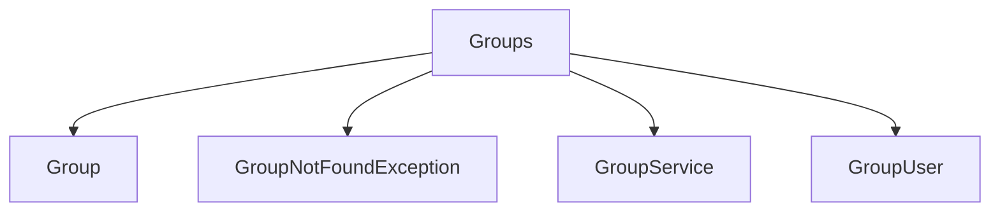

# Groups

## Contents

- [Overview](#overview)
- [Files](#files)
- [Types and Members](#types-and-members)
- [Validation and Constraints](#validation-and-constraints)
- [Package Dependencies](#package-dependencies)
- [Diagrams](#diagrams)
- [Examples](#examples)
- [See Also](#see-also)

## Overview

The **Groups** area groups 4 documented types, including `Group`, `GroupNotFoundException`, `GroupService`, `GroupUser`. It provides the contracts and implementation used by this part of ThunderPropagator.Channels.

## Files

| File | Primary type(s)/symbol(s) | LOC (approx.) | Responsibility |
|---|---|---:|---|
| `Group.cs` | `Group` | 58 | Defines Group and its related behavior. |
| `GroupNotFoundException.cs` | `GroupNotFoundException` | 9 | Defines GroupNotFoundException and its related behavior. |
| `GroupService.cs` | `GroupService` | 57 | Defines GroupService and its related behavior. |
| `GroupUser.cs` | `GroupUser` | 30 | Defines GroupUser and its related behavior. |

## Types and Members

| Type | Kind | Summary | Inherits/Implements | Key Members |
|---|---|---|---|---|
| [`Group`](#group) | class | Represents the Group class. | — | `Id`, `Name`, `GroupIcon`, `GroupUsers`, `AddUser(…)`, `RemoveUser(…)` |
| [`GroupNotFoundException`](#groupnotfoundexception) | class | Represents the GroupNotFoundException class. | — | — |
| [`GroupService`](#groupservice) | class | Represents the GroupService class. | — | `GetByIdAsync(…)`, `CreateAsync(…)`, `GetAllAsync(…)`, `AddUserToGroupAsync(…)`, `RemoveUserFromGroupAsync(…)`, `RenameGroupAsync(…)` |
| [`GroupUser`](#groupuser) | class | Represents the GroupUser class. | — | `Id`, `GroupId`, `Group`, `UserId`, `User`, `Create(…)` |

### Group

- **Kind:** class
- **Namespace:** `ThunderPropagator.Channels.Chat.Models.Groups`
- **Inherits/implements:** None declared
- **Attributes:** None detected
- **Key members:** `Id`, `Name`, `GroupIcon`, `GroupUsers`, `AddUser(…)`, `RemoveUser(…)`, `SetName(…)`, `SetGroupIcon(…)`
- **Summary:** Represents the Group class.
- **Thread safety:** Follow the lifetime and concurrency guarantees of the owning component; no additional guarantee is inferred.

**Usage recipe**

```csharp
// Resolve Group from the configured service container or construct it with its declared dependencies.
```

[↑ Back to top](#contents)

### GroupNotFoundException

- **Kind:** class
- **Namespace:** `ThunderPropagator.Channels.Chat.Models.Groups`
- **Inherits/implements:** None declared
- **Attributes:** None detected
- **Key members:** Refer to the API surface in the source package
- **Summary:** Represents the GroupNotFoundException class.
- **Thread safety:** Follow the lifetime and concurrency guarantees of the owning component; no additional guarantee is inferred.

**Usage recipe**

```csharp
// Resolve GroupNotFoundException from the configured service container or construct it with its declared dependencies.
```

[↑ Back to top](#contents)

### GroupService

- **Kind:** class
- **Namespace:** `ThunderPropagator.Channels.Chat.Models.Groups`
- **Inherits/implements:** None declared
- **Attributes:** None detected
- **Key members:** `GetByIdAsync(…)`, `CreateAsync(…)`, `GetAllAsync(…)`, `AddUserToGroupAsync(…)`, `RemoveUserFromGroupAsync(…)`, `RenameGroupAsync(…)`, `SetGroupIconAsync(…)`
- **Summary:** Represents the GroupService class.
- **Thread safety:** Follow the lifetime and concurrency guarantees of the owning component; no additional guarantee is inferred.

**Usage recipe**

```csharp
// Resolve GroupService from the configured service container or construct it with its declared dependencies.
```

[↑ Back to top](#contents)

### GroupUser

- **Kind:** class
- **Namespace:** `ThunderPropagator.Channels.Chat.Models.Groups`
- **Inherits/implements:** None declared
- **Attributes:** None detected
- **Key members:** `Id`, `GroupId`, `Group`, `UserId`, `User`, `Create(…)`
- **Summary:** Represents the GroupUser class.
- **Thread safety:** Follow the lifetime and concurrency guarantees of the owning component; no additional guarantee is inferred.

**Usage recipe**

```csharp
// Resolve GroupUser from the configured service container or construct it with its declared dependencies.
```

[↑ Back to top](#contents)

## Validation and Constraints

Inputs are validated at component boundaries. Callers should provide non-null required values and handle domain or argument exceptions without retrying invalid requests unchanged.

## Package Dependencies

| Package | Version | Description | Links |
|---|---|---|---|
| `Bogus` | `35.6.5` | External dependency used by the repository. | [Registry](https://www.nuget.org/packages/Bogus) |
| `Microsoft.Extensions.Caching.StackExchangeRedis` | `10.*` | External dependency used by the repository. | [Registry](https://www.nuget.org/packages/Microsoft.Extensions.Caching.StackExchangeRedis) |
| `Microsoft.Extensions.Diagnostics.Testing` | `10.*` | External dependency used by the repository. | [Registry](https://www.nuget.org/packages/Microsoft.Extensions.Diagnostics.Testing) |
| `Microsoft.Extensions.Http.Polly` | `10.*` | External dependency used by the repository. | [Registry](https://www.nuget.org/packages/Microsoft.Extensions.Http.Polly) |
| `NodaTime` | `3.3.2` | External dependency used by the repository. | [Registry](https://www.nuget.org/packages/NodaTime) |

## Diagrams

### Component overview



The diagram shows the direct components documented by the **Groups** area.

## Examples

Start with `Group` as the primary entry point for this folder, then follow its linked contracts and collaborators.

## See Also

- [Parent area](../README.md)
- [Messages](../Messages/README.md)
- [Users](../Users/README.md)

[↑ Back to top](#contents)
