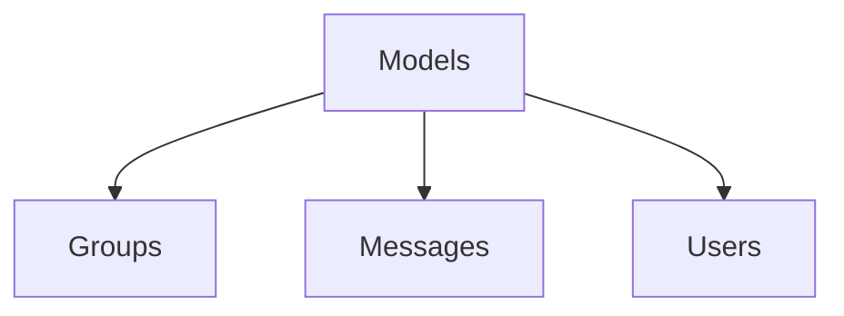

# Models

## Contents

- [Overview](#overview)
- [Files](#files)
- [Types and Members](#types-and-members)
- [Package Dependencies](#package-dependencies)
- [Diagrams](#diagrams)
- [Examples](#examples)
- [See Also](#see-also)

## Overview

The **Models** area groups 1 documented type, including `BaseChatContext`. It provides the contracts and implementation used by this part of ThunderPropagator.Channels.

## Files

| File | Primary type(s)/symbol(s) | LOC (approx.) | Responsibility |
|---|---|---:|---|
| `BaseChatContext.cs` | `IChatContext`, `BaseChatContext` | 51 | Defines IChatContext, BaseChatContext and its related behavior. |

### Direct child areas

- [Groups](./Groups/README.md) `Types:4` `Files:4`
- [Messages](./Messages/README.md) `Types:2` `Files:2`
- [Users](./Users/README.md) `Types:3` `Files:3`

## Types and Members

| Type | Kind | Summary | Inherits/Implements | Key Members |
|---|---|---|---|---|
| [`BaseChatContext`](#basechatcontext) | class | Represents the BaseChatContext class. | `IChatContext` | `Migrate(…)`, `Seed(…)` |

### BaseChatContext

- **Kind:** class
- **Namespace:** `ThunderPropagator.Channels.Chat.Models`
- **Inherits/implements:** `IChatContext`
- **Attributes:** None detected
- **Key members:** `Migrate(…)`, `Seed(…)`
- **Summary:** Represents the BaseChatContext class.
- **Thread safety:** Follow the lifetime and concurrency guarantees of the owning component; no additional guarantee is inferred.

**Usage recipe**

```csharp
// Resolve BaseChatContext from the configured service container or construct it with its declared dependencies.
```

[↑ Back to top](#contents)

## Package Dependencies

| Package | Version | Description | Links |
|---|---|---|---|
| `Bogus` | `35.6.5` | External dependency used by the repository. | [Registry](https://www.nuget.org/packages/Bogus) |
| `Microsoft.Extensions.Caching.StackExchangeRedis` | `10.*` | External dependency used by the repository. | [Registry](https://www.nuget.org/packages/Microsoft.Extensions.Caching.StackExchangeRedis) |
| `Microsoft.Extensions.Diagnostics.Testing` | `10.*` | External dependency used by the repository. | [Registry](https://www.nuget.org/packages/Microsoft.Extensions.Diagnostics.Testing) |
| `Microsoft.Extensions.Http.Polly` | `10.*` | External dependency used by the repository. | [Registry](https://www.nuget.org/packages/Microsoft.Extensions.Http.Polly) |
| `NodaTime` | `3.3.2` | External dependency used by the repository. | [Registry](https://www.nuget.org/packages/NodaTime) |

## Diagrams

### Component overview



The diagram shows the direct components documented by the **Models** area.

## Examples

Start with `BaseChatContext` as the primary entry point for this folder, then follow its linked contracts and collaborators.

## See Also

- [Parent area](../README.md)
- [Pipelines](../Pipelines/README.md)

[↑ Back to top](#contents)
