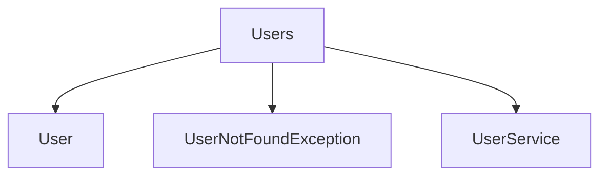

# Users

## Contents

- [Overview](#overview)
- [Files](#files)
- [Types and Members](#types-and-members)
- [Serialization and Contracts](#serialization-and-contracts)
- [Validation and Constraints](#validation-and-constraints)
- [Package Dependencies](#package-dependencies)
- [Diagrams](#diagrams)
- [Examples](#examples)
- [See Also](#see-also)

## Overview

The **Users** area groups 3 documented types, including `User`, `UserNotFoundException`, `UserService`. It provides the contracts and implementation used by this part of ThunderPropagator.Channels.

## Files

| File | Primary type(s)/symbol(s) | LOC (approx.) | Responsibility |
|---|---|---:|---|
| `User.cs` | `User` | 70 | Defines User and its related behavior. |
| `UserNotFoundException.cs` | `UserNotFoundException` | 7 | Defines UserNotFoundException and its related behavior. |
| `UserService.cs` | `UserService` | 80 | Defines UserService and its related behavior. |

## Types and Members

| Type | Kind | Summary | Inherits/Implements | Key Members |
|---|---|---|---|---|
| [`User`](#user) | class | Represents the User class. | — | `Id`, `UserName`, `Password`, `Name`, `Avatar`, `Bio` |
| [`UserNotFoundException`](#usernotfoundexception) | class | Represents the UserNotFoundException class. | — | — |
| [`UserService`](#userservice) | class | Represents the UserService class. | — | `GetByIdAsync(…)`, `GetByUsernameAsync(…)`, `RegisterAsync(…)`, `LoginAsync(…)`, `GetUserGroupsAsync(…)`, `GetUserContactsAsync(…)` |

### User

- **Kind:** class
- **Namespace:** `ThunderPropagator.Channels.Chat.Models.Users`
- **Inherits/implements:** None declared
- **Attributes:** None detected
- **Key members:** `Id`, `UserName`, `Password`, `Name`, `Avatar`, `Bio`, `BirthDate`, `SetName(…)`
- **Summary:** Represents the User class.
- **Thread safety:** Follow the lifetime and concurrency guarantees of the owning component; no additional guarantee is inferred.

**Usage recipe**

```csharp
// Resolve User from the configured service container or construct it with its declared dependencies.
```

[↑ Back to top](#contents)

### UserNotFoundException

- **Kind:** class
- **Namespace:** `ThunderPropagator.Channels.Chat.Models.Users`
- **Inherits/implements:** None declared
- **Attributes:** None detected
- **Key members:** Refer to the API surface in the source package
- **Summary:** Represents the UserNotFoundException class.
- **Thread safety:** Follow the lifetime and concurrency guarantees of the owning component; no additional guarantee is inferred.

**Usage recipe**

```csharp
// Resolve UserNotFoundException from the configured service container or construct it with its declared dependencies.
```

[↑ Back to top](#contents)

### UserService

- **Kind:** class
- **Namespace:** `ThunderPropagator.Channels.Chat.Models.Users`
- **Inherits/implements:** None declared
- **Attributes:** None detected
- **Key members:** `GetByIdAsync(…)`, `GetByUsernameAsync(…)`, `RegisterAsync(…)`, `LoginAsync(…)`, `GetUserGroupsAsync(…)`, `GetUserContactsAsync(…)`, `UpdateAsync(…)`, `SetNameAsync(…)`
- **Summary:** Represents the UserService class.
- **Thread safety:** Follow the lifetime and concurrency guarantees of the owning component; no additional guarantee is inferred.

**Usage recipe**

```csharp
// Resolve UserService from the configured service container or construct it with its declared dependencies.
```

[↑ Back to top](#contents)

## Serialization and Contracts

Serialization behavior is part of the public wire or persistence contract in this area. Preserve field names, ordering rules, content negotiation, and backward-compatibility expectations when changing these types.

## Validation and Constraints

Inputs are validated at component boundaries. Callers should provide non-null required values and handle domain or argument exceptions without retrying invalid requests unchanged.

## Package Dependencies

| Package | Version | Description | Links |
|---|---|---|---|
| `Bogus` | `35.6.5` | External dependency used by the repository. | [Registry](https://www.nuget.org/packages/Bogus) |
| `Microsoft.Extensions.Caching.StackExchangeRedis` | `10.*` | External dependency used by the repository. | [Registry](https://www.nuget.org/packages/Microsoft.Extensions.Caching.StackExchangeRedis) |
| `Microsoft.Extensions.Diagnostics.Testing` | `10.*` | External dependency used by the repository. | [Registry](https://www.nuget.org/packages/Microsoft.Extensions.Diagnostics.Testing) |
| `Microsoft.Extensions.Http.Polly` | `10.*` | External dependency used by the repository. | [Registry](https://www.nuget.org/packages/Microsoft.Extensions.Http.Polly) |
| `NodaTime` | `3.3.2` | External dependency used by the repository. | [Registry](https://www.nuget.org/packages/NodaTime) |

## Diagrams

### Component overview



The diagram shows the direct components documented by the **Users** area.

## Examples

Start with `User` as the primary entry point for this folder, then follow its linked contracts and collaborators.

## See Also

- [Parent area](../README.md)
- [Groups](../Groups/README.md)
- [Messages](../Messages/README.md)

[↑ Back to top](#contents)
