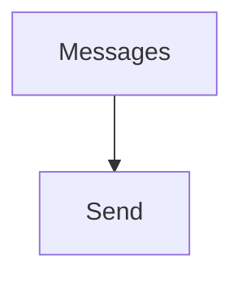

# Messages

## Contents

- [Overview](#overview)
- [Files](#files)
- [Package Dependencies](#package-dependencies)
- [Diagrams](#diagrams)
- [Examples](#examples)
- [See Also](#see-also)

## Overview

The **Messages** area organizes 1 direct sub-area. Each child is documented separately so responsibilities and APIs remain easy to navigate.

## Files

*None.*

### Direct child areas

- [Send](./Send/README.md) `Types:2` `Files:2`

## Package Dependencies

| Package | Version | Description | Links |
|---|---|---|---|
| `Bogus` | `35.6.5` | External dependency used by the repository. | [Registry](https://www.nuget.org/packages/Bogus) |
| `Microsoft.Extensions.Caching.StackExchangeRedis` | `10.*` | External dependency used by the repository. | [Registry](https://www.nuget.org/packages/Microsoft.Extensions.Caching.StackExchangeRedis) |
| `Microsoft.Extensions.Diagnostics.Testing` | `10.*` | External dependency used by the repository. | [Registry](https://www.nuget.org/packages/Microsoft.Extensions.Diagnostics.Testing) |
| `Microsoft.Extensions.Http.Polly` | `10.*` | External dependency used by the repository. | [Registry](https://www.nuget.org/packages/Microsoft.Extensions.Http.Polly) |
| `NodaTime` | `3.3.2` | External dependency used by the repository. | [Registry](https://www.nuget.org/packages/NodaTime) |

## Diagrams

### Component overview

The diagram shows the direct components documented by the **Messages** area.

## Examples

Choose the child area that matches the required capability; parent documentation intentionally does not duplicate child implementation details.

## See Also

- [Parent area](../README.md)
- [Groups](../Groups/README.md)
- [Users](../Users/README.md)

[↑ Back to top](#contents)
