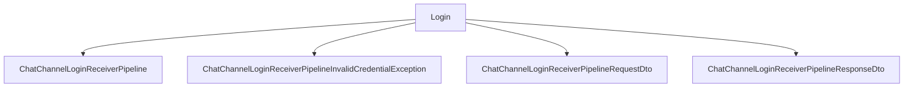

# Login

## Contents

- [Overview](#overview)
- [Files](#files)
- [Types and Members](#types-and-members)
- [Validation and Constraints](#validation-and-constraints)
- [Package Dependencies](#package-dependencies)
- [Diagrams](#diagrams)
- [Examples](#examples)
- [See Also](#see-also)

## Overview

The **Login** area groups 4 documented types, including `ChatChannelLoginReceiverPipeline`, `ChatChannelLoginReceiverPipelineInvalidCredentialException`, `ChatChannelLoginReceiverPipelineRequestDto`, `ChatChannelLoginReceiverPipelineResponseDto`. It provides the contracts and implementation used by this part of ThunderPropagator.Channels.

## Files

| File | Primary type(s)/symbol(s) | LOC (approx.) | Responsibility |
|---|---|---:|---|
| `ChatChannelLoginReceiverPipeline.cs` | `ChatChannelLoginReceiverPipeline` | 81 | Defines ChatChannelLoginReceiverPipeline and its related behavior. |
| `ChatChannelLoginReceiverPipelineInvalidCredentialException.cs` | `ChatChannelLoginReceiverPipelineInvalidCredentialException` | 12 | Defines ChatChannelLoginReceiverPipelineInvalidCredentialException and its related behavior. |
| `ChatChannelLoginReceiverPipelineRequestDto.cs` | `ChatChannelLoginReceiverPipelineRequestDto` | 24 | Defines ChatChannelLoginReceiverPipelineRequestDto and its related behavior. |
| `ChatChannelLoginReceiverPipelineResponseDto.cs` | `ChatChannelLoginReceiverPipelineResponseDto` | 17 | Defines ChatChannelLoginReceiverPipelineResponseDto and its related behavior. |

## Types and Members

| Type | Kind | Summary | Inherits/Implements | Key Members |
|---|---|---|---|---|
| [`ChatChannelLoginReceiverPipeline`](#chatchannelloginreceiverpipeline) | class | Represents the ChatChannelLoginReceiverPipeline class. | — | `RequestKey`, `Invoke(…)` |
| [`ChatChannelLoginReceiverPipelineInvalidCredentialException`](#chatchannelloginreceiverpipelineinvalidcredentialexception) | class | Represents the ChatChannelLoginReceiverPipelineInvalidCredentialException class. | — | — |
| [`ChatChannelLoginReceiverPipelineRequestDto`](#chatchannelloginreceiverpipelinerequestdto) | class | Represents the ChatChannelLoginReceiverPipelineRequestDto class. | `BindingDictionary<string, object>, IRequestContentFormCollection` | — |
| [`ChatChannelLoginReceiverPipelineResponseDto`](#chatchannelloginreceiverpipelineresponsedto) | class | Represents the ChatChannelLoginReceiverPipelineResponseDto class. | `ResponseContentFormCollection` | `User`, `Groups`, `Contacts` |

### ChatChannelLoginReceiverPipeline

- **Kind:** class
- **Namespace:** `ThunderPropagator.Channels.Chat.Pipelines.Users.Login`
- **Inherits/implements:** None declared
- **Attributes:** None detected
- **Key members:** `RequestKey`, `Invoke(…)`
- **Summary:** Represents the ChatChannelLoginReceiverPipeline class.
- **Thread safety:** Follow the lifetime and concurrency guarantees of the owning component; no additional guarantee is inferred.

**Usage recipe**

```csharp
// Resolve ChatChannelLoginReceiverPipeline from the configured service container or construct it with its declared dependencies.
```

[↑ Back to top](#contents)

### ChatChannelLoginReceiverPipelineInvalidCredentialException

- **Kind:** class
- **Namespace:** `ThunderPropagator.Channels.Chat.Pipelines.Users.Login`
- **Inherits/implements:** None declared
- **Attributes:** None detected
- **Key members:** Refer to the API surface in the source package
- **Summary:** Represents the ChatChannelLoginReceiverPipelineInvalidCredentialException class.
- **Thread safety:** Follow the lifetime and concurrency guarantees of the owning component; no additional guarantee is inferred.

**Usage recipe**

```csharp
// Resolve ChatChannelLoginReceiverPipelineInvalidCredentialException from the configured service container or construct it with its declared dependencies.
```

[↑ Back to top](#contents)

### ChatChannelLoginReceiverPipelineRequestDto

- **Kind:** class
- **Namespace:** `ThunderPropagator.Channels.Chat.Pipelines.Users.Login`
- **Inherits/implements:** `BindingDictionary<string, object>, IRequestContentFormCollection`
- **Attributes:** None detected
- **Key members:** Refer to the API surface in the source package
- **Summary:** Represents the ChatChannelLoginReceiverPipelineRequestDto class.
- **Thread safety:** Follow the lifetime and concurrency guarantees of the owning component; no additional guarantee is inferred.

**Usage recipe**

```csharp
// Resolve ChatChannelLoginReceiverPipelineRequestDto from the configured service container or construct it with its declared dependencies.
```

[↑ Back to top](#contents)

### ChatChannelLoginReceiverPipelineResponseDto

- **Kind:** class
- **Namespace:** `ThunderPropagator.Channels.Chat.Pipelines.Users.Login`
- **Inherits/implements:** `ResponseContentFormCollection`
- **Attributes:** None detected
- **Key members:** `User`, `Groups`, `Contacts`
- **Summary:** Represents the ChatChannelLoginReceiverPipelineResponseDto class.
- **Thread safety:** Follow the lifetime and concurrency guarantees of the owning component; no additional guarantee is inferred.

**Usage recipe**

```csharp
// Resolve ChatChannelLoginReceiverPipelineResponseDto from the configured service container or construct it with its declared dependencies.
```

[↑ Back to top](#contents)

## Validation and Constraints

Inputs are validated at component boundaries. Callers should provide non-null required values and handle domain or argument exceptions without retrying invalid requests unchanged.

## Package Dependencies

| Package | Version | Description | Links |
|---|---|---|---|
| `Bogus` | `35.6.5` | External dependency used by the repository. | [Registry](https://www.nuget.org/packages/Bogus) |
| `Microsoft.Extensions.Caching.StackExchangeRedis` | `10.*` | External dependency used by the repository. | [Registry](https://www.nuget.org/packages/Microsoft.Extensions.Caching.StackExchangeRedis) |
| `Microsoft.Extensions.Diagnostics.Testing` | `10.*` | External dependency used by the repository. | [Registry](https://www.nuget.org/packages/Microsoft.Extensions.Diagnostics.Testing) |
| `Microsoft.Extensions.Http.Polly` | `10.*` | External dependency used by the repository. | [Registry](https://www.nuget.org/packages/Microsoft.Extensions.Http.Polly) |
| `NodaTime` | `3.3.2` | External dependency used by the repository. | [Registry](https://www.nuget.org/packages/NodaTime) |

## Diagrams

### Component overview



The diagram shows the direct components documented by the **Login** area.

## Examples

Start with `ChatChannelLoginReceiverPipeline` as the primary entry point for this folder, then follow its linked contracts and collaborators.

## See Also

- [Parent area](../README.md)
- [Register](../Register/README.md)
- [SetAvatar](../SetAvatar/README.md)
- [SetName](../SetName/README.md)
- [Update](../Update/README.md)

[↑ Back to top](#contents)
