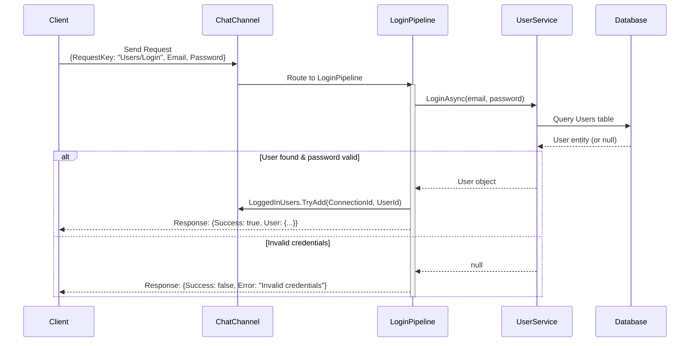
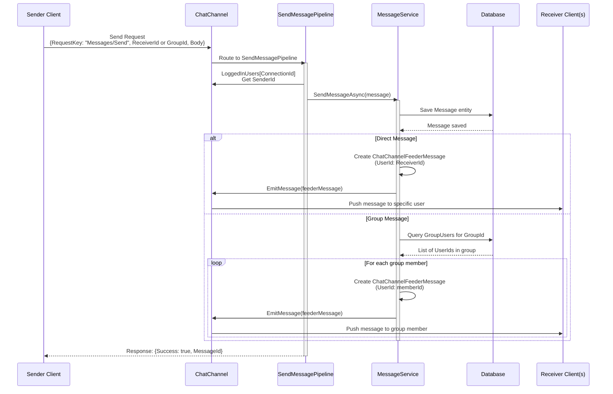
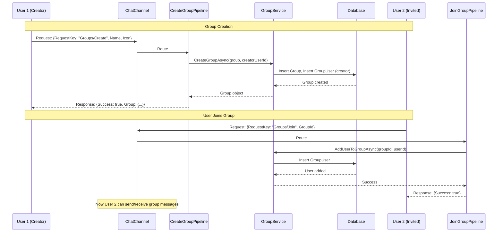

# Chat Channel

[↑ Back to Channels](../README.md) | [→ All Documentation](/docs/README.md)

## Contents

- [Overview](#overview)
- [Architecture](#architecture)
- [Files & Structure](#files--structure)
- [Domain Models](#domain-models)
  - [Users](./Models/Users/README.md)
  - [Groups](./Models/Groups/README.md)
  - [Messages](./Models/Messages/README.md)
- [Pipelines](#pipelines)
  - [User Pipelines](./Pipelines/Users/README.md)
  - [Group Pipelines](./Pipelines/Groups/README.md)
  - [Message Pipelines](./Pipelines/Messages/README.md)
- [Key Types](#key-types)
- [Diagrams](#diagrams)
- [Dependencies](#dependencies)
- [Examples](#examples)
- [See Also](#see-also)

## Overview

The **Chat Channel** is the most complex production channel in the repository, implementing a full-featured real-time chat system with users, groups, and messages. This channel demonstrates advanced ThunderPropagator patterns including:
- **Bidirectional Communication**: 14 receive pipelines handling client requests
- **Stateful Session Management**: `LoggedInUsers` dictionary tracking active sessions
- **Domain-Driven Design**: Organized Models and Pipelines by domain (Users, Groups, Messages)
- **Database Integration**: Pluggable `BaseChatContext` for persistence
- **Complex Business Logic**: User authentication, group membership, message routing

This channel serves as the reference implementation for complex, stateful, bidirectional ThunderPropagator applications.

## Architecture

```mermaid
graph TB
    subgraph "Chat Channel"
        Channel[ChatChannel<br/>LoggedInUsers Dictionary<br/>Session Management]
        Config[ChatChannelConfiguration<br/>IsEnabled]
        Metadata[ChatChannelMetadata<br/>4 Schema Descriptors]
        
        Channel -->|Uses| Config
        Channel -->|Provides| Metadata
    end
    
    subgraph "Domain Models [Models/]"
        UserModel[User<br/>Id, Name, Avatar]
        GroupModel[Group<br/>Id, Name, Icon, Users]
        MessageModel[Message<br/>Id, Body, SenderId, ReceiverId, GroupId]
        
        UserService[UserService<br/>CRUD operations]
        GroupService[GroupService<br/>Membership management]
        MessageService[MessageService<br/>Message delivery]
    end
    
    subgraph "Pipelines [Pipelines/]"
        direction TB
        
        subgraph "Users [Users/]"
            LoginPipeline[Login<br/>RequestKey: Users/Login]
            RegisterPipeline[Register<br/>RequestKey: Users/Register]
            UpdatePipeline[Update<br/>RequestKey: Users/Update]
            SetNamePipeline[SetName<br/>RequestKey: Users/SetName]
            SetAvatarPipeline[SetAvatar<br/>RequestKey: Users/SetAvatar]
        end
        
        subgraph "Groups [Groups/]"
            CreateGroupPipeline[Create<br/>RequestKey: Groups/Create]
            JoinGroupPipeline[Join<br/>RequestKey: Groups/Join]
            AddUserPipeline[AddUser<br/>RequestKey: Groups/AddUser]
            RemoveUserPipeline[RemoveUser<br/>RequestKey: Groups/RemoveUser]
            RenameGroupPipeline[Rename<br/>RequestKey: Groups/Rename]
            SetIconPipeline[SetIcon<br/>RequestKey: Groups/SetIcon]
            GetAllPipeline[GetAll<br/>RequestKey: Groups/GetAll]
            UserLeavePipeline[UserLeave<br/>RequestKey: Groups/UserLeave]
        end
        
        subgraph "Messages [Messages/]"
            SendMessagePipeline[Send<br/>RequestKey: Messages/Send]
        end
    end
    
    subgraph "Database"
        ChatContext[IChatContext<br/>BaseChatContext Implementation]
    end
    
    Channel -->|Routes Requests| LoginPipeline
    Channel -->|Routes Requests| CreateGroupPipeline
    Channel -->|Routes Requests| SendMessagePipeline
    
    LoginPipeline -->|Uses| UserService
    CreateGroupPipeline -->|Uses| GroupService
    SendMessagePipeline -->|Uses| MessageService
    
    UserService -->|Persist| ChatContext
    GroupService -->|Persist| ChatContext
    MessageService -->|Persist| ChatContext
    
    MessageService -->|Emits| Channel
    
    subgraph "Clients"
        WebClient[Web Chat UI]
        MobileClient[Mobile App]
    end
    
    Channel <-->|WebSocket| WebClient
    Channel <-->|WebSocket| MobileClient
    
    style Channel fill:#4a9eff,color:#fff
    style UserService fill:#28a745,color:#fff
    style GroupService fill:#28a745,color:#fff
    style MessageService fill:#28a745,color:#fff
    style ChatContext fill:#6c757d,color:#fff
```



## Files & Structure

### Core Channel Files

| File | Primary Type(s) | LOC | Responsibility |
|------|-----------------|-----|----------------|
| [ChatChannel.cs](../../../src/Channels/ThunderPropagator.Channels.Chat/ChatChannel.cs) | `ChatChannel` | 18 | Main channel with `LoggedInUsers` dictionary & `EmitMessage()` |
| [ChatChannelConfiguration.cs](../../../src/Channels/ThunderPropagator.Channels.Chat/ChatChannelConfiguration.cs) | `ChatChannelConfiguration` | 15 | Channel configuration (IsEnabled) |
| [ChatChannelMetadata.cs](../../../src/Channels/ThunderPropagator.Channels.Chat/ChatChannelMetadata.cs) | `ChatChannelMetadata` | 20 | Schema descriptors (4 fields) |
| [ChatChannelFeederMessage.cs](../../../src/Channels/ThunderPropagator.Channels.Chat/ChatChannelFeederMessage.cs) | `ChatChannelFeederMessage` | 55 | Message data contract |
| [ChatChannelExtensions.cs](../../../src/Channels/ThunderPropagator.Channels.Chat/ChatChannelExtensions.cs) | `ChatChannelExtensions` | 72 | DI registration with all 14 pipelines |

### Domain Models (Models/)

| Subdirectory | Key Types | Responsibility |
|--------------|-----------|----------------|
| [Models/](./Models/README.md) | `BaseChatContext`, `IChatContext` | Database abstraction layer |
| [Models/Users/](./Models/Users/README.md) | `User`, `UserService`, `UserNotFoundException` | User management |
| [Models/Groups/](./Models/Groups/README.md) | `Group`, `GroupUser`, `GroupService`, `GroupNotFoundException` | Group/membership management |
| [Models/Messages/](./Models/Messages/README.md) | `Message`, `MessageService` | Message storage & routing |

### Pipelines (Pipelines/)

| Subdirectory | Pipelines | Request Keys |
|--------------|-----------|--------------|
| [Pipelines/Users/](./Pipelines/Users/README.md) | Login, Register, Update, SetName, SetAvatar | `Users/Login`, `Users/Register`, `Users/Update`, `Users/SetName`, `Users/SetAvatar` |
| [Pipelines/Groups/](./Pipelines/Groups/README.md) | Create, Join, AddUser, RemoveUser, Rename, SetIcon, GetAll, UserLeave | `Groups/Create`, `Groups/Join`, `Groups/AddUser`, `Groups/RemoveUser`, `Groups/Rename`, `Groups/SetIcon`, `Groups/GetAll`, `Groups/UserLeave` |
| [Pipelines/Messages/](./Pipelines/Messages/README.md) | Send | `Messages/Send` |

## Domain Models

### Users
Complete user lifecycle management including registration, authentication, profile updates, and session tracking. See [Models/Users/README.md](./Models/Users/README.md) for details.

**Key Types**:
- `User` — Entity with Id, Name, Avatar properties
- `UserService` — CRUD operations, login validation
- `UserNotFoundException` — Custom exception

### Groups
Group chat functionality with membership management, permissions, and multi-user coordination. See [Models/Groups/README.md](./Models/Groups/README.md) for details.

**Key Types**:
- `Group` — Entity with Id, Name, Icon, user collection
- `GroupUser` — Many-to-many join entity
- `GroupService` — Group operations, membership
- `GroupNotFoundException` — Custom exception

### Messages
Message persistence, routing, and delivery with support for direct and group messages. See [Models/Messages/README.md](./Models/Messages/README.md) for details.

**Key Types**:
- `Message` — Entity with Id, Body, SenderId, ReceiverId, GroupId, Created
- `MessageService` — Message storage, channel emission

## Pipelines

### User Pipelines (5 pipelines)
Handle user authentication, registration, and profile management. See [Pipelines/Users/README.md](./Pipelines/Users/README.md) for full API documentation.

- **Login** (`Users/Login`) — Authenticate user, track session in `LoggedInUsers`
- **Register** (`Users/Register`) — Create new user account
- **Update** (`Users/Update`) — Update user properties (bulk)
- **SetName** (`Users/SetName`) — Update display name
- **SetAvatar** (`Users/SetAvatar`) — Update avatar URL

### Group Pipelines (8 pipelines)
Manage group lifecycle, membership, and settings. See [Pipelines/Groups/README.md](./Pipelines/Groups/README.md) for full API documentation.

- **Create** (`Groups/Create`) — Create new group
- **Join** (`Groups/Join`) — User joins existing group
- **AddUser** (`Groups/AddUser`) — Add user to group (admin action)
- **RemoveUser** (`Groups/RemoveUser`) — Remove user from group (admin action)
- **Rename** (`Groups/Rename`) — Update group name
- **SetIcon** (`Groups/SetIcon`) — Update group icon
- **GetAll** (`Groups/GetAll`) — List all groups for user
- **UserLeave** (`Groups/UserLeave`) — User leaves group

### Message Pipelines (1 pipeline)
Handle message sending with routing logic. See [Pipelines/Messages/README.md](./Pipelines/Messages/README.md) for full API documentation.

- **Send** (`Messages/Send`) — Send message to user or group

## Key Types

### ChatChannel

```csharp
public class ChatChannel : AbstractChannel<ChatChannelMetadata, ChatChannelConfiguration>
{
    internal ConcurrentDictionary<string, Guid> LoggedInUsers { get; }
    
    public ChatChannel(IServiceProvider serviceProvider);
    protected override void OnSubscriptionRemoved(Subscription subscription);
    internal void EmitMessage(ChatChannelFeederMessage feederMessage);
}
```

**Key Features**:
- `LoggedInUsers` — Thread-safe dictionary mapping ConnectionId → UserId
- `OnSubscriptionRemoved` — Clears logged-in state on disconnect
- `EmitMessage` — Internal method for MessageService to push messages

### ChatChannelFeederMessage

```csharp
internal class ChatChannelFeederMessage : FeederMessage
{
    public string UserId { get; }               // Recipient UserId (subscription key)
    public Guid SenderUserId { get; }           // Sender UserId
    public Guid GroupId { get; }                // GroupId (Guid.Empty for direct messages)
    public string Message { get; }              // Message body text
    public DateTimeOffset DateTime { get; }     // Message timestamp
}
```

**Construction**: Created by `MessageService` from `Message` entities before emission.

### BaseChatContext

```csharp
public abstract class BaseChatContext : IChatContext
{
    public abstract DbSet<User> Users { get; set; }
    public abstract DbSet<Group> Groups { get; set; }
    public abstract DbSet<GroupUser> GroupUsers { get; set; }
    public abstract DbSet<Message> Messages { get; set; }
    public abstract Task<int> SaveChangesAsync(CancellationToken cancellationToken = default);
}
```

**Usage**: Implement this abstract class with your ORM (EF Core, Dapper, etc.) to provide persistence.

## Diagrams

### User Login Flow



### Message Sending Flow



### Group Management Flow



[↑ Back to top](#chat-channel)

## Dependencies

| Package | Version | Description | Links |
|---------|---------|-------------|-------|
| ThunderPropagator (platform-specific) | 1.0.1-beta.5 | Core framework with channel/pipeline infrastructure | [GitHub Packages](https://github.com/orgs/ThunderPropagator/packages) |

**Database**: Requires implementation of `BaseChatContext` with your chosen ORM (EF Core recommended).

[↑ Back to top](#chat-channel)

## Examples

### Basic Registration

```csharp
using Microsoft.Extensions.DependencyInjection;
using ThunderPropagator.Channels.Chat;

var services = new ServiceCollection();

// Implement BaseChatContext with EF Core
public class MyChatDbContext : BaseChatContext
{
    public override DbSet<User> Users { get; set; }
    public override DbSet<Group> Groups { get; set; }
    public override DbSet<GroupUser> GroupUsers { get; set; }
    public override DbSet<Message> Messages { get; set; }
    
    protected override void OnConfiguring(DbContextOptionsBuilder optionsBuilder)
    {
        optionsBuilder.UseSqlServer("YourConnectionString");
    }
}

// Register Chat channel
services.AddChatChannel<MyChatDbContext>(config =>
{
    config.IsEnabled = true;
});
```

### Client Usage: User Registration & Login

```csharp
// Register new user
var registerRequest = new
{
    RequestKey = "Users/Register",
    Email = "user@example.com",
    Name = "John Doe",
    Password = "SecurePassword123",
    Avatar = "https://example.com/avatar.jpg"
};
var registerResponse = await channel.SendRequestAsync(registerRequest);

// Login
var loginRequest = new
{
    RequestKey = "Users/Login",
    Email = "user@example.com",
    Password = "SecurePassword123"
};
var loginResponse = await channel.SendRequestAsync(loginRequest);
// Server tracks session in ChatChannel.LoggedInUsers
```

### Client Usage: Create Group & Send Message

```csharp
// Create group
var createGroupRequest = new
{
    RequestKey = "Groups/Create",
    Name = "Project Team",
    Icon = "📁"
};
var createGroupResponse = await channel.SendRequestAsync(createGroupRequest);
var groupId = createGroupResponse.Group.Id;

// Invite user to group
var addUserRequest = new
{
    RequestKey = "Groups/AddUser",
    GroupId = groupId,
    UserId = "user-guid-to-add"
};
await channel.SendRequestAsync(addUserRequest);

// Send group message
var sendMessageRequest = new
{
    RequestKey = "Messages/Send",
    GroupId = groupId,
    Body = "Hello team!"
};
await channel.SendRequestAsync(sendMessageRequest);
```

### Client Usage: Receive Messages

```csharp
// Subscribe to receive messages for logged-in user
var subscription = await channel.SubscribeAsync(new Dictionary<string, object>
{
    ["UserId"] = currentUserId  // Set after login
});

subscription.OnMessage(message =>
{
    var chatMessage = message as ChatChannelFeederMessage;
    
    if (chatMessage.GroupId != Guid.Empty)
    {
        // Group message
        Console.WriteLine($"[Group {chatMessage.GroupId}] {chatMessage.SenderUserId}: {chatMessage.Message}");
    }
    else
    {
        // Direct message
        Console.WriteLine($"[DM from {chatMessage.SenderUserId}] {chatMessage.Message}");
    }
});
```

[↑ Back to top](#chat-channel)

## See Also

- [Channels Overview](../README.md) — All 7 production channels
- [Models Documentation](./Models/README.md) — Domain entities (Users, Groups, Messages)
- [Pipelines Documentation](./Pipelines/README.md) — Request/response handlers
- [Notifications Channel](../Notifications/README.md) — Another complex channel with custom logic
- [Main Documentation](/docs/README.md) — Repository documentation home

[↑ Back to top](#chat-channel)
