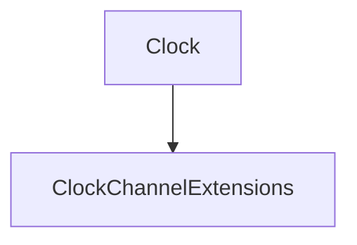

# Clock

## Contents

- [Overview](#overview)
- [Files](#files)
- [Types and Members](#types-and-members)
- [Performance Notes](#performance-notes)
- [Package Dependencies](#package-dependencies)
- [Diagrams](#diagrams)
- [Examples](#examples)
- [See Also](#see-also)

## Overview

The **Clock** area groups 1 documented type, including `ClockChannelExtensions`. It provides the contracts and implementation used by this part of ThunderPropagator.Channels.

## Files

| File | Primary type(s)/symbol(s) | LOC (approx.) | Responsibility |
|---|---|---:|---|
| `AssemblyInfo.cs` | — | 5 | Contains the assembly info implementation or configuration. |
| `ClockChannel.cs` | `ClockChannel` | 15 | Defines ClockChannel and its related behavior. |
| `ClockChannelConfiguration.cs` | `ClockChannelConfiguration` | 19 | Defines ClockChannelConfiguration and its related behavior. |
| `ClockChannelExtensions.cs` | `ClockChannelExtensions` | 22 | Defines ClockChannelExtensions and its related behavior. |
| `ClockChannelFeederMessage.cs` | `ClockChannelFeederMessage` | 48 | Defines ClockChannelFeederMessage and its related behavior. |
| `ClockChannelMetadata.cs` | `ClockChannelMetadata` | 21 | Defines ClockChannelMetadata and its related behavior. |
| `NowClockFeeder.cs` | `NowClockFeeder` | 30 | Defines NowClockFeeder and its related behavior. |
| `NowClockFeederConfiguration.cs` | `NowClockFeederConfiguration` | 18 | Defines NowClockFeederConfiguration and its related behavior. |
| `ThunderPropagator.Channels.Clock.csproj` | — | 25 | Defines project build targets, dependencies, and package metadata. |
| `UtcNowClockFeeder.cs` | `UtcNowClockFeeder` | 29 | Defines UtcNowClockFeeder and its related behavior. |
| `UtcNowClockFeederConfiguration.cs` | `UtcNowClockFeederConfiguration` | 18 | Defines UtcNowClockFeederConfiguration and its related behavior. |

## Types and Members

| Type | Kind | Summary | Inherits/Implements | Key Members |
|---|---|---|---|---|
| [`ClockChannelExtensions`](#clockchannelextensions) | class | Represents the ClockChannelExtensions class. | — | `AddClockChannel(…)` |

### ClockChannelExtensions

- **Kind:** class
- **Namespace:** `ThunderPropagator.Channels.Clock`
- **Inherits/implements:** None declared
- **Attributes:** None detected
- **Key members:** `AddClockChannel(…)`
- **Summary:** Represents the ClockChannelExtensions class.
- **Thread safety:** Follow the lifetime and concurrency guarantees of the owning component; no additional guarantee is inferred.

**Usage recipe**

```csharp
// Resolve ClockChannelExtensions from the configured service container or construct it with its declared dependencies.
```

[↑ Back to top](#contents)

## Performance Notes

This area contains performance-sensitive constructs such as pooled buffers, spans, asynchronous value types, or concurrent collections. Avoid unnecessary allocations and blocking calls on streaming or message-processing paths.

## Package Dependencies

| Package | Version | Description | Links |
|---|---|---|---|
| `Bogus` | `35.6.5` | External dependency used by the repository. | [Registry](https://www.nuget.org/packages/Bogus) |
| `Microsoft.Extensions.Caching.StackExchangeRedis` | `10.*` | External dependency used by the repository. | [Registry](https://www.nuget.org/packages/Microsoft.Extensions.Caching.StackExchangeRedis) |
| `Microsoft.Extensions.Diagnostics.Testing` | `10.*` | External dependency used by the repository. | [Registry](https://www.nuget.org/packages/Microsoft.Extensions.Diagnostics.Testing) |
| `Microsoft.Extensions.Http.Polly` | `10.*` | External dependency used by the repository. | [Registry](https://www.nuget.org/packages/Microsoft.Extensions.Http.Polly) |
| `NodaTime` | `3.3.2` | External dependency used by the repository. | [Registry](https://www.nuget.org/packages/NodaTime) |

## Diagrams

### Component overview



The diagram shows the direct components documented by the **Clock** area.

## Examples

Start with `ClockChannelExtensions` as the primary entry point for this folder, then follow its linked contracts and collaborators.

## See Also

- [Parent area](../README.md)
- [Chat](../Chat/README.md)
- [NetworkMonitoring](../NetworkMonitoring/README.md)
- [Notifications](../Notifications/README.md)
- [ResourceMonitoring](../ResourceMonitoring/README.md)
- [Throughput](../Throughput/README.md)
- [TimeZones](../TimeZones/README.md)

[↑ Back to top](#contents)
