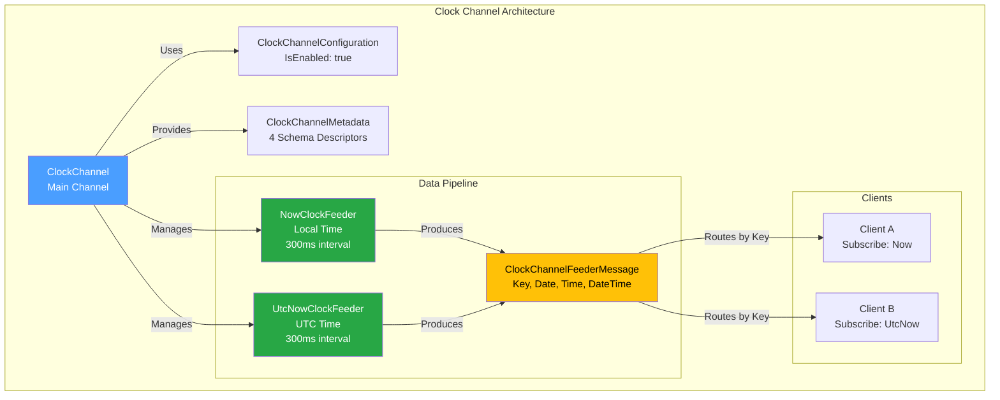
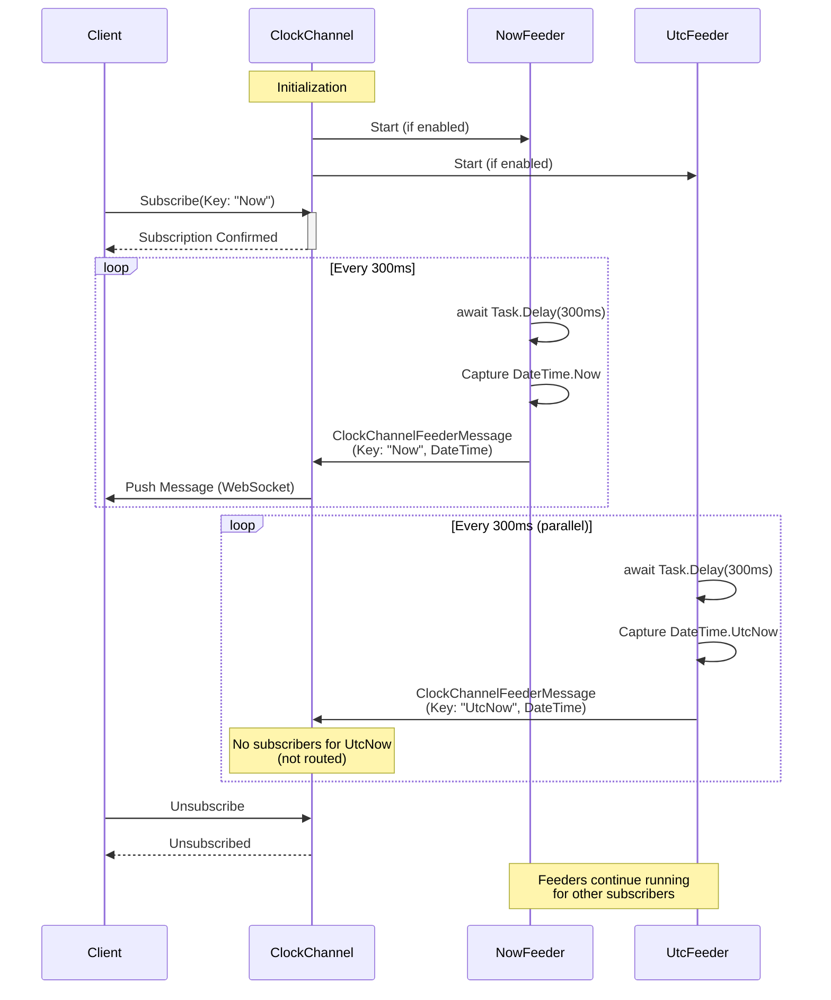

# Clock Channel

[↑ Back to Channels](../README.md) | [→ All Documentation](/docs/README.md)

## Contents

- [Overview](#overview)
- [Files](#files)
- [Types & Members](#types--members)
- [ClockChannel](#clockchannel)
- [ClockChannelConfiguration](#clockchannelconfiguration)
- [ClockChannelMetadata](#clockchannelmetadata)
- [ClockChannelFeederMessage](#clockchannelfeedermessage)
- [NowClockFeeder](#nowclockfeeder)
- [UtcNowClockFeeder](#utcnowclockfeeder)
- [NowClockFeederConfiguration](#nowclockfeederconfiguration)
- [UtcNowClockFeederConfiguration](#utcnowclockfeederconfiguration)
- [ClockChannelExtensions](#clockchannelextensions)
- [Diagrams](#diagrams)
  - [Architecture Overview](#architecture-overview)
  - [Feeder Data Flow](#feeder-data-flow)
  - [Type Relationships](#type-relationships)
- [ThunderPropagator Dependencies](#thunderpropagator-dependencies)
- [Examples](#examples)
- [See Also](#see-also)

## Overview

The **Clock Channel** provides real-time streaming of current date and time information via two independent feeders. Clients can subscribe to local time (`Now`) or UTC time (`UtcNow`) feeds that emit updates every 300ms. This channel demonstrates the simplest form of data streaming in ThunderPropagator, making it ideal for testing, demos, or applications requiring synchronized time displays across distributed clients.

The channel implements a pure push-based model with no receive pipelines, relying entirely on iterative feeders to generate time data. Both feeders run independently and clients select which feed to subscribe to via the subscription key parameter.

## Files

| File | Primary Type(s) | LOC (approx) | Responsibility |
|------|-----------------|--------------|----------------|
| [ClockChannel.cs](../../../src/Channels/ThunderPropagator.Channels.Clock/ClockChannel.cs) | `ClockChannel` | 15 | Main channel implementation inheriting `AbstractChannel` |
| [ClockChannelConfiguration.cs](../../../src/Channels/ThunderPropagator.Channels.Clock/ClockChannelConfiguration.cs) | `ClockChannelConfiguration` | 19 | Channel configuration with feeder settings |
| [ClockChannelMetadata.cs](../../../src/Channels/ThunderPropagator.Channels.Clock/ClockChannelMetadata.cs) | `ClockChannelMetadata` | 21 | Channel schema descriptors for client-side validation |
| [ClockChannelFeederMessage.cs](../../../src/Channels/ThunderPropagator.Channels.Clock/ClockChannelFeederMessage.cs) | `ClockChannelFeederMessage` | 48 | Data contract for time messages (Key, Date, Time, DateTime) |
| [NowClockFeeder.cs](../../../src/Channels/ThunderPropagator.Channels.Clock/NowClockFeeder.cs) | `NowClockFeeder` | 30 | Feeder emitting `DateTime.Now` every 300ms |
| [UtcNowClockFeeder.cs](../../../src/Channels/ThunderPropagator.Channels.Clock/UtcNowClockFeeder.cs) | `UtcNowClockFeeder` | 29 | Feeder emitting `DateTime.UtcNow` every 300ms |
| [NowClockFeederConfiguration.cs](../../../src/Channels/ThunderPropagator.Channels.Clock/NowClockFeederConfiguration.cs) | `NowClockFeederConfiguration` | 18 | Configuration for local time feeder |
| [UtcNowClockFeederConfiguration.cs](../../../src/Channels/ThunderPropagator.Channels.Clock/UtcNowClockFeederConfiguration.cs) | `UtcNowClockFeederConfiguration` | 18 | Configuration for UTC time feeder |
| [ClockChannelExtensions.cs](../../../src/Channels/ThunderPropagator.Channels.Clock/ClockChannelExtensions.cs) | `ClockChannelExtensions` | 22 | DI registration via `AddClockChannel()` |
| [AssemblyInfo.cs](../../../src/Channels/ThunderPropagator.Channels.Clock/AssemblyInfo.cs) | - | 3 | Assembly-level attributes |

[↑ Back to top](#clock-channel)

## Types & Members

| Type | Kind | Summary | Inherits/Implements | Key Members |
|------|------|---------|---------------------|-------------|
| `ClockChannel` | Class (sealed in Release) | Main channel coordinating time feeders | `AbstractChannel<ClockChannelMetadata, ClockChannelConfiguration>` | Constructor |
| `ClockChannelConfiguration` | Class (sealed in Release) | Channel configuration with feeder settings | `AbstractChannelConfiguration` | `NowClockFeederConfiguration`, `UtcNowClockFeederConfiguration`, `IsEnabled` |
| `ClockChannelMetadata` | Class (sealed in Release) | Schema descriptors for channel data | `AbstractChannelMetadata<ClockChannel>` | `ChannelProgramsDescriptors` (4 descriptors) |
| `ClockChannelFeederMessage` | Class (internal, sealed in Release) | Time data contract | `FeederMessage` | `Key`, `Date`, `Time`, `DateTime` |
| `NowClockFeeder` | Class (internal, sealed in Release) | Local time feeder | `IterativeFeeder<ClockChannel, ClockChannelFeederMessage, NowClockFeederConfiguration>` | `ReceiveAsync()` |
| `UtcNowClockFeeder` | Class (internal, sealed in Release) | UTC time feeder | `IterativeFeeder<ClockChannel, ClockChannelFeederMessage, UtcNowClockFeederConfiguration>` | `ReceiveAsync()` |
| `NowClockFeederConfiguration` | Class (sealed in Release) | Local feeder config | `AbstractFeederConfiguration` | `IsEnabled`, `Bind()` |
| `UtcNowClockFeederConfiguration` | Class (sealed in Release) | UTC feeder config | `AbstractFeederConfiguration` | `IsEnabled`, `Bind()` |
| `ClockChannelExtensions` | Static Class | DI registration extensions | - | `AddClockChannel()` |

[↑ Back to top](#clock-channel)

## ClockChannel

**Namespace:** `ThunderPropagator.Channels.Clock`  
**Inheritance:** `AbstractChannel<ClockChannelMetadata, ClockChannelConfiguration>`  
**Modifiers:** `public`, `sealed` (in Release builds only)

The core channel implementation coordinating two independent time feeders. This channel has no custom logic beyond the base channel infrastructure, relying entirely on feeders for data generation.

### Constructor

```csharp
public ClockChannel(IServiceProvider serviceProvider)
```

Initializes the channel with dependency injection support. The base constructor handles feeder discovery and lifecycle management.

**Parameters:**
- `serviceProvider` — DI container for resolving feeders and other dependencies

[↑ Back to top](#clock-channel)

## ClockChannelConfiguration

**Namespace:** `ThunderPropagator.Channels.Clock`  
**Inheritance:** `AbstractChannelConfiguration`  
**Modifiers:** `public`, `sealed` (in Release builds only)

Configuration class managing channel and feeder settings. Both feeders are enabled by default.

### Properties

```csharp
public NowClockFeederConfiguration NowClockFeederConfiguration { get; set; }
public UtcNowClockFeederConfiguration UtcNowClockFeederConfiguration { get; set; }
```

Individual feeder configurations. Modify these to disable feeders or customize their behavior.

### Constructor

```csharp
public ClockChannelConfiguration()
```

Initializes configuration with `IsEnabled = true` and default feeder configurations.

[↑ Back to top](#clock-channel)

## ClockChannelMetadata

**Namespace:** `ThunderPropagator.Channels.Clock`  
**Inheritance:** `AbstractChannelMetadata<ClockChannel>`  
**Modifiers:** `public`, `sealed` (in Release builds only)

Provides schema descriptors for client-side type validation and IDE IntelliSense support. Defines the structure of messages sent by feeders.

### Properties

```csharp
public override ChannelProgramsDescriptorCollection ChannelProgramsDescriptors { get; }
```

Returns a collection of 4 descriptors:

| Index | Name | Type | Description |
|-------|------|------|-------------|
| 0 | `Key` | `SubscribingKeyChannelProgramsDescriptor` | Subscription key: "Now" or "UtcNow" |
| 1 | `Date` | `DateChannelProgramsDescriptor` | Current date component |
| 2 | `Time` | `TimeChannelProgramsDescriptor` | Current time component |
| 3 | `DateTime` | `DateTimeChannelProgramsDescriptor` | Full date and time value |

[↑ Back to top](#clock-channel)

## ClockChannelFeederMessage

**Namespace:** `ThunderPropagator.Channels.Clock`  
**Inheritance:** `FeederMessage`  
**Modifiers:** `internal`, `sealed` (in Release builds only)

Data contract for time messages transmitted to subscribers. Uses `FeederMessage` base class for efficient property storage and serialization.

### Constructors

```csharp
public ClockChannelFeederMessage()
internal ClockChannelFeederMessage(string key, DateTime dateTime)
```

The parameterless constructor is required for deserialization. The internal constructor initializes all properties from a `DateTime` value.

### Properties

```csharp
public string Key { get; private set; }
```
Identifies the feed source: `"Now"` or `"UtcNow"`. Used for subscription routing.

```csharp
public DateTime Date { get; private set; }
```
Date component extracted via `DateTime.Date`. Normalized to midnight.

```csharp
public TimeSpan Time { get; private set; }
```
Time component extracted via `DateTime.TimeOfDay`. Represents time since midnight.

```csharp
public DateTime DateTime { get; private set; }
```
Full `DateTime` value as provided by the feeder.

[↑ Back to top](#clock-channel)

## NowClockFeeder

**Namespace:** `ThunderPropagator.Channels.Clock`  
**Inheritance:** `IterativeFeeder<ClockChannel, ClockChannelFeederMessage, NowClockFeederConfiguration>`  
**Modifiers:** `internal`, `sealed` (in Release builds only)

Feeder generating local time updates using `DateTime.Now`. Emits messages every 300ms with health monitoring enabled.

### Constructor

```csharp
public NowClockFeeder(
    ClockChannel channel,
    NowClockFeederConfiguration feederConfiguration,
    IFeederHandler<ClockChannel, ClockChannelFeederMessage> feederHandler,
    IServiceProvider serviceProvider)
```

Initializes feeder with health monitoring:
- `HealthName`: `"NowClockFeeder"`
- `HealthTags`: includes `"StaticFeeder"` tag

### Methods

```csharp
protected override async IAsyncEnumerable<FeederReceivedMessage<ClockChannelFeederMessage>> ReceiveAsync(
    CancellationToken cancellationToken = default)
```

Generates time messages in an infinite loop:
1. Delays 300ms (configurable interval for production)
2. Captures `DateTime.Now`
3. Yields `ClockChannelFeederMessage` with key `"Now"`
4. Repeats until cancellation

[↑ Back to top](#clock-channel)

## UtcNowClockFeeder

**Namespace:** `ThunderPropagator.Channels.Clock`  
**Inheritance:** `IterativeFeeder<ClockChannel, ClockChannelFeederMessage, UtcNowClockFeederConfiguration>`  
**Modifiers:** `internal`, `sealed` (in Release builds only)

Feeder generating UTC time updates using `DateTime.UtcNow`. Identical to `NowClockFeeder` but uses UTC timezone.

### Constructor

```csharp
public UtcNowClockFeeder(
    ClockChannel channel,
    UtcNowClockFeederConfiguration feederConfiguration,
    IFeederHandler<ClockChannel, ClockChannelFeederMessage> feederHandler,
    IServiceProvider serviceProvider)
```

Initializes feeder with health monitoring:
- `HealthName`: `"UtcNowClockFeeder"`
- `HealthTags`: includes `"StaticFeeder"` tag

### Methods

```csharp
protected override async IAsyncEnumerable<FeederReceivedMessage<ClockChannelFeederMessage>> ReceiveAsync(
    CancellationToken cancellationToken = default)
```

Generates UTC time messages:
1. Delays 300ms
2. Captures `DateTime.UtcNow`
3. Yields `ClockChannelFeederMessage` with key `"UtcNow"`
4. Repeats until cancellation

[↑ Back to top](#clock-channel)

## NowClockFeederConfiguration

**Namespace:** `ThunderPropagator.Channels.Clock`  
**Inheritance:** `AbstractFeederConfiguration`  
**Modifiers:** `public`, `sealed` (in Release builds only)

Configuration for the local time feeder. Enabled by default.

### Methods

```csharp
internal void Bind(NowClockFeederConfiguration nowClockFeederConfiguration)
```

Copies configuration settings from another instance (used during DI registration).

[↑ Back to top](#clock-channel)

## UtcNowClockFeederConfiguration

**Namespace:** `ThunderPropagator.Channels.Clock`  
**Inheritance:** `AbstractFeederConfiguration`  
**Modifiers:** `public`, `sealed` (in Release builds only)

Configuration for the UTC time feeder. Enabled by default.

### Methods

```csharp
internal void Bind(UtcNowClockFeederConfiguration utcNowClockFeederConfiguration)
```

Copies configuration settings from another instance (used during DI registration).

[↑ Back to top](#clock-channel)

## ClockChannelExtensions

**Namespace:** `ThunderPropagator.Channels.Clock`  
**Modifiers:** `public static`

DI registration extensions for the Clock channel.

### Methods

```csharp
public static IServiceCollection AddClockChannel(
    this IServiceCollection services,
    Action<ClockChannelConfiguration>? channelConfigurator = null)
```

Registers the Clock channel with all feeders:
1. Creates and optionally configures `ClockChannelConfiguration`
2. Registers configuration as singleton
3. Registers `ClockChannel` via `AddChannel<T>()`
4. Registers both feeders with configuration binding
5. Returns services for fluent chaining

**Example:**
```csharp
services.AddClockChannel(config =>
{
    config.UtcNowClockFeederConfiguration.IsEnabled = false; // Disable UTC feeder
});
```

[↑ Back to top](#clock-channel)

## Diagrams

### Architecture Overview



### Feeder Data Flow



### Type Relationships

```mermaid
classDiagram
    class AbstractChannel~TMetadata, TConfiguration~ {
        <<abstract>>
        +IServiceProvider ServiceProvider
        #OnSubscriptionRemoved()
    }
    
    class ClockChannel {
        +ClockChannel(IServiceProvider)
    }
    
    class AbstractChannelConfiguration {
        <<abstract>>
        +bool IsEnabled
    }
    
    class ClockChannelConfiguration {
        +NowClockFeederConfiguration NowClockFeederConfiguration
        +UtcNowClockFeederConfiguration UtcNowClockFeederConfiguration
        +bool IsEnabled
    }
    
    class AbstractChannelMetadata~TChannel~ {
        <<abstract>>
        +ChannelProgramsDescriptorCollection ChannelProgramsDescriptors
    }
    
    class ClockChannelMetadata {
        +ChannelProgramsDescriptorCollection ChannelProgramsDescriptors
    }
    
    class FeederMessage {
        <<abstract>>
        #GetValueOrDefault~T~()
        #SetValue~T~()
    }
    
    class ClockChannelFeederMessage {
        +string Key
        +DateTime Date
        +TimeSpan Time
        +DateTime DateTime
    }
    
    class IterativeFeeder~TChannel, TMessage, TConfig~ {
        <<abstract>>
        +string HealthName
        +List~string~ HealthTags
        #ReceiveAsync() IAsyncEnumerable~FeederReceivedMessage~
    }
    
    class NowClockFeeder {
        +NowClockFeeder(...)
        #ReceiveAsync() IAsyncEnumerable~FeederReceivedMessage~
    }
    
    class UtcNowClockFeeder {
        +UtcNowClockFeeder(...)
        #ReceiveAsync() IAsyncEnumerable~FeederReceivedMessage~
    }
    
    class AbstractFeederConfiguration {
        <<abstract>>
        +bool IsEnabled
    }
    
    class NowClockFeederConfiguration {
        +bool IsEnabled
        #Bind()
    }
    
    class UtcNowClockFeederConfiguration {
        +bool IsEnabled
        #Bind()
    }
    
    AbstractChannel~TMetadata, TConfiguration~ <|-- ClockChannel
    AbstractChannelConfiguration <|-- ClockChannelConfiguration
    AbstractChannelMetadata~TChannel~ <|-- ClockChannelMetadata
    FeederMessage <|-- ClockChannelFeederMessage
    IterativeFeeder~TChannel, TMessage, TConfig~ <|-- NowClockFeeder
    IterativeFeeder~TChannel, TMessage, TConfig~ <|-- UtcNowClockFeeder
    AbstractFeederConfiguration <|-- NowClockFeederConfiguration
    AbstractFeederConfiguration <|-- UtcNowClockFeederConfiguration
    
    ClockChannel ..> ClockChannelMetadata : uses
    ClockChannel ..> ClockChannelConfiguration : uses
    ClockChannel ..> NowClockFeeder : manages
    ClockChannel ..> UtcNowClockFeeder : manages
    NowClockFeeder ..> ClockChannelFeederMessage : produces
    UtcNowClockFeeder ..> ClockChannelFeederMessage : produces
    NowClockFeeder ..> NowClockFeederConfiguration : configured by
    UtcNowClockFeeder ..> UtcNowClockFeederConfiguration : configured by
    ClockChannelConfiguration *-- NowClockFeederConfiguration
    ClockChannelConfiguration *-- UtcNowClockFeederConfiguration
```



[↑ Back to top](#clock-channel)

## ThunderPropagator Dependencies

| Package | Version | Description | Links |
|---------|---------|-------------|-------|
| ThunderPropagator (platform-specific) | 1.0.1-beta.5 | Core framework providing `AbstractChannel`, `IterativeFeeder`, `FeederMessage`, and pub/sub infrastructure | [GitHub Packages](https://github.com/orgs/ThunderPropagator/packages) |

**Note:** The package ID varies by configuration and platform:
- Debug builds: `ThunderPropagator.Debug.{Platform}`
- Release builds: `ThunderPropagator.{Platform}` (AnyCPU omits platform suffix)

All framework classes (`AbstractChannel`, `IterativeFeeder`, etc.) are part of the core ThunderPropagator package.

[↑ Back to top](#clock-channel)

## Examples

### Basic Registration

```csharp
using Microsoft.Extensions.DependencyInjection;
using ThunderPropagator.Channels.Clock;

var services = new ServiceCollection();

// Register with default configuration (both feeders enabled)
services.AddClockChannel();
```

### Custom Configuration

```csharp
services.AddClockChannel(config =>
{
    // Disable UTC feeder, keep local time only
    config.UtcNowClockFeederConfiguration.IsEnabled = false;
    
    // Channel remains enabled
    config.IsEnabled = true;
});
```

### Client Subscription (Conceptual)

```csharp
// Client subscribes to local time feed
var subscription = await channel.SubscribeAsync(new Dictionary<string, object>
{
    ["Key"] = "Now" // or "UtcNow" for UTC feed
});

// Receive messages every 300ms
subscription.OnMessage(message =>
{
    var clockMessage = message as ClockChannelFeederMessage;
    Console.WriteLine($"Time: {clockMessage.DateTime:HH:mm:ss}");
    Console.WriteLine($"Date: {clockMessage.Date:yyyy-MM-dd}");
});
```

### Feeder Health Monitoring

```csharp
// Both feeders expose health information
// HealthName: "NowClockFeeder" or "UtcNowClockFeeder"
// HealthTags: ["StaticFeeder", ...]

// Use IHealthCheckService to monitor feeder status
var healthCheck = serviceProvider.GetRequiredService<IHealthCheckService>();
var feederHealth = await healthCheck.CheckHealthAsync("NowClockFeeder");
```

[↑ Back to top](#clock-channel)

## See Also

- [Channels Overview](../README.md) — All 7 production channels
- [TimeZones Channel](../TimeZones/README.md) — Advanced time management with NodaTime integration
- [Notifications Channel](../Notifications/README.md) — Another simple push-only channel example
- [Chat Channel](../Chat/README.md) — Complex bidirectional channel with pipelines
- [Main Documentation](/docs/README.md) — Repository documentation home

[↑ Back to top](#clock-channel)
