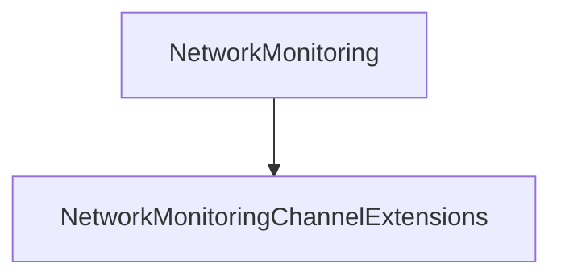

# NetworkMonitoring

## Contents

- [Overview](#overview)
- [Files](#files)
- [Types and Members](#types-and-members)
- [Performance Notes](#performance-notes)
- [Package Dependencies](#package-dependencies)
- [Diagrams](#diagrams)
- [Examples](#examples)
- [See Also](#see-also)

## Overview

The **NetworkMonitoring** area groups 1 documented type, including `NetworkMonitoringChannelExtensions`. It provides the contracts and implementation used by this part of ThunderPropagator.Channels.

## Files

| File | Primary type(s)/symbol(s) | LOC (approx.) | Responsibility |
|---|---|---:|---|
| `AssemblyInfo.cs` | — | 5 | Contains the assembly info implementation or configuration. |
| `NetworkMonitoringChannel.cs` | `NetworkMonitoringChannel` | 15 | Defines NetworkMonitoringChannel and its related behavior. |
| `NetworkMonitoringChannelConfiguration.cs` | `NetworkMonitoringChannelConfiguration` | 18 | Defines NetworkMonitoringChannelConfiguration and its related behavior. |
| `NetworkMonitoringChannelExtensions.cs` | `NetworkMonitoringChannelExtensions` | 22 | Defines NetworkMonitoringChannelExtensions and its related behavior. |
| `NetworkMonitoringChannelFeeder.cs` | `NetworkMonitoringChannelFeeder` | 56 | Defines NetworkMonitoringChannelFeeder and its related behavior. |
| `NetworkMonitoringChannelFeederConfiguration.cs` | `NetworkMonitoringChannelFeederConfiguration` | 18 | Defines NetworkMonitoringChannelFeederConfiguration and its related behavior. |
| `NetworkMonitoringChannelFeederMessage.cs` | `NetworkMonitoringChannelFeederMessage` | 40 | Defines NetworkMonitoringChannelFeederMessage and its related behavior. |
| `NetworkMonitoringChannelMetadata.cs` | `NetworkMonitoringChannelMetadata` | 26 | Defines NetworkMonitoringChannelMetadata and its related behavior. |
| `ThunderPropagator.Channels.NetworkMonitoring.csproj` | — | 22 | Defines project build targets, dependencies, and package metadata. |

## Types and Members

| Type | Kind | Summary | Inherits/Implements | Key Members |
|---|---|---|---|---|
| [`NetworkMonitoringChannelExtensions`](#networkmonitoringchannelextensions) | class | Represents the NetworkMonitoringChannelExtensions class. | — | `AddNetworkMonitoringChannel(…)` |

### NetworkMonitoringChannelExtensions

- **Kind:** class
- **Namespace:** `ThunderPropagator.Channels.NetworkMonitoring`
- **Inherits/implements:** None declared
- **Attributes:** None detected
- **Key members:** `AddNetworkMonitoringChannel(…)`
- **Summary:** Represents the NetworkMonitoringChannelExtensions class.
- **Thread safety:** Follow the lifetime and concurrency guarantees of the owning component; no additional guarantee is inferred.

**Usage recipe**

```csharp
// Resolve NetworkMonitoringChannelExtensions from the configured service container or construct it with its declared dependencies.
```

[↑ Back to top](#contents)

## Performance Notes

This area contains performance-sensitive constructs such as pooled buffers, spans, asynchronous value types, or concurrent collections. Avoid unnecessary allocations and blocking calls on streaming or message-processing paths.

## Package Dependencies

| Package | Version | Description | Links |
|---|---|---|---|
| `Bogus` | `35.6.5` | External dependency used by the repository. | [Registry](https://www.nuget.org/packages/Bogus) |
| `Microsoft.Extensions.Caching.StackExchangeRedis` | `10.*` | External dependency used by the repository. | [Registry](https://www.nuget.org/packages/Microsoft.Extensions.Caching.StackExchangeRedis) |
| `Microsoft.Extensions.Diagnostics.Testing` | `10.*` | External dependency used by the repository. | [Registry](https://www.nuget.org/packages/Microsoft.Extensions.Diagnostics.Testing) |
| `Microsoft.Extensions.Http.Polly` | `10.*` | External dependency used by the repository. | [Registry](https://www.nuget.org/packages/Microsoft.Extensions.Http.Polly) |
| `NodaTime` | `3.3.2` | External dependency used by the repository. | [Registry](https://www.nuget.org/packages/NodaTime) |

## Diagrams

### Component overview



The diagram shows the direct components documented by the **NetworkMonitoring** area.

## Examples

Start with `NetworkMonitoringChannelExtensions` as the primary entry point for this folder, then follow its linked contracts and collaborators.

## See Also

- [Parent area](../README.md)
- [Chat](../Chat/README.md)
- [Clock](../Clock/README.md)
- [Notifications](../Notifications/README.md)
- [ResourceMonitoring](../ResourceMonitoring/README.md)
- [Throughput](../Throughput/README.md)
- [TimeZones](../TimeZones/README.md)

[↑ Back to top](#contents)
