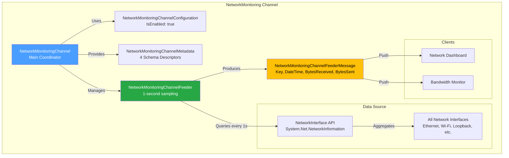
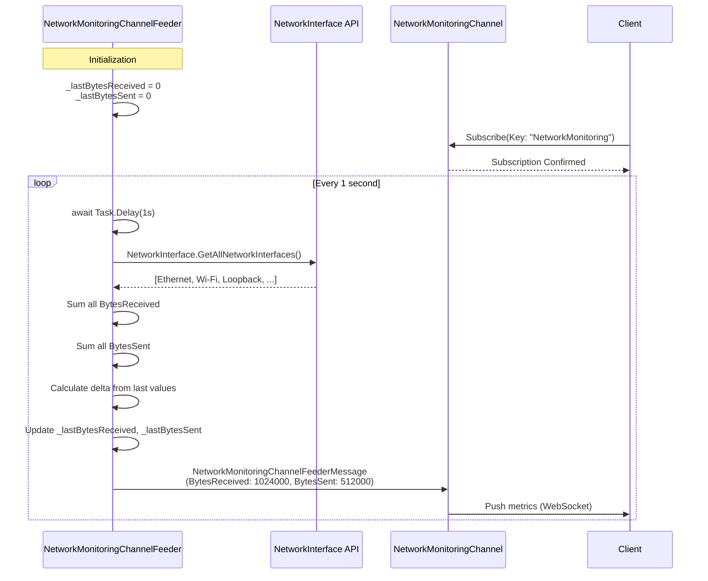

# NetworkMonitoring Channel

[↑ Back to Channels](../README.md) | [→ All Documentation](/docs/README.md)

## Contents

- [Overview](#overview)
- [Files](#files)
- [Types & Members](#types--members)
- [NetworkMonitoringChannel](#networkmonitoringchannel)
- [NetworkMonitoringChannelConfiguration](#networkmonitoringchannelconfiguration)
- [NetworkMonitoringChannelMetadata](#networkmonitoringchannelmetadata)
- [NetworkMonitoringChannelFeederMessage](#networkmonitoringchannelfeedermessage)
- [NetworkMonitoringChannelFeeder](#networkmonitoringchannelfeeder)
- [NetworkMonitoringChannelFeederConfiguration](#networkmonitoringchannelfeederconfiguration)
- [NetworkMonitoringChannelExtensions](#networkmonitoringchannelextensions)
- [Diagrams](#diagrams)
- [ThunderPropagator Dependencies](#thunderpropagator-dependencies)
- [Examples](#examples)
- [See Also](#see-also)

## Overview

The **NetworkMonitoring Channel** provides real-time monitoring of network performance metrics across all network interfaces. This push-only channel tracks bytes received and bytes sent with 1-second sampling intervals, enabling network operations dashboards, bandwidth monitoring, and diagnostics.

The feeder utilizes .NET's `System.Net.NetworkInformation.NetworkInterface` API to aggregate statistics from all active network interfaces, calculating delta values to provide per-second throughput measurements. Ideal for infrastructure monitoring, capacity planning, and network troubleshooting.

## Files

| File | Primary Type(s) | LOC (approx) | Responsibility |
|------|-----------------|--------------|----------------|
| [NetworkMonitoringChannel.cs](../../../src/Channels/ThunderPropagator.Channels.NetworkMonitoring/NetworkMonitoringChannel.cs) | `NetworkMonitoringChannel` | 15 | Main channel implementation |
| [NetworkMonitoringChannelConfiguration.cs](../../../src/Channels/ThunderPropagator.Channels.NetworkMonitoring/NetworkMonitoringChannelConfiguration.cs) | `NetworkMonitoringChannelConfiguration` | ~18 | Channel configuration |
| [NetworkMonitoringChannelMetadata.cs](../../../src/Channels/ThunderPropagator.Channels.NetworkMonitoring/NetworkMonitoringChannelMetadata.cs) | `NetworkMonitoringChannelMetadata` | ~20 | Schema descriptors |
| [NetworkMonitoringChannelFeederMessage.cs](../../../src/Channels/ThunderPropagator.Channels.NetworkMonitoring/NetworkMonitoringChannelFeederMessage.cs) | `NetworkMonitoringChannelFeederMessage` | 37 | Data contract (Key, DateTime, BytesReceived, BytesSent) |
| [NetworkMonitoringChannelFeeder.cs](../../../src/Channels/ThunderPropagator.Channels.NetworkMonitoring/NetworkMonitoringChannelFeeder.cs) | `NetworkMonitoringChannelFeeder` | 60 | Network statistics collection feeder |
| [NetworkMonitoringChannelFeederConfiguration.cs](../../../src/Channels/ThunderPropagator.Channels.NetworkMonitoring/NetworkMonitoringChannelFeederConfiguration.cs) | `NetworkMonitoringChannelFeederConfiguration` | ~18 | Feeder configuration |
| [NetworkMonitoringChannelExtensions.cs](../../../src/Channels/ThunderPropagator.Channels.NetworkMonitoring/NetworkMonitoringChannelExtensions.cs) | `NetworkMonitoringChannelExtensions` | ~22 | DI registration |
| [AssemblyInfo.cs](../../../src/Channels/ThunderPropagator.Channels.NetworkMonitoring/AssemblyInfo.cs) | - | 3 | Assembly attributes |

[↑ Back to top](#networkmonitoring-channel)

## Types & Members

| Type | Kind | Summary | Inherits/Implements | Key Members |
|------|------|---------|---------------------|-------------|
| `NetworkMonitoringChannel` | Class (sealed in Release) | Main channel coordinator | `AbstractChannel<NetworkMonitoringChannelMetadata, NetworkMonitoringChannelConfiguration>` | Constructor |
| `NetworkMonitoringChannelConfiguration` | Class (sealed in Release) | Channel configuration | `AbstractChannelConfiguration` | `NetworkMonitoringChannelFeederConfiguration`, `IsEnabled` |
| `NetworkMonitoringChannelMetadata` | Class (sealed in Release) | Schema descriptors | `AbstractChannelMetadata<NetworkMonitoringChannel>` | `ChannelProgramsDescriptors` (4 descriptors) |
| `NetworkMonitoringChannelFeederMessage` | Class (internal, sealed in Release) | Network metrics data contract | `FeederMessage` | `Key`, `DateTime`, `BytesReceived`, `BytesSent` |
| `NetworkMonitoringChannelFeeder` | Class (internal, sealed in Release) | Network stats collector | `IterativeFeeder<...>` | `ReceiveAsync()`, delta tracking |
| `NetworkMonitoringChannelFeederConfiguration` | Class (sealed in Release) | Feeder configuration | `AbstractFeederConfiguration` | `IsEnabled`, `Bind()` |
| `NetworkMonitoringChannelExtensions` | Static Class | DI registration | - | `AddNetworkMonitoringChannel()` |

[↑ Back to top](#networkmonitoring-channel)

## NetworkMonitoringChannel

**Namespace:** `ThunderPropagator.Channels.NetworkMonitoring`  
**Inheritance:** `AbstractChannel<NetworkMonitoringChannelMetadata, NetworkMonitoringChannelConfiguration>`  
**Modifiers:** `public`, `sealed` (in Release builds only)

Simple channel implementation with no custom logic. Delegates entirely to the feeder for network data collection.

### Constructor

```csharp
public NetworkMonitoringChannel(IServiceProvider serviceProvider)
```

[↑ Back to top](#networkmonitoring-channel)

## NetworkMonitoringChannelConfiguration

**Namespace:** `ThunderPropagator.Channels.NetworkMonitoring`  
**Inheritance:** `AbstractChannelConfiguration`

Configuration class managing channel and feeder settings.

### Properties

```csharp
public NetworkMonitoringChannelFeederConfiguration NetworkMonitoringChannelFeederConfiguration { get; set; }
```

[↑ Back to top](#networkmonitoring-channel)

## NetworkMonitoringChannelMetadata

**Namespace:** `ThunderPropagator.Channels.NetworkMonitoring`  
**Inheritance:** `AbstractChannelMetadata<NetworkMonitoringChannel>`

Schema descriptors for network monitoring data.

### Properties

```csharp
public override ChannelProgramsDescriptorCollection ChannelProgramsDescriptors { get; }
```

Returns 4 descriptors:

| Index | Name | Type | Description |
|-------|------|------|-------------|
| 0 | `Key` | `SubscribingKey` | Subscription key (always "NetworkMonitoring") |
| 1 | `DateTime` | `String` | Unix timestamp (seconds) |
| 2 | `BytesReceived` | `Number` | Bytes received delta (per second) |
| 3 | `BytesSent` | `Number` | Bytes sent delta (per second) |

[↑ Back to top](#networkmonitoring-channel)

## NetworkMonitoringChannelFeederMessage

**Namespace:** `ThunderPropagator.Channels.NetworkMonitoring`  
**Inheritance:** `FeederMessage`  
**Modifiers:** `internal`, `sealed` (in Release builds only)

Data contract for network performance metrics with per-second throughput deltas.

### Properties

```csharp
public string Key { get; private set; }
```
Always set to `"NetworkMonitoring"`. Used for subscription routing.

```csharp
public string DateTime { get; set; }
```
Unix timestamp in seconds (`DateTimeOffset.UtcNow.ToUnixTimeSeconds()`).

```csharp
public long BytesReceived { get; set; }
```
Bytes received delta since last measurement (per-second throughput).

```csharp
public long BytesSent { get; set; }
```
Bytes sent delta since last measurement (per-second throughput).

[↑ Back to top](#networkmonitoring-channel)

## NetworkMonitoringChannelFeeder

**Namespace:** `ThunderPropagator.Channels.NetworkMonitoring`  
**Inheritance:** `IterativeFeeder<NetworkMonitoringChannel, NetworkMonitoringChannelFeederMessage, NetworkMonitoringChannelFeederConfiguration>`  
**Modifiers:** `internal`, `sealed` (in Release builds only)

Feeder collecting network statistics from all network interfaces using `System.Net.NetworkInformation` API. Tracks cumulative values and calculates deltas to provide per-second throughput measurements.

### Fields

```csharp
private long _lastBytesReceived;
private long _lastBytesSent;
```

Stores cumulative values from previous iteration for delta calculation.

### Constructor

```csharp
public NetworkMonitoringChannelFeeder(...)
```

Initializes feeder with health monitoring:
- `HealthName`: `"NetworkMonitoringChannelFeeder"`
- `HealthTags`: includes `"StaticFeeder"` tag

### Methods

```csharp
protected override async IAsyncEnumerable<FeederReceivedMessage<NetworkMonitoringChannelFeederMessage>> ReceiveAsync(
    CancellationToken cancellationToken = default)
```

Generates network metrics in infinite loop:
1. Delays 1 second
2. Queries all network interfaces via `NetworkInterface.GetAllNetworkInterfaces()`
3. Aggregates `BytesReceived` and `BytesSent` from all interfaces
4. Calculates deltas from previous values
5. Updates tracking fields
6. Yields message with per-second throughput
7. Repeats until cancellation

**Network Interfaces Queried**: All interfaces returned by `NetworkInterface.GetAllNetworkInterfaces()`, including Ethernet, Wi-Fi, loopback, and virtual adapters.

[↑ Back to top](#networkmonitoring-channel)

## NetworkMonitoringChannelFeederConfiguration

**Namespace:** `ThunderPropagator.Channels.NetworkMonitoring`  
**Inheritance:** `AbstractFeederConfiguration`

Configuration for network monitoring feeder. Enabled by default.

### Methods

```csharp
internal void Bind(NetworkMonitoringChannelFeederConfiguration configuration)
```

[↑ Back to top](#networkmonitoring-channel)

## NetworkMonitoringChannelExtensions

**Namespace:** `ThunderPropagator.Channels.NetworkMonitoring`

DI registration extensions.

### Methods

```csharp
public static IServiceCollection AddNetworkMonitoringChannel(
    this IServiceCollection services,
    Action<NetworkMonitoringChannelConfiguration>? channelConfigurator = null)
```

Registers channel with feeder.

[↑ Back to top](#networkmonitoring-channel)

## Diagrams

### Architecture Overview



### Data Flow



[↑ Back to top](#networkmonitoring-channel)

## ThunderPropagator Dependencies

| Package | Version | Description | Links |
|---------|---------|-------------|-------|
| ThunderPropagator (platform-specific) | 1.0.1-beta.5 | Core framework | [GitHub Packages](https://github.com/orgs/ThunderPropagator/packages) |

[↑ Back to top](#networkmonitoring-channel)

## Examples

### Basic Registration

```csharp
using Microsoft.Extensions.DependencyInjection;
using ThunderPropagator.Channels.NetworkMonitoring;

var services = new ServiceCollection();

services.AddNetworkMonitoringChannel(config =>
{
    config.IsEnabled = true;
    config.NetworkMonitoringChannelFeederConfiguration.IsEnabled = true;
});
```

### Client Subscription

```csharp
var subscription = await channel.SubscribeAsync(new Dictionary<string, object>
{
    ["Key"] = "NetworkMonitoring"
});

subscription.OnMessage(message =>
{
    var metrics = message as NetworkMonitoringChannelFeederMessage;
    
    // Convert to human-readable format
    var receivedMB = metrics.BytesReceived / 1024.0 / 1024.0;
    var sentMB = metrics.BytesSent / 1024.0 / 1024.0;
    
    Console.WriteLine($"↓ {receivedMB:F2} MB/s  ↑ {sentMB:F2} MB/s");
});
```

### Dashboard Visualization

```csharp
// Real-time network throughput chart
var chartData = new List<(DateTime Time, double DownloadMBps, double UploadMBps)>();

subscription.OnMessage(message =>
{
    var metrics = message as NetworkMonitoringChannelFeederMessage;
    var timestamp = DateTimeOffset.FromUnixTimeSeconds(long.Parse(metrics.DateTime)).DateTime;
    
    chartData.Add((
        Time: timestamp,
        DownloadMBps: metrics.BytesReceived / 1024.0 / 1024.0,
        UploadMBps: metrics.BytesSent / 1024.0 / 1024.0
    ));
    
    // Keep only last 60 seconds
    if (chartData.Count > 60)
        chartData.RemoveAt(0);
    
    UpdateChart(chartData);
});
```

[↑ Back to top](#networkmonitoring-channel)

## See Also

- [Channels Overview](../README.md) — All 7 production channels
- [ResourceMonitoring Channel](../ResourceMonitoring/README.md) — System resource monitoring
- [Throughput Channel](../Throughput/README.md) — High-volume streaming
- [Main Documentation](/docs/README.md) — Repository documentation home

[↑ Back to top](#networkmonitoring-channel)
