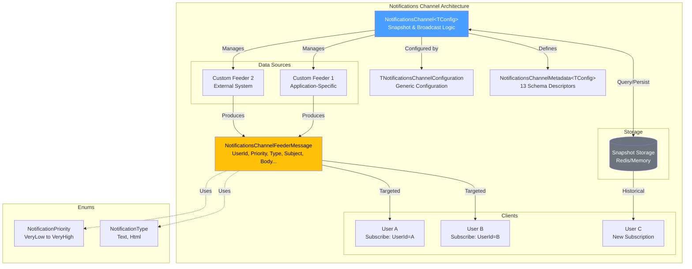
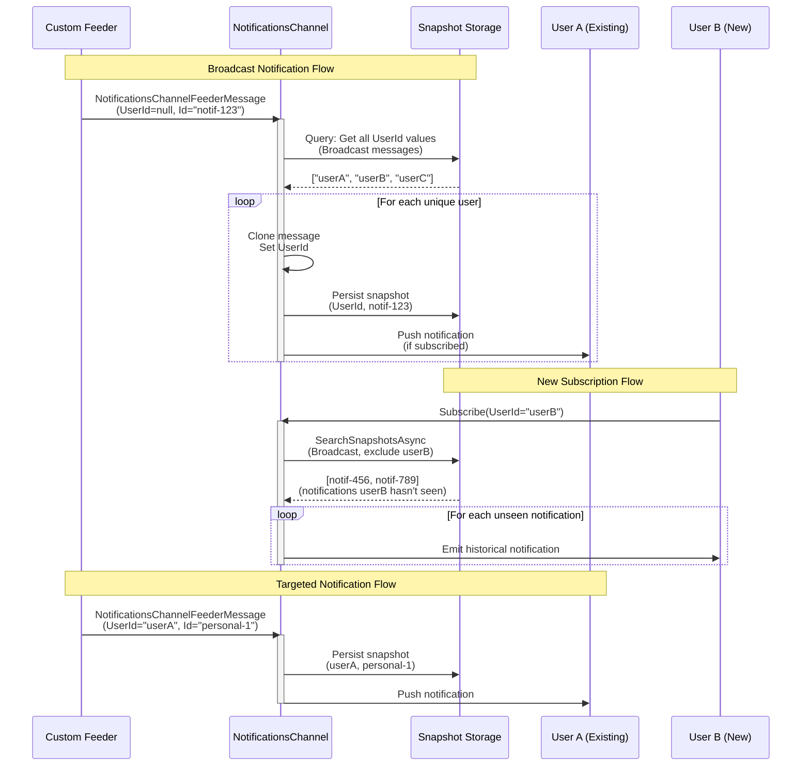

# Notifications Channel

[↑ Back to Channels](../README.md) | [→ All Documentation](/docs/README.md)

## Contents

- [Overview](#overview)
- [Files](#files)
- [Types & Members](#types--members)
- [NotificationsChannel](#notificationschannel)
- [NotificationsChannelMetadata](#notificationschannelmetadata)
- [NotificationsChannelFeederMessage](#notificationschannelfeedermessage)
- [NotificationPriority](#notificationpriority)
- [NotificationType](#notificationtype)
- [NotificationsFeederConfiguration](#notificationsfeederconfiguration)
- [NotificationsExtensions](#notificationsextensions)
- [Diagrams](#diagrams)
  - [Architecture Overview](#architecture-overview)
  - [Snapshot Flow](#snapshot-flow)
  - [Type Relationships](#type-relationships)
- [ThunderPropagator Dependencies](#thunderpropagator-dependencies)
- [Examples](#examples)
- [See Also](#see-also)

## Overview

The **Notifications Channel** provides a generic, production-ready user notification system with priority-based routing, multiple notification types, and snapshot-based message persistence. This channel demonstrates advanced ThunderPropagator patterns including custom `EmitMessage` logic for broadcast notifications, snapshot querying for state recovery, and flexible generic configuration.

Unlike simple push-only channels, Notifications implements sophisticated snapshot management to ensure new subscribers receive relevant historical notifications. The channel supports both targeted (user-specific) and broadcast notifications, with intelligent deduplication based on notification IDs and user subscriptions.

**Key capabilities**: Priority levels (VeryLow to VeryHigh), notification types (Text/HTML), broadcast and user-targeted delivery, snapshot-based history, and generic configuration model for extensibility.

## Files

| File | Primary Type(s) | LOC (approx) | Responsibility |
|------|-----------------|--------------|----------------|
| [NotificationsChannel.cs](../../../src/Channels/ThunderPropagator.Channels.Notifications/NotificationsChannel.cs) | `NotificationsChannel<T>` | 79 | Main channel with snapshot logic and broadcast handling |
| [NotificationsChannelMetadata.cs](../../../src/Channels/ThunderPropagator.Channels.Notifications/NotificationsChannelMetadata.cs) | `NotificationsChannelMetadata<T>` | 34 | Schema descriptors for 13 message fields |
| [NotificationsChannelFeederMessage.cs](../../../src/Channels/ThunderPropagator.Channels.Notifications/NotificationsChannelFeederMessage.cs) | `NotificationsChannelFeederMessage` | 101 | Data contract with UserId, Priority, Type, Subject, Body, etc. |
| [NotificationPriority.cs](../../../src/Channels/ThunderPropagator.Channels.Notifications/NotificationPriority.cs) | `NotificationPriority` | 11 | Enum: VeryLow, Low, Normal, High, VeryHigh |
| [NotificationType.cs](../../../src/Channels/ThunderPropagator.Channels.Notifications/NotificationType.cs) | `NotificationType` | 8 | Enum: Text, Html |
| [NotificationsFeederConfiguration.cs](../../../src/Channels/ThunderPropagator.Channels.Notifications/NotificationsFeederConfiguration.cs) | `NotificationsFeederConfiguration` | 6 | Abstract base for custom feeder configurations |
| [NotificationsExtensions.cs](../../../src/Channels/ThunderPropagator.Channels.Notifications/NotificationsExtensions.cs) | `NotificationsExtensions` | 49 | DI registration with generic configuration support |
| [AssemblyInfo.cs](../../../src/Channels/ThunderPropagator.Channels.Notifications/AssemblyInfo.cs) | - | 3 | Assembly-level attributes |

[↑ Back to top](#notifications-channel)

## Types & Members

| Type | Kind | Summary | Inherits/Implements | Key Members |
|------|------|---------|---------------------|-------------|
| `NotificationsChannel<TConfig>` | Class (sealed in Release) | Main channel with snapshot and broadcast logic | `AbstractChannel<NotificationsChannelMetadata<TConfig>, TConfig>` | `OnSubscriptionAdded()`, `EmitMessage()`, `SnapshotsToSendAsync()` |
| `NotificationsChannelMetadata<TConfig>` | Class (sealed in Release) | Schema descriptors for notifications | `AbstractChannelMetadata<NotificationsChannel<TConfig>>` | `ChannelProgramsDescriptors` (13 descriptors) |
| `NotificationsChannelFeederMessage` | Class (public, sealed in Release) | Notification data contract | `FeederMessage` | `UserId`, `Id`, `Priority`, `Type`, `Subject`, `Body`, `Seen`, etc. |
| `NotificationPriority` | Enum | Priority levels for notifications | - | `VeryLow(-2)`, `Low(-1)`, `Normal(0)`, `High(1)`, `VeryHigh(2)` |
| `NotificationType` | Enum | Content type for notifications | - | `Text(0)`, `Html(1)` |
| `NotificationsFeederConfiguration` | Abstract Class | Base for custom feeder configs | `AbstractFeederConfiguration` | Inherited: `IsEnabled` |
| `NotificationsExtensions` | Static Class | DI registration | - | `AddNotificationsChannel<T>()`, `AddNotificationsChannelFeeder<T>()` |

[↑ Back to top](#notifications-channel)

## NotificationsChannel

**Namespace:** `ThunderPropagator.Channels.Notifications`  
**Inheritance:** `AbstractChannel<NotificationsChannelMetadata<TNotificationsChannelConfiguration>, TNotificationsChannelConfiguration>`  
**Modifiers:** `public`, `sealed` (in Release builds only)  
**Generic Constraints:** `TNotificationsChannelConfiguration : AbstractChannelConfiguration, new()`

Advanced channel implementation with snapshot-based state management and broadcast notification support. Overrides key lifecycle methods to provide intelligent notification routing and historical data delivery.

### Constructor

```csharp
public NotificationsChannel(IServiceProvider serviceProvider)
```

Initializes channel and captures the application stopping cancellation token from `IHostApplicationLifetime` for async operations.

**Parameters:**
- `serviceProvider` — DI container providing `IHostApplicationLifetime` and other services

### Methods

#### OnSubscriptionAdded

```csharp
protected override void OnSubscriptionAdded(Subscription subscription)
```

Called when a new client subscribes. Queries snapshot storage for broadcast notifications that the user hasn't received (based on `UserId` not matching any snapshot entry for that notification `Id`). Sends deduplicated historical notifications to the new subscriber.

**Logic:**
1. Extract `UserId` from subscription parameters
2. Query snapshots for broadcast messages (`CastType.Broadcast`)
3. Group by notification `Id`
4. Filter groups where no entry matches the user's `UserId`
5. Emit first snapshot from each group to the subscriber

#### EmitMessage

```csharp
protected override void EmitMessage(FeederMessage feederMessage)
```

Custom message emission logic handling broadcast notifications. If `UserId` is empty/null, queries snapshots to find all unique users and emits the notification to each user individually.

**Logic:**
- **Targeted notification** (`UserId` set): Emits directly via base implementation
- **Broadcast notification** (`UserId` null/empty):
  1. Query snapshots for all broadcast messages
  2. Group by `UserId` to get unique user list
  3. Clone message for each user
  4. Set user-specific `UserId` and clear `HashKey`
  5. Emit individual messages

#### SnapshotsToSendAsync

```csharp
public override Task<SnapshotEntry[]> SnapshotsToSendAsync(
    Subscription subscription,
    CancellationToken cancellationToken = default)
```

Returns snapshots matching the subscription's subscribed keys. Used for state recovery when clients reconnect.

**Returns:** Array of `SnapshotEntry` objects matching subscription parameters

[↑ Back to top](#notifications-channel)

## NotificationsChannelMetadata

**Namespace:** `ThunderPropagator.Channels.Notifications`  
**Inheritance:** `AbstractChannelMetadata<NotificationsChannel<TNotificationsChannelConfiguration>>`  
**Modifiers:** `public`, `sealed` (in Release builds only)

Defines the schema for notification messages with 13 descriptors. Uses `SetTable()` method to organize descriptors into logical tables (`UserId`, `Date`, `Notifications`).

### Properties

```csharp
public override ChannelProgramsDescriptorCollection ChannelProgramsDescriptors { get; }
```

Returns 13 descriptors across 3 logical tables:

| Index | Name | Type | Description | Table |
|-------|------|------|-------------|-------|
| 0 | `UserId` | `SubscribingKey` | User identifier (subscription key) | `UserId` |
| 1 | `Date` | `SubscribingKey` | Notification date (subscription key) | `Date` |
| 2 | `Id` | `String` | Unique notification identifier | `Notifications` |
| 3 | `Time` | `Time` | Notification time | `Notifications` |
| 4 | `Origin` | `String` | Notification source/origin | `Notifications` |
| 5 | `Type` | `Enum<NotificationType>` | Text or HTML | `Notifications` |
| 6 | `Priority` | `Enum<NotificationPriority>` | VeryLow to VeryHigh | `Notifications` |
| 7 | `Icon` | `String` | Icon identifier/URL | `Notifications` |
| 8 | `Subject` | `String` | Notification title | `Notifications` |
| 9 | `Body` | `String` | Full notification content | `Notifications` |
| 10 | `EllipsisBody` | `String` | Truncated preview text | `Notifications` |
| 11 | `Seen` | `Number` | Seen status (bitwise flags) | `Notifications` |
| 12 | `Metadata` | `Json` | Custom JSON metadata | `Notifications` |

[↑ Back to top](#notifications-channel)

## NotificationsChannelFeederMessage

**Namespace:** `ThunderPropagator.Channels.Notifications`  
**Inheritance:** `FeederMessage`  
**Modifiers:** `public`, `sealed` (in Release builds only)

Comprehensive data contract for notification messages with 13 properties covering user targeting, priority, content, and metadata.

### Constructors

```csharp
public NotificationsChannelFeederMessage()
internal NotificationsChannelFeederMessage(IDictionary<string, object?> feederMessage)
```

The parameterless constructor is required for deserialization. The internal dictionary constructor copies all key-value pairs into the message (used for snapshot reconstruction).

### Properties

```csharp
public string? UserId { get; set; }
```
Target user ID. If null, treated as broadcast notification.

```csharp
public DateTime Date { get; private set; }
```
Notification date (populated automatically, private setter).

```csharp
public TimeSpan Time { get; private set; }
```
Notification time (populated automatically, private setter).

```csharp
public string Id { get; set; }
```
Unique notification identifier for deduplication and tracking.

```csharp
public string Origin { get; private set; }
```
Source system or component generating the notification.

```csharp
public NotificationType Type { get; private set; }
```
Content type: `Text` or `Html`.

```csharp
public NotificationPriority Priority { get; private set; }
```
Priority level: `VeryLow`, `Low`, `Normal`, `High`, or `VeryHigh`.

```csharp
public string Icon { get; private set; }
```
Icon identifier (e.g., FontAwesome class) or URL.

```csharp
public string Subject { get; private set; }
```
Notification title/headline.

```csharp
public string Body { get; private set; }
```
Full notification content (text or HTML based on `Type`).

```csharp
public string EllipsisBody { get; private set; }
```
Truncated preview text for UI lists.

```csharp
public int Seen { get; set; }
```
Bitwise flags indicating seen status (0 = unseen, can support multiple "seen" states).

```csharp
public string Metadata { get; private set; }
```
Custom JSON metadata for application-specific data.

[↑ Back to top](#notifications-channel)

## NotificationPriority

**Namespace:** `ThunderPropagator.Channels.Notifications`  
**Kind:** `enum`

Defines five priority levels for notifications with integer values for natural sorting.

### Values

```csharp
public enum NotificationPriority
{
    VeryLow = -2,  // Lowest priority
    Low = -1,       // Below normal
    Normal = 0,     // Default priority
    High = 1,       // Above normal
    VeryHigh = 2    // Highest priority
}
```

**Usage:** Allows UI to sort/filter notifications by importance and apply visual indicators (colors, icons).

[↑ Back to top](#notifications-channel)

## NotificationType

**Namespace:** `ThunderPropagator.Channels.Notifications`  
**Kind:** `enum`

Specifies the content type for notification rendering.

### Values

```csharp
public enum NotificationType
{
    Text = 0,  // Plain text content
    Html = 1   // HTML content (sanitize on client!)
}
```

**Usage:** Determines how clients render the `Body` property (escaped text vs. rendered HTML).

[↑ Back to top](#notifications-channel)

## NotificationsFeederConfiguration

**Namespace:** `ThunderPropagator.Channels.Notifications`  
**Inheritance:** `AbstractFeederConfiguration`  
**Modifiers:** `public` (abstract, no sealing)

Abstract base class for custom notification feeder configurations. Allows applications to define domain-specific feeder configurations while maintaining type safety.

**Note:** No implementation details in this class—purely for type constraint in generic methods.

[↑ Back to top](#notifications-channel)

## NotificationsExtensions

**Namespace:** `ThunderPropagator.Channels.Notifications`  
**Modifiers:** `public static`

DI registration extensions with generic configuration support. Allows applications to define custom channel and feeder configurations.

### Methods

#### AddNotificationsChannel (Action)

```csharp
public static IServiceCollection AddNotificationsChannel<TNotificationsChannelConfiguration>(
    this IServiceCollection services,
    Action<TNotificationsChannelConfiguration>? options = null)
    where TNotificationsChannelConfiguration : AbstractChannelConfiguration, new()
```

Registers the notifications channel with custom configuration type.

**Example:**
```csharp
services.AddNotificationsChannel<MyCustomNotificationConfig>(config =>
{
    config.IsEnabled = true;
    config.MyCustomProperty = "value";
});
```

#### AddNotificationsChannel (IConfigurationSection)

```csharp
public static IServiceCollection AddNotificationsChannel<TNotificationsChannelConfiguration>(
    this IServiceCollection services,
    IConfigurationSection configurationSection)
```

Registers channel binding configuration from `appsettings.json` or similar sources.

#### AddNotificationsChannelFeeder

```csharp
public static IServiceCollection AddNotificationsChannelFeeder<TFeeder, TNotificationsChannelConfiguration, TNotificationsFeederConfiguration>(
    this IServiceCollection services,
    Action<TNotificationsFeederConfiguration>? options = null)
    where TFeeder : AbstractFeeder<NotificationsChannel<TNotificationsChannelConfiguration>, NotificationsChannelFeederMessage, TNotificationsFeederConfiguration>
    where TNotificationsChannelConfiguration : AbstractChannelConfiguration, new()
    where TNotificationsFeederConfiguration : NotificationsFeederConfiguration, new()
```

Registers a custom feeder with type-safe configuration.

**Example:**
```csharp
services.AddNotificationsChannelFeeder<MyNotificationFeeder, MyChannelConfig, MyFeederConfig>(config =>
{
    config.IsEnabled = true;
    config.PollingInterval = TimeSpan.FromSeconds(30);
});
```

[↑ Back to top](#notifications-channel)

## Diagrams

### Architecture Overview



### Snapshot Flow



### Type Relationships

```mermaid
classDiagram
    class AbstractChannel~TMetadata, TConfiguration~ {
        <<abstract>>
        +IServiceProvider ServiceProvider
        #OnSubscriptionAdded()
        #EmitMessage()
        +SnapshotsToSendAsync()
    }
    
    class NotificationsChannel~TConfig~ {
        -CancellationToken _cancellationToken
        +NotificationsChannel(IServiceProvider)
        #OnSubscriptionAdded() override
        #EmitMessage() override
        +SnapshotsToSendAsync() override
    }
    
    class AbstractChannelConfiguration {
        <<abstract>>
        +bool IsEnabled
    }
    
    class AbstractChannelMetadata~TChannel~ {
        <<abstract>>
        +ChannelProgramsDescriptorCollection ChannelProgramsDescriptors
    }
    
    class NotificationsChannelMetadata~TConfig~ {
        +ChannelProgramsDescriptorCollection ChannelProgramsDescriptors override
    }
    
    class FeederMessage {
        <<abstract>>
        #GetValueOrDefault~T~()
        #SetValue~T~()
    }
    
    class NotificationsChannelFeederMessage {
        +string? UserId
        +DateTime Date
        +TimeSpan Time
        +string Id
        +string Origin
        +NotificationType Type
        +NotificationPriority Priority
        +string Icon
        +string Subject
        +string Body
        +string EllipsisBody
        +int Seen
        +string Metadata
        +NotificationsChannelFeederMessage()
        +NotificationsChannelFeederMessage(IDictionary)
    }
    
    class NotificationPriority {
        <<enumeration>>
        VeryLow = -2
        Low = -1
        Normal = 0
        High = 1
        VeryHigh = 2
    }
    
    class NotificationType {
        <<enumeration>>
        Text = 0
        Html = 1
    }
    
    class AbstractFeederConfiguration {
        <<abstract>>
        +bool IsEnabled
    }
    
    class NotificationsFeederConfiguration {
        <<abstract>>
    }
    
    AbstractChannel~TMetadata, TConfiguration~ <|-- NotificationsChannel~TConfig~
    AbstractChannelConfiguration <|.. "TConfig"
    AbstractChannelMetadata~TChannel~ <|-- NotificationsChannelMetadata~TConfig~
    FeederMessage <|-- NotificationsChannelFeederMessage
    AbstractFeederConfiguration <|-- NotificationsFeederConfiguration
    
    NotificationsChannel~TConfig~ ..> NotificationsChannelMetadata~TConfig~ : uses
    NotificationsChannel~TConfig~ ..> NotificationsChannelFeederMessage : routes
    NotificationsChannelFeederMessage ..> NotificationPriority : uses
    NotificationsChannelFeederMessage ..> NotificationType : uses
```

[↑ Back to top](#notifications-channel)

## ThunderPropagator Dependencies

| Package | Version | Description | Links |
|---------|---------|-------------|-------|
| ThunderPropagator (platform-specific) | 1.0.1-beta.5 | Core framework providing `AbstractChannel`, `FeederMessage`, snapshot infrastructure, and pub/sub | [GitHub Packages](https://github.com/orgs/ThunderPropagator/packages) |

**Note:** Package ID varies by configuration and platform (see [Clock Channel documentation](../Clock/README.md#thunderpropagator-dependencies) for details).

[↑ Back to top](#notifications-channel)

## Examples

### Basic Registration with Custom Feeder

```csharp
using Microsoft.Extensions.DependencyInjection;
using ThunderPropagator.Channels.Notifications;

var services = new ServiceCollection();

// Define custom configuration
public class MyNotificationConfig : AbstractChannelConfiguration
{
    public string CompanyName { get; set; } = "Acme Corp";
}

// Define custom feeder configuration
public class MyFeederConfig : NotificationsFeederConfiguration
{
    public TimeSpan PollingInterval { get; set; } = TimeSpan.FromSeconds(30);
}

// Register channel with custom configuration
services.AddNotificationsChannel<MyNotificationConfig>(config =>
{
    config.IsEnabled = true;
    config.CompanyName = "My Company";
});

// Register custom feeder
services.AddNotificationsChannelFeeder<MyCustomFeeder, MyNotificationConfig, MyFeederConfig>(config =>
{
    config.IsEnabled = true;
    config.PollingInterval = TimeSpan.FromMinutes(1);
});
```

### Implementing a Custom Feeder

```csharp
using ThunderPropagator.Application.Feeders;

public class MyCustomFeeder : IterativeFeeder<
    NotificationsChannel<MyNotificationConfig>,
    NotificationsChannelFeederMessage,
    MyFeederConfig>
{
    private readonly IMyNotificationService _notificationService;
    
    public MyCustomFeeder(
        NotificationsChannel<MyNotificationConfig> channel,
        MyFeederConfig feederConfiguration,
        IFeederHandler<NotificationsChannel<MyNotificationConfig>, NotificationsChannelFeederMessage> feederHandler,
        IServiceProvider serviceProvider,
        IMyNotificationService notificationService)
        : base(channel, feederConfiguration, feederHandler, serviceProvider)
    {
        _notificationService = notificationService;
        HealthName = nameof(MyCustomFeeder);
    }
    
    protected override async IAsyncEnumerable<FeederReceivedMessage<NotificationsChannelFeederMessage>> ReceiveAsync(
        [EnumeratorCancellation] CancellationToken cancellationToken = default)
    {
        await Task.Delay(FeederConfiguration.PollingInterval, cancellationToken);
        
        var notifications = await _notificationService.GetPendingNotificationsAsync(cancellationToken);
        
        foreach (var notification in notifications)
        {
            yield return new NotificationsChannelFeederMessage
            {
                UserId = notification.TargetUserId, // or null for broadcast
                Id = notification.Id,
                Priority = NotificationPriority.High,
                Type = NotificationType.Text,
                Subject = notification.Title,
                Body = notification.Content,
                Icon = "bell"
            };
        }
    }
}
```

### Client Subscription

```csharp
// Subscribe to notifications for specific user
var subscription = await channel.SubscribeAsync(new Dictionary<string, object>
{
    ["UserId"] = "user-123",
    ["Date"] = DateTime.Today
});

subscription.OnMessage(message =>
{
    var notification = message as NotificationsChannelFeederMessage;
    
    Console.WriteLine($"[{notification.Priority}] {notification.Subject}");
    Console.WriteLine(notification.Body);
    
    // Mark as seen
    notification.Seen = 1;
    // Update via custom pipeline (if implemented)
});
```

### Broadcast Notification

```csharp
// Feeder emits notification without UserId
yield return new NotificationsChannelFeederMessage
{
    UserId = null, // Broadcast to all users
    Id = Guid.NewGuid().ToString(),
    Priority = NotificationPriority.VeryHigh,
    Type = NotificationType.Html,
    Subject = "System Maintenance",
    Body = "<strong>Scheduled maintenance</strong> tonight at midnight.",
    EllipsisBody = "Scheduled maintenance tonight...",
    Icon = "wrench"
};

// Channel automatically sends to all subscribed users
```

[↑ Back to top](#notifications-channel)

## See Also

- [Channels Overview](../README.md) — All 7 production channels
- [Chat Channel](../Chat/README.md) — Complex stateful channel with pipelines
- [TimeZones Channel](../TimeZones/README.md) — Another snapshot-enabled channel
- [Clock Channel](../Clock/README.md) — Simpler push-only channel example
- [Main Documentation](/docs/README.md) — Repository documentation home

[↑ Back to top](#notifications-channel)
