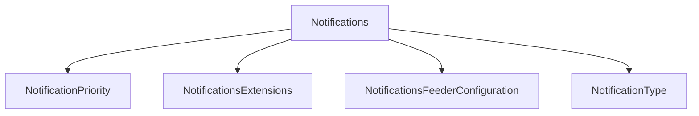

# Notifications

## Contents

- [Overview](#overview)
- [Files](#files)
- [Types and Members](#types-and-members)
- [Serialization and Contracts](#serialization-and-contracts)
- [Validation and Constraints](#validation-and-constraints)
- [Performance Notes](#performance-notes)
- [Package Dependencies](#package-dependencies)
- [Diagrams](#diagrams)
- [Examples](#examples)
- [See Also](#see-also)

## Overview

The **Notifications** area groups 4 documented types, including `NotificationPriority`, `NotificationsExtensions`, `NotificationsFeederConfiguration`, `NotificationType`. It provides the contracts and implementation used by this part of ThunderPropagator.Channels.

## Files

| File | Primary type(s)/symbol(s) | LOC (approx.) | Responsibility |
|---|---|---:|---|
| `AssemblyInfo.cs` | — | 5 | Contains the assembly info implementation or configuration. |
| `NotificationPriority.cs` | `NotificationPriority` | 11 | Defines NotificationPriority and its related behavior. |
| `NotificationsChannel.cs` | `NotificationsChannel` | 79 | Defines NotificationsChannel and its related behavior. |
| `NotificationsChannelFeederMessage.cs` | `NotificationsChannelFeederMessage` | 101 | Defines NotificationsChannelFeederMessage and its related behavior. |
| `NotificationsChannelMetadata.cs` | `NotificationsChannelMetadata` | 34 | Defines NotificationsChannelMetadata and its related behavior. |
| `NotificationsExtensions.cs` | `NotificationsExtensions` | 49 | Defines NotificationsExtensions and its related behavior. |
| `NotificationsFeederConfiguration.cs` | `NotificationsFeederConfiguration` | 6 | Defines NotificationsFeederConfiguration and its related behavior. |
| `NotificationType.cs` | `NotificationType` | 8 | Defines NotificationType and its related behavior. |
| `ThunderPropagator.Channels.Notifications.csproj` | — | 25 | Defines project build targets, dependencies, and package metadata. |

## Types and Members

| Type | Kind | Summary | Inherits/Implements | Key Members |
|---|---|---|---|---|
| [`NotificationPriority`](#notificationpriority) | enum | Represents the NotificationPriority enum. | — | — |
| [`NotificationsExtensions`](#notificationsextensions) | class | Represents the NotificationsExtensions class. | — | — |
| [`NotificationsFeederConfiguration`](#notificationsfeederconfiguration) | class | Represents the NotificationsFeederConfiguration class. | `AbstractFeederConfiguration;` | — |
| [`NotificationType`](#notificationtype) | enum | Represents the NotificationType enum. | — | — |

### NotificationPriority

- **Kind:** enum
- **Namespace:** `ThunderPropagator.Channels.Notifications`
- **Inherits/implements:** None declared
- **Attributes:** None detected
- **Key members:** Refer to the API surface in the source package
- **Summary:** Represents the NotificationPriority enum.
- **Thread safety:** Follow the lifetime and concurrency guarantees of the owning component; no additional guarantee is inferred.

**Usage recipe**

```csharp
// Resolve NotificationPriority from the configured service container or construct it with its declared dependencies.
```

[↑ Back to top](#contents)

### NotificationsExtensions

- **Kind:** class
- **Namespace:** `ThunderPropagator.Channels.Notifications`
- **Inherits/implements:** None declared
- **Attributes:** None detected
- **Key members:** Refer to the API surface in the source package
- **Summary:** Represents the NotificationsExtensions class.
- **Thread safety:** Follow the lifetime and concurrency guarantees of the owning component; no additional guarantee is inferred.

**Usage recipe**

```csharp
// Resolve NotificationsExtensions from the configured service container or construct it with its declared dependencies.
```

[↑ Back to top](#contents)

### NotificationsFeederConfiguration

- **Kind:** class
- **Namespace:** `ThunderPropagator.Channels.Notifications`
- **Inherits/implements:** `AbstractFeederConfiguration;`
- **Attributes:** None detected
- **Key members:** Refer to the API surface in the source package
- **Summary:** Represents the NotificationsFeederConfiguration class.
- **Thread safety:** Follow the lifetime and concurrency guarantees of the owning component; no additional guarantee is inferred.

**Usage recipe**

```csharp
// Resolve NotificationsFeederConfiguration from the configured service container or construct it with its declared dependencies.
```

[↑ Back to top](#contents)

### NotificationType

- **Kind:** enum
- **Namespace:** `ThunderPropagator.Channels.Notifications`
- **Inherits/implements:** None declared
- **Attributes:** None detected
- **Key members:** Refer to the API surface in the source package
- **Summary:** Represents the NotificationType enum.
- **Thread safety:** Follow the lifetime and concurrency guarantees of the owning component; no additional guarantee is inferred.

**Usage recipe**

```csharp
// Resolve NotificationType from the configured service container or construct it with its declared dependencies.
```

[↑ Back to top](#contents)

## Serialization and Contracts

Serialization behavior is part of the public wire or persistence contract in this area. Preserve field names, ordering rules, content negotiation, and backward-compatibility expectations when changing these types.

## Validation and Constraints

Inputs are validated at component boundaries. Callers should provide non-null required values and handle domain or argument exceptions without retrying invalid requests unchanged.

## Performance Notes

This area contains performance-sensitive constructs such as pooled buffers, spans, asynchronous value types, or concurrent collections. Avoid unnecessary allocations and blocking calls on streaming or message-processing paths.

## Package Dependencies

| Package | Version | Description | Links |
|---|---|---|---|
| `Bogus` | `35.6.5` | External dependency used by the repository. | [Registry](https://www.nuget.org/packages/Bogus) |
| `Microsoft.Extensions.Caching.StackExchangeRedis` | `10.*` | External dependency used by the repository. | [Registry](https://www.nuget.org/packages/Microsoft.Extensions.Caching.StackExchangeRedis) |
| `Microsoft.Extensions.Diagnostics.Testing` | `10.*` | External dependency used by the repository. | [Registry](https://www.nuget.org/packages/Microsoft.Extensions.Diagnostics.Testing) |
| `Microsoft.Extensions.Http.Polly` | `10.*` | External dependency used by the repository. | [Registry](https://www.nuget.org/packages/Microsoft.Extensions.Http.Polly) |
| `NodaTime` | `3.3.2` | External dependency used by the repository. | [Registry](https://www.nuget.org/packages/NodaTime) |

## Diagrams

### Component overview



The diagram shows the direct components documented by the **Notifications** area.

## Examples

Start with `NotificationPriority` as the primary entry point for this folder, then follow its linked contracts and collaborators.

## See Also

- [Parent area](../README.md)
- [Chat](../Chat/README.md)
- [Clock](../Clock/README.md)
- [NetworkMonitoring](../NetworkMonitoring/README.md)
- [ResourceMonitoring](../ResourceMonitoring/README.md)
- [Throughput](../Throughput/README.md)
- [TimeZones](../TimeZones/README.md)

[↑ Back to top](#contents)
