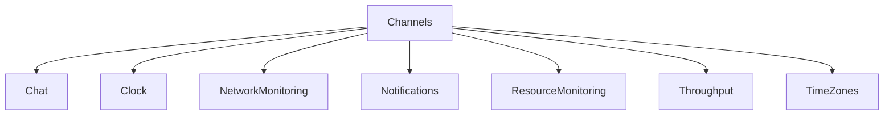

# Channels

## Contents

- [Overview](#overview)
- [Files](#files)
- [Package Dependencies](#package-dependencies)
- [Diagrams](#diagrams)
- [Examples](#examples)
- [See Also](#see-also)

## Overview

The **Channels** area organizes 7 direct sub-areas. Each child is documented separately so responsibilities and APIs remain easy to navigate.

## Files

*None.*

### Direct child areas

- [Chat](./Chat/README.md) `Types:1` `Files:7`
- [Clock](./Clock/README.md) `Types:1` `Files:11`
- [NetworkMonitoring](./NetworkMonitoring/README.md) `Types:1` `Files:9`
- [Notifications](./Notifications/README.md) `Types:4` `Files:9`
- [ResourceMonitoring](./ResourceMonitoring/README.md) `Types:1` `Files:9`
- [Throughput](./Throughput/README.md) `Types:1` `Files:9`
- [TimeZones](./TimeZones/README.md) `Types:1` `Files:9`

## Package Dependencies

| Package | Version | Description | Links |
|---|---|---|---|
| `Bogus` | `35.6.5` | External dependency used by the repository. | [Registry](https://www.nuget.org/packages/Bogus) |
| `Microsoft.Extensions.Caching.StackExchangeRedis` | `10.*` | External dependency used by the repository. | [Registry](https://www.nuget.org/packages/Microsoft.Extensions.Caching.StackExchangeRedis) |
| `Microsoft.Extensions.Diagnostics.Testing` | `10.*` | External dependency used by the repository. | [Registry](https://www.nuget.org/packages/Microsoft.Extensions.Diagnostics.Testing) |
| `Microsoft.Extensions.Http.Polly` | `10.*` | External dependency used by the repository. | [Registry](https://www.nuget.org/packages/Microsoft.Extensions.Http.Polly) |
| `NodaTime` | `3.3.2` | External dependency used by the repository. | [Registry](https://www.nuget.org/packages/NodaTime) |

## Diagrams

### Component overview

The diagram shows the direct components documented by the **Channels** area.

## Examples

Choose the child area that matches the required capability; parent documentation intentionally does not duplicate child implementation details.

## See Also

- [Documentation home](../README.md)
- [Demo](../Demo/README.md)
- [Games](../Games/README.md)

[↑ Back to top](#contents)
