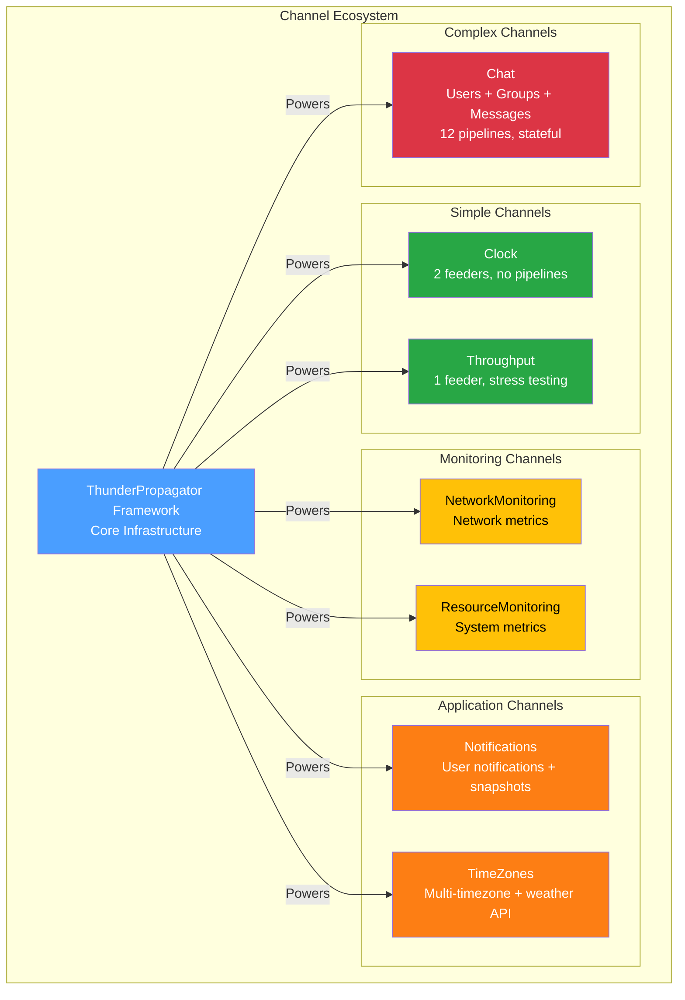

# Production Channels

[↑ Back to Documentation Home](/docs/README.md)

## Contents

- [Overview](#overview)
- [Channel Architecture](#channel-architecture)
- [Available Channels](#available-channels)
- [Channel Comparison](#channel-comparison)
- [Common Patterns](#common-patterns)
- [Getting Started](#getting-started)
- [See Also](#see-also)

## Overview

The **Channels** directory contains **7 production-ready real-time streaming channels** built on the ThunderPropagator framework. Each channel demonstrates specific architectural patterns and use cases, from simple push-only time streams to complex bidirectional chat systems with stateful pipelines.

All channels follow the mandatory ThunderPropagator channel structure with:
- Main channel class inheriting `AbstractChannel<TMetadata, TConfiguration>`
- Configuration class extending `AbstractChannelConfiguration`
- Metadata class with schema descriptors
- Feeder message data contracts
- DI registration extensions

## Channel Architecture



## Available Channels

### [Clock Channel](./Clock/README.md)

**Complexity**: Beginner | **Pattern**: Push-Only | **Feeders**: 2 | **Pipelines**: 0

Real-time time streaming with local (`Now`) and UTC (`UtcNow`) feeds emitting updates every 300ms. Perfect for testing, demos, and synchronized time displays.

**Key Features**:
- Dual independent feeders (local time & UTC time)
- 300ms update interval
- Simple subscription model (Key: "Now" or "UtcNow")
- No pipelines (pure push model)

**[→ Full Documentation](./Clock/README.md)**

### [NetworkMonitoring Channel](./NetworkMonitoring/README.md)

**Complexity**: Intermediate | **Pattern**: Push-Only | **Feeders**: 1 | **Pipelines**: 0

Monitors network performance metrics including latency, bandwidth, packet loss, and connection stability. Ideal for network operations centers and diagnostics dashboards.

**Key Features**:
- Real-time network metrics collection
- Latency, bandwidth, packet loss tracking
- Connection quality monitoring
- Health monitoring integration

**[→ Full Documentation](./NetworkMonitoring/README.md)**

### [Notifications Channel](./Notifications/README.md)

**Complexity**: Intermediate | **Pattern**: Push + Snapshots | **Feeders**: Varies | **Pipelines**: 0

Generic user notification system with priority levels, notification types, and snapshot support for state recovery. Supports broadcast and targeted notifications.

**Key Features**:
- Priority levels (VeryLow to VeryHigh)
- Notification types (Text, HTML)
- Snapshot support for history
- Broadcast and user-targeted notifications
- Generic configuration model

**[→ Full Documentation](./Notifications/README.md)**

### [ResourceMonitoring Channel](./ResourceMonitoring/README.md)

**Complexity**: Intermediate | **Pattern**: Push-Only | **Feeders**: 1 | **Pipelines**: 0

Monitors system resources including CPU usage, memory consumption, disk I/O, and process metrics. Essential for infrastructure monitoring and capacity planning.

**Key Features**:
- CPU utilization tracking
- Memory consumption monitoring
- Disk I/O metrics
- Process-level resource data
- Configurable sampling intervals

**[→ Full Documentation](./ResourceMonitoring/README.md)**

### [Throughput Channel](./Throughput/README.md)

**Complexity**: Beginner | **Pattern**: Push-Only (High Volume) | **Feeders**: 1 | **Pipelines**: 0

High-volume data streaming channel designed for stress testing and performance validation. Generates configurable message rates for load testing ThunderPropagator infrastructure.

**Key Features**:
- Configurable message generation rates
- Minimal overhead for maximum throughput
- Performance benchmarking support
- Stress testing capabilities

**[→ Full Documentation](./Throughput/README.md)**

### [TimeZones Channel](./TimeZones/README.md)

**Complexity**: Advanced | **Pattern**: Push + External API | **Feeders**: 1 | **Pipelines**: 0

Multi-timezone time display with NodaTime integration and optional weather API data. Demonstrates external API integration, snapshot persistence, and advanced time handling.

**Key Features**:
- NodaTime integration for accurate timezone handling
- Weather API integration (optional)
- Snapshot-based state persistence
- Multi-timezone synchronization
- Configurable snapshot TTL and storage

**[→ Full Documentation](./TimeZones/README.md)**

### [Chat Channel](./Chat/README.md)

**Complexity**: Expert | **Pattern**: Bidirectional + Stateful | **Feeders**: 0 | **Pipelines**: 12

Full-featured chat system with users, groups, and messages. Demonstrates complex bidirectional communication, stateful session management, and domain-driven pipeline organization.

**Key Features**:
- User management (Login, Logout, Register, Update)
- Group management (Create, Join, AddUser, RemoveUser, Rename, GetAll)
- Message handling (Send with broadcast/targeted delivery)
- Stateful session tracking (LoggedInUsers dictionary)
- 12 receive pipelines organized by domain
- Models subfolder for domain entities

**Pipeline Domains**:
- `Users/`: Login, Logout, Register, Update
- `Groups/`: Create, Join, AddUser, RemoveUser, Rename, GetAll
- `Messages/`: Send

**[→ Full Documentation](./Chat/README.md)**

## Channel Comparison

| Channel | Complexity | Feeders | Pipelines | External APIs | Snapshots | Primary Use Case |
|---------|------------|---------|-----------|---------------|-----------|------------------|
| [Clock](./Clock/README.md) | ★☆☆☆☆ | 2 | 0 | No | No | Testing, demos, time sync |
| [Throughput](./Throughput/README.md) | ★☆☆☆☆ | 1 | 0 | No | No | Performance testing |
| [NetworkMonitoring](./NetworkMonitoring/README.md) | ★★☆☆☆ | 1 | 0 | No | No | Network diagnostics |
| [ResourceMonitoring](./ResourceMonitoring/README.md) | ★★☆☆☆ | 1 | 0 | No | No | System monitoring |
| [Notifications](./Notifications/README.md) | ★★★☆☆ | Varies | 0 | No | Yes | User notifications |
| [TimeZones](./TimeZones/README.md) | ★★★★☆ | 1 | 0 | Yes (Weather) | Yes | Global time display |
| [Chat](./Chat/README.md) | ★★★★★ | 0 | 12 | No | No | Real-time messaging |

**Legend**:
- ★☆☆☆☆ Beginner — Simple feeders, no pipelines
- ★★☆☆☆ Intermediate — Monitoring patterns
- ★★★☆☆ Advanced — Snapshots or complex logic
- ★★★★☆ Expert — External APIs, persistence
- ★★★★★ Master — Stateful, bidirectional, many pipelines

## Common Patterns

### Push-Only Channels

Channels that only push data to clients (no client-initiated requests):
- **Clock**, **NetworkMonitoring**, **ResourceMonitoring**, **Throughput**
- Rely entirely on feeders for data generation
- No receive pipelines
- Simpler architecture, easier to implement

### Bidirectional Channels

Channels supporting both push and client requests:
- **Chat** (12 pipelines for user actions)
- Include receive pipelines for request handling
- More complex state management
- Domain-organized pipeline folders

### Snapshot-Enabled Channels

Channels persisting message history:
- **Notifications**, **TimeZones**
- Override `OnSubscriptionAdded` to send historical data
- Implement `SnapshotsToSendAsync` for state recovery
- Configure snapshot storage and TTL

### External API Integration

Channels consuming external APIs:
- **TimeZones** (weather data)
- Use HTTP clients with Polly resilience policies
- Handle API rate limits and failures gracefully
- Cache API responses when appropriate

## Getting Started

### 1. Install a Channel

```bash
# Via NuGet (GitHub Packages)
dotnet add package ThunderPropagator.Channels.Clock
```

### 2. Register in DI Container

```csharp
using Microsoft.Extensions.DependencyInjection;
using ThunderPropagator.Channels.Clock;

var services = new ServiceCollection();

services.AddClockChannel(config =>
{
    config.IsEnabled = true;
    config.NowClockFeederConfiguration.IsEnabled = true;
    config.UtcNowClockFeederConfiguration.IsEnabled = false; // Disable UTC
});
```

### 3. Start the Channel

```csharp
var serviceProvider = services.BuildServiceProvider();
var channel = serviceProvider.GetRequiredService<ClockChannel>();

// Channel automatically starts feeders based on configuration
```

### 4. Subscribe from Client

```csharp
// WebSocket client subscription (conceptual)
await channel.SubscribeAsync(new Dictionary<string, object>
{
    ["Key"] = "Now" // Subscription parameter
});
```

## See Also

- [Main Documentation](/docs/README.md) — Documentation home
- [Demo Projects](../Demo/README.md) — Business demonstration applications
- [Games](../Games/README.md) — Interactive multiplayer games
- [Development Guide](../../.github/copilot-instructions.md) — Contributing and architecture rules

[↑ Back to top](#production-channels)
