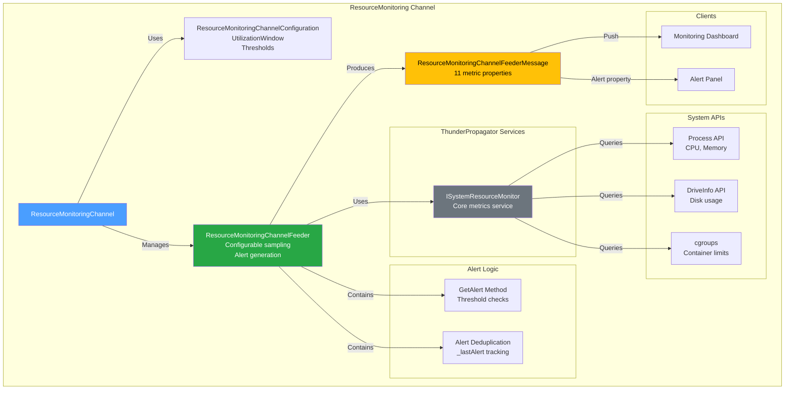
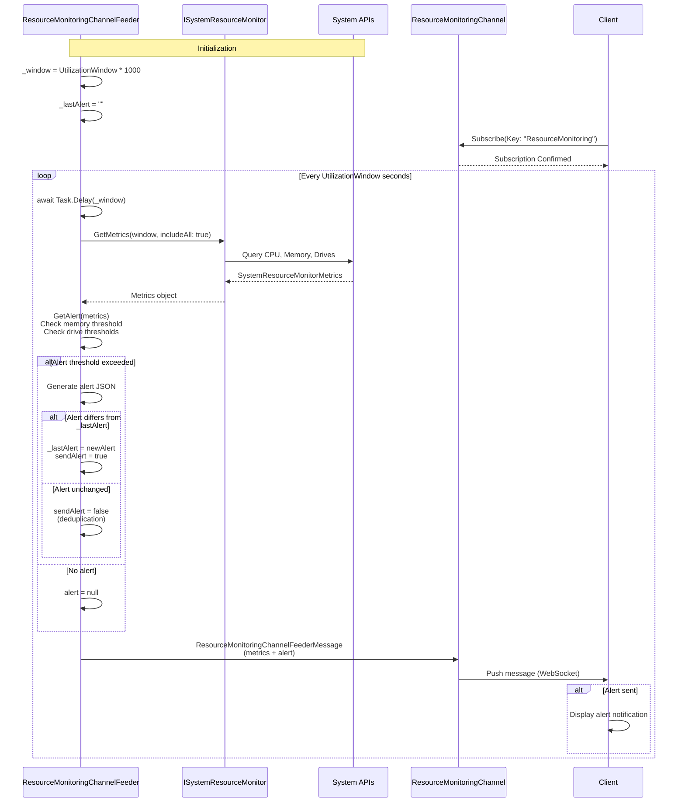

# ResourceMonitoring Channel

[↑ Back to Channels](../README.md) | [→ All Documentation](/docs/README.md)

## Contents

- [Overview](#overview)
- [Files](#files)
- [Types & Members](#types--members)
- [Key Types](#key-types)
- [Diagrams](#diagrams)
- [ThunderPropagator Dependencies](#thunderpropagator-dependencies)
- [Examples](#examples)
- [See Also](#see-also)

## Overview

The **ResourceMonitoring Channel** provides comprehensive real-time system resource monitoring including CPU usage, memory consumption, process/thread counts, and configurable alerting. This production-ready channel leverages ThunderPropagator's `ISystemResourceMonitor` service to collect accurate metrics with configurable sampling windows and threshold-based alerts.

The feeder tracks CPU percentage, memory usage (percentage and bytes), guaranteed/maximum resource limits, process counts, thread counts, and optionally disk usage. Alert logic triggers when memory or storage exceeds configurable thresholds, with deduplication to prevent alert spam.

**Key capabilities**: CPU/memory/disk monitoring, configurable sampling windows, threshold-based alerting, alert deduplication, process/thread tracking, containerized environment support (cgroups limits).

## Files

| File | Primary Type(s) | LOC (approx) | Responsibility |
|------|-----------------|--------------|----------------|
| [ResourceMonitoringChannel.cs](../../../src/Channels/ThunderPropagator.Channels.ResourceMonitoring/ResourceMonitoringChannel.cs) | `ResourceMonitoringChannel` | 15 | Main channel implementation |
| [ResourceMonitoringChannelConfiguration.cs](../../../src/Channels/ThunderPropagator.Channels.ResourceMonitoring/ResourceMonitoringChannelConfiguration.cs) | `ResourceMonitoringChannelConfiguration` | ~18 | Channel configuration |
| [ResourceMonitoringChannelMetadata.cs](../../../src/Channels/ThunderPropagator.Channels.ResourceMonitoring/ResourceMonitoringChannelMetadata.cs) | `ResourceMonitoringChannelMetadata` | ~35 | Schema descriptors |
| [ResourceMonitoringChannelFeederMessage.cs](../../../src/Channels/ThunderPropagator.Channels.ResourceMonitoring/ResourceMonitoringChannelFeederMessage.cs) | `ResourceMonitoringChannelFeederMessage` | 86 | Data contract with 11 metric properties |
| [ResourceMonitoringChannelFeeder.cs](../../../src/Channels/ThunderPropagator.Channels.ResourceMonitoring/ResourceMonitoringChannelFeeder.cs) | `ResourceMonitoringChannelFeeder` | 95 | System metrics collector with alerting |
| [ResourceMonitoringChannelFeederConfiguration.cs](../../../src/Channels/ThunderPropagator.Channels.ResourceMonitoring/ResourceMonitoringChannelFeederConfiguration.cs) | `ResourceMonitoringChannelFeederConfiguration` | ~30 | Feeder configuration with thresholds |
| [ResourceMonitoringChannelExtensions.cs](../../../src/Channels/ThunderPropagator.Channels.ResourceMonitoring/ResourceMonitoringChannelExtensions.cs) | `ResourceMonitoringChannelExtensions` | ~22 | DI registration |
| [AssemblyInfo.cs](../../../src/Channels/ThunderPropagator.Channels.ResourceMonitoring/AssemblyInfo.cs) | - | 3 | Assembly attributes |

[↑ Back to top](#resourcemonitoring-channel)

## Types & Members

| Type | Kind | Summary | Inherits/Implements | Key Members |
|------|------|---------|---------------------|-------------|
| `ResourceMonitoringChannel` | Class (sealed in Release) | Main channel coordinator | `AbstractChannel<...>` | Constructor |
| `ResourceMonitoringChannelConfiguration` | Class (sealed in Release) | Channel configuration | `AbstractChannelConfiguration` | `ResourceMonitoringChannelFeederConfiguration`, `IsEnabled` |
| `ResourceMonitoringChannelMetadata` | Class (sealed in Release) | Schema descriptors | `AbstractChannelMetadata<...>` | `ChannelProgramsDescriptors` (11 descriptors) |
| `ResourceMonitoringChannelFeederMessage` | Class (internal, sealed in Release) | System metrics data contract | `FeederMessage` | `Key`, `Alert`, `DateTime`, `CpuUsedPercentage`, `MemoryUsedPercentage`, `MemoryUsedInBytes`, etc. |
| `ResourceMonitoringChannelFeeder` | Class (internal, sealed in Release) | System metrics collector | `IterativeFeeder<...>` | `ReceiveAsync()`, `GetAlert()`, alert deduplication |
| `ResourceMonitoringChannelFeederConfiguration` | Class (sealed in Release) | Feeder configuration | `AbstractFeederConfiguration` | `UtilizationWindow`, `MemoryUsedPercentageThreshold`, `StorageUsedPercentageThreshold` |
| `ResourceMonitoringChannelExtensions` | Static Class | DI registration | - | `AddResourceMonitoringChannel()` |

[↑ Back to top](#resourcemonitoring-channel)

## Key Types

### ResourceMonitoringChannelFeederMessage

Data contract with 11 properties:

```csharp
public string Key { get; private set; }                    // Always "ResourceMonitoring"
public string? Alert { get; set; }                         // JSON array of AlertInfo objects (when thresholds exceeded)
public string DateTime { get; set; }                       // Unix timestamp (seconds)
public double CpuUsedPercentage { get; set; }             // CPU usage percentage (0-100)
public double MemoryUsedPercentage { get; set; }          // Memory usage percentage (0-100)
public double MemoryUsedInBytes { get; set; }             // Memory used in bytes
public ulong GuaranteedMemoryInBytes { get; set; }        // Guaranteed memory limit (cgroups)
public double MaximumMemoryInBytes { get; set; }          // Maximum memory limit
public double GuaranteedCpuUnits { get; set; }            // Guaranteed CPU units
public double MaximumCpuUnits { get; set; }               // Maximum CPU units (processor count)
public decimal Processes { get; set; }                     // Active process count
public decimal Threads { get; set; }                       // Total thread count
```

### ResourceMonitoringChannelFeeder

Advanced feeder with:
- **ISystemResourceMonitor Integration**: Leverages ThunderPropagator's system resource monitoring service
- **Configurable Sampling Window**: `UtilizationWindow` property (seconds) for CPU averaging
- **Alert Generation**: `GetAlert()` method checks memory and storage thresholds
- **Alert Deduplication**: Tracks `_lastAlert` to prevent spam
- **Drive Monitoring**: Checks all ready drives against storage threshold
- **Health Monitoring**: Tagged as "StaticFeeder"

**Alert Format** (JSON):
```json
[
  {"Type": "Memory", "Alert": "Memory usage has exceeded the threshold of 80%. Please investigate immediately."},
  {"Type": "Storage", "Alert": "Storage usage on <code>C:</code> has exceeded the threshold of 90%. Please investigate immediately."}
]
```

### ResourceMonitoringChannelFeederConfiguration

Configuration with thresholds:

```csharp
public long UtilizationWindow { get; set; }                // Sampling window in seconds (default varies)
public double MemoryUsedPercentageThreshold { get; set; }  // Memory alert threshold (0-100)
public double StorageUsedPercentageThreshold { get; set; } // Storage alert threshold (0-100)
```

[↑ Back to top](#resourcemonitoring-channel)

## Diagrams

### Architecture Overview



### Monitoring Flow



[↑ Back to top](#resourcemonitoring-channel)

## ThunderPropagator Dependencies

| Package | Version | Description | Links |
|---------|---------|-------------|-------|
| ThunderPropagator (platform-specific) | 1.0.1-beta.5 | Core framework with `ISystemResourceMonitor` service | [GitHub Packages](https://github.com/orgs/ThunderPropagator/packages) |

**Note:** `ISystemResourceMonitor` is part of ThunderPropagator's infrastructure and provides cross-platform system metrics collection with support for containerized environments (cgroups limits).

[↑ Back to top](#resourcemonitoring-channel)

## Examples

### Basic Registration

```csharp
using Microsoft.Extensions.DependencyInjection;
using ThunderPropagator.Channels.ResourceMonitoring;

var services = new ServiceCollection();

services.AddResourceMonitoringChannel(config =>
{
    config.IsEnabled = true;
    config.ResourceMonitoringChannelFeederConfiguration.IsEnabled = true;
    config.ResourceMonitoringChannelFeederConfiguration.UtilizationWindow = 5; // 5 seconds
    config.ResourceMonitoringChannelFeederConfiguration.MemoryUsedPercentageThreshold = 80.0;
    config.ResourceMonitoringChannelFeederConfiguration.StorageUsedPercentageThreshold = 90.0;
});
```

### Client Subscription with Alert Handling

```csharp
var subscription = await channel.SubscribeAsync(new Dictionary<string, object>
{
    ["Key"] = "ResourceMonitoring"
});

subscription.OnMessage(message =>
{
    var metrics = message as ResourceMonitoringChannelFeederMessage;
    
    // Display current metrics
    Console.WriteLine($"CPU: {metrics.CpuUsedPercentage:F1}%");
    Console.WriteLine($"Memory: {metrics.MemoryUsedPercentage:F1}% ({metrics.MemoryUsedInBytes / 1024 / 1024:F0} MB)");
    Console.WriteLine($"Processes: {metrics.Processes}, Threads: {metrics.Threads}");
    
    // Handle alerts
    if (!string.IsNullOrEmpty(metrics.Alert))
    {
        var alerts = JsonSerializer.Deserialize<List<AlertInfo>>(metrics.Alert);
        foreach (var alert in alerts)
        {
            Console.ForegroundColor = ConsoleColor.Red;
            Console.WriteLine($"⚠️ {alert.Type} ALERT: {alert.Alert}");
            Console.ResetColor();
        }
    }
});

record AlertInfo(string Type, string Alert);
```

### Monitoring Dashboard

```csharp
// Real-time resource monitoring dashboard
var cpuHistory = new Queue<double>(60);
var memoryHistory = new Queue<double>(60);

subscription.OnMessage(message =>
{
    var metrics = message as ResourceMonitoringChannelFeederMessage;
    
    // Track history (last 60 samples)
    cpuHistory.Enqueue(metrics.CpuUsedPercentage);
    if (cpuHistory.Count > 60) cpuHistory.Dequeue();
    
    memoryHistory.Enqueue(metrics.MemoryUsedPercentage);
    if (memoryHistory.Count > 60) memoryHistory.Dequeue();
    
    // Calculate averages
    var avgCpu = cpuHistory.Average();
    var avgMemory = memoryHistory.Average();
    
    // Update dashboard
    UpdateCpuChart(cpuHistory);
    UpdateMemoryChart(memoryHistory);
    UpdateProcessInfo(metrics.Processes, metrics.Threads);
    UpdateResourceLimits(
        metrics.MaximumCpuUnits,
        metrics.MaximumMemoryInBytes,
        metrics.GuaranteedCpuUnits,
        metrics.GuaranteedMemoryInBytes
    );
});
```

### Container-Aware Monitoring

```csharp
// In containerized environments, leverage cgroups limits
subscription.OnMessage(message =>
{
    var metrics = message as ResourceMonitoringChannelFeederMessage;
    
    if (metrics.GuaranteedMemoryInBytes > 0)
    {
        // Running in container with memory limits
        var usedGB = metrics.MemoryUsedInBytes / 1024 / 1024 / 1024;
        var limitGB = metrics.MaximumMemoryInBytes / 1024 / 1024 / 1024;
        var guaranteedGB = metrics.GuaranteedMemoryInBytes / 1024 / 1024 / 1024;
        
        Console.WriteLine($"Container Memory: {usedGB:F2} GB / {limitGB:F2} GB (Guaranteed: {guaranteedGB:F2} GB)");
    }
    
    if (metrics.GuaranteedCpuUnits > 0)
    {
        // Running in container with CPU limits
        Console.WriteLine($"Container CPU: {metrics.CpuUsedPercentage:F1}% of {metrics.MaximumCpuUnits} units");
    }
});
```

[↑ Back to top](#resourcemonitoring-channel)

## See Also

- [Channels Overview](../README.md) — All 7 production channels
- [NetworkMonitoring Channel](../NetworkMonitoring/README.md) — Network performance monitoring
- [Throughput Channel](../Throughput/README.md) — High-volume streaming metrics
- [Main Documentation](/docs/README.md) — Repository documentation home

[↑ Back to top](#resourcemonitoring-channel)
