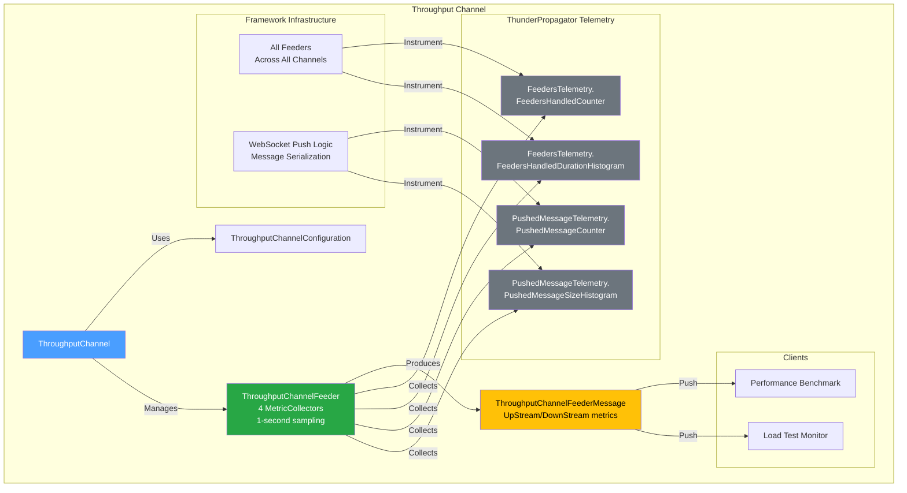
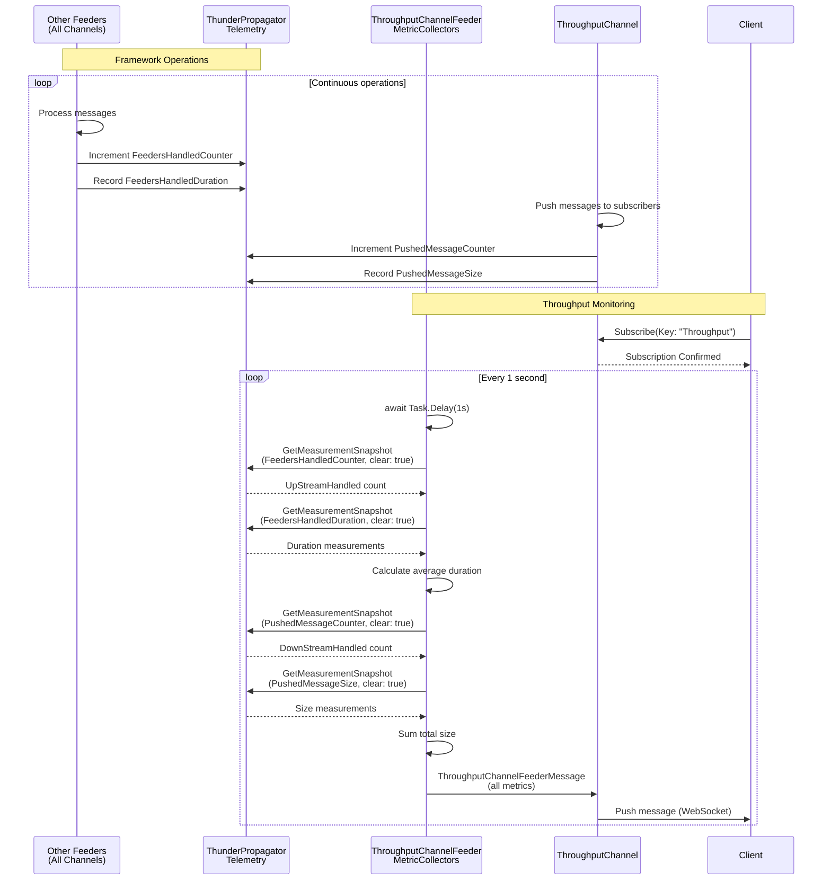

# Throughput Channel

[↑ Back to Channels](../README.md) | [→ All Documentation](/docs/README.md)

## Contents

- [Overview](#overview)
- [Files](#files)
- [Types & Members](#types--members)
- [Key Types](#key-types)
- [Diagrams](#diagrams)
- [ThunderPropagator Dependencies](#thunderpropagator-dependencies)
- [Examples](#examples)
- [See Also](#see-also)

## Overview

The **Throughput Channel** is a specialized high-volume data streaming channel designed for stress testing, performance validation, and benchmarking of ThunderPropagator infrastructure. Unlike application channels, Throughput focuses on measuring and reporting the framework's own performance metrics using telemetry collectors.

This channel demonstrates advanced telemetry integration, collecting real-time metrics from ThunderPropagator's built-in counters and histograms: feeder processing rates, message push rates, message sizes, and processing durations. Ideal for load testing, capacity planning, and performance regression detection.

**Key capabilities**: Telemetry-based metrics collection, feeder/downstream throughput tracking, message size monitoring, performance benchmarking, minimal overhead design.

## Files

| File | Primary Type(s) | LOC (approx) | Responsibility |
|------|-----------------|--------------|----------------|
| [ThroughputChannel.cs](../../../src/Channels/ThunderPropagator.Channels.Throughput/ThroughputChannel.cs) | `ThroughputChannel` | 15 | Main channel implementation |
| [ThroughputChannelConfiguration.cs](../../../src/Channels/ThunderPropagator.Channels.Throughput/ThroughputChannelConfiguration.cs) | `ThroughputChannelConfiguration` | ~18 | Channel configuration |
| [ThroughputChannelMetadata.cs](../../../src/Channels/ThunderPropagator.Channels.Throughput/ThroughputChannelMetadata.cs) | `ThroughputChannelMetadata` | ~25 | Schema descriptors |
| [ThroughputChannelFeederMessage.cs](../../../src/Channels/ThunderPropagator.Channels.Throughput/ThroughputChannelFeederMessage.cs) | `ThroughputChannelFeederMessage` | 43 | Data contract with 4 throughput metrics |
| [ThroughputChannelFeeder.cs](../../../src/Channels/ThunderPropagator.Channels.Throughput/ThroughputChannelFeeder.cs) | `ThroughputChannelFeeder` | 80 | Telemetry metrics collector |
| [ThroughputChannelFeederConfiguration.cs](../../../src/Channels/ThunderPropagator.Channels.Throughput/ThroughputChannelFeederConfiguration.cs) | `ThroughputChannelFeederConfiguration` | ~18 | Feeder configuration |
| [ThroughputChannelExtensions.cs](../../../src/Channels/ThunderPropagator.Channels.Throughput/ThroughputChannelExtensions.cs) | `ThroughputChannelExtensions` | ~22 | DI registration |
| [AssemblyInfo.cs](../../../src/Channels/ThunderPropagator.Channels.Throughput/AssemblyInfo.cs) | - | 3 | Assembly attributes |

[↑ Back to top](#throughput-channel)

## Types & Members

| Type | Kind | Summary | Inherits/Implements | Key Members |
|------|------|---------|---------------------|-------------|
| `ThroughputChannel` | Class (sealed in Release) | Main channel coordinator | `AbstractChannel<...>` | Constructor |
| `ThroughputChannelConfiguration` | Class (sealed in Release) | Channel configuration | `AbstractChannelConfiguration` | `ThroughputChannelFeederConfiguration`, `IsEnabled` |
| `ThroughputChannelMetadata` | Class (sealed in Release) | Schema descriptors | `AbstractChannelMetadata<...>` | `ChannelProgramsDescriptors` (5 descriptors) |
| `ThroughputChannelFeederMessage` | Class (internal, sealed in Release) | Throughput metrics data contract | `FeederMessage` | `Key`, `UpStreamHandled`, `DownStreamHandled`, `DownStreamSize`, `DownStreamDuration` |
| `ThroughputChannelFeeder` | Class (internal, sealed in Release) | Telemetry collector | `IterativeFeeder<...>` | `ReceiveAsync()`, 4 `MetricCollector<long>` fields |
| `ThroughputChannelFeederConfiguration` | Class (sealed in Release) | Feeder configuration | `AbstractFeederConfiguration` | `IsEnabled`, `Bind()` |
| `ThroughputChannelExtensions` | Static Class | DI registration | - | `AddThroughputChannel()` |

[↑ Back to top](#throughput-channel)

## Key Types

### ThroughputChannelFeederMessage

Data contract with 5 properties measuring framework throughput:

```csharp
public string Key { get; private set; }                // Always "Throughput"
public long UpStreamHandled { get; set; }              // Feeder messages processed (count)
public long DownStreamHandled { get; set; }            // Messages pushed to clients (count)
public double DownStreamSize { get; set; }             // Average message processing duration (calculated from histogram)
public long DownStreamDuration { get; set; }           // Total message size pushed (bytes)
```

**Note:** Property names may be semantically confusing—`DownStreamSize` contains duration averages, `DownStreamDuration` contains size totals. This appears to be implementation-specific naming.

### ThroughputChannelFeeder

Advanced telemetry-integrated feeder with 4 `MetricCollector<long>` fields:

```csharp
private readonly MetricCollector<long>? _feedersHandledMetricCollector;
private readonly MetricCollector<long>? _feedersHandledDurationMetricCollector;
private readonly MetricCollector<long>? _pushedMessageMetricCollector;
private readonly MetricCollector<long>? _pushedMessageSizeMetricCollector;
```

**Telemetry Sources** (from ThunderPropagator):
- `FeedersTelemetry.FeedersHandledCounter` — Count of feeder messages processed
- `FeedersTelemetry.FeedersHandledDurationHistogram` — Feeder processing durations
- `PushedMessageTelemetry.PushedMessageCounter` — Count of messages pushed to clients
- `PushedMessageTelemetry.PushedMessageSizeHistogram` — Message sizes (bytes)

**Sampling**: Every 1 second with snapshot reset (`GetMeasurementSnapshot(clearAfterReading: true)`)

[↑ Back to top](#throughput-channel)

## Diagrams

### Architecture Overview



### Telemetry Flow



[↑ Back to top](#throughput-channel)

## ThunderPropagator Dependencies

| Package | Version | Description | Links |
|---------|---------|-------------|-------|
| ThunderPropagator (platform-specific) | 1.0.1-beta.5 | Core framework with telemetry infrastructure | [GitHub Packages](https://github.com/orgs/ThunderPropagator/packages) |
| Microsoft.Extensions.Diagnostics.Testing | 8.x/9.x/10.x | `MetricCollector<T>` for telemetry sampling | [NuGet](https://www.nuget.org/packages/Microsoft.Extensions.Diagnostics.Testing/) |

**Note:** Telemetry classes (`FeedersTelemetry`, `PushedMessageTelemetry`) are part of ThunderPropagator's Application/Infrastructure layers.

[↑ Back to top](#throughput-channel)

## Examples

### Basic Registration

```csharp
using Microsoft.Extensions.DependencyInjection;
using ThunderPropagator.Channels.Throughput;

var services = new ServiceCollection();

services.AddThroughputChannel(config =>
{
    config.IsEnabled = true;
    config.ThroughputChannelFeederConfiguration.IsEnabled = true;
});
```

### Performance Benchmarking

```csharp
var subscription = await channel.SubscribeAsync(new Dictionary<string, object>
{
    ["Key"] = "Throughput"
});

var samples = new List<(long UpStream, long DownStream, double AvgDuration, long TotalSize)>();

subscription.OnMessage(message =>
{
    var metrics = message as ThroughputChannelFeederMessage;
    
    samples.Add((
        UpStream: metrics.UpStreamHandled,
        DownStream: metrics.DownStreamHandled,
        AvgDuration: metrics.DownStreamSize,  // Actually contains average duration
        TotalSize: metrics.DownStreamDuration  // Actually contains total size
    ));
    
    Console.WriteLine($"[Throughput] Upstream: {metrics.UpStreamHandled} msgs/s | " +
                      $"Downstream: {metrics.DownStreamHandled} msgs/s | " +
                      $"Avg Duration: {metrics.DownStreamSize:F2} ms | " +
                      $"Total Size: {metrics.DownStreamDuration} bytes");
});

// After test duration
var avgUpstream = samples.Average(s => s.UpStream);
var avgDownstream = samples.Average(s => s.DownStream);
var avgDuration = samples.Average(s => s.AvgDuration);
var totalDataPushed = samples.Sum(s => s.TotalSize);

Console.WriteLine($"\n=== Performance Summary ===");
Console.WriteLine($"Average Upstream: {avgUpstream:F0} msgs/s");
Console.WriteLine($"Average Downstream: {avgDownstream:F0} msgs/s");
Console.WriteLine($"Average Processing Duration: {avgDuration:F2} ms");
Console.WriteLine($"Total Data Pushed: {totalDataPushed / 1024 / 1024:F2} MB");
```

### Load Test Monitoring

```csharp
// Monitor throughput during load test
var startTime = DateTime.UtcNow;
var peakUpstream = 0L;
var peakDownstream = 0L;

subscription.OnMessage(message =>
{
    var metrics = message as ThroughputChannelFeederMessage;
    var elapsed = (DateTime.UtcNow - startTime).TotalSeconds;
    
    peakUpstream = Math.Max(peakUpstream, metrics.UpStreamHandled);
    peakDownstream = Math.Max(peakDownstream, metrics.DownStreamHandled);
    
    Console.WriteLine($"[{elapsed:F0}s] ↑ {metrics.UpStreamHandled} msg/s  " +
                      $"↓ {metrics.DownStreamHandled} msg/s  " +
                      $"Peak: ↑{peakUpstream} ↓{peakDownstream}");
    
    // Alert on performance degradation
    if (metrics.DownStreamHandled < peakDownstream * 0.5)
    {
        Console.ForegroundColor = ConsoleColor.Yellow;
        Console.WriteLine($"⚠️ Throughput dropped 50% from peak!");
        Console.ResetColor();
    }
});
```

### Capacity Planning

```csharp
// Determine system capacity under load
var testDuration = TimeSpan.FromMinutes(5);
var measurementInterval = TimeSpan.FromSeconds(1);
var measurements = new List<ThroughputMeasurement>();

subscription.OnMessage(message =>
{
    var metrics = message as ThroughputChannelFeederMessage;
    
    measurements.Add(new ThroughputMeasurement
    {
        Timestamp = DateTime.UtcNow,
        UpstreamRate = metrics.UpStreamHandled,
        DownstreamRate = metrics.DownStreamHandled,
        AverageDuration = metrics.DownStreamSize,
        TotalSize = metrics.DownStreamDuration
    });
    
    if (measurements.Count * measurementInterval.TotalSeconds >= testDuration.TotalSeconds)
    {
        // Calculate capacity metrics
        var sustainedUpstream = measurements.Skip(10).Take(measurements.Count - 20).Average(m => m.UpstreamRate);
        var sustainedDownstream = measurements.Skip(10).Take(measurements.Count - 20).Average(m => m.DownstreamRate);
        var p99Duration = measurements.Select(m => m.AverageDuration).OrderBy(d => d).Skip((int)(measurements.Count * 0.99)).First();
        
        Console.WriteLine($"\n=== Capacity Report ===");
        Console.WriteLine($"Sustained Upstream Capacity: {sustainedUpstream:F0} msgs/s");
        Console.WriteLine($"Sustained Downstream Capacity: {sustainedDownstream:F0} msgs/s");
        Console.WriteLine($"P99 Processing Duration: {p99Duration:F2} ms");
    }
});

record ThroughputMeasurement
{
    public DateTime Timestamp { get; init; }
    public long UpstreamRate { get; init; }
    public long DownstreamRate { get; init; }
    public double AverageDuration { get; init; }
    public long TotalSize { get; init; }
}
```

[↑ Back to top](#throughput-channel)

## See Also

- [Channels Overview](../README.md) — All 7 production channels
- [ResourceMonitoring Channel](../ResourceMonitoring/README.md) — System resource monitoring
- [NetworkMonitoring Channel](../NetworkMonitoring/README.md) — Network performance monitoring
- [Main Documentation](/docs/README.md) — Repository documentation home

[↑ Back to top](#throughput-channel)
