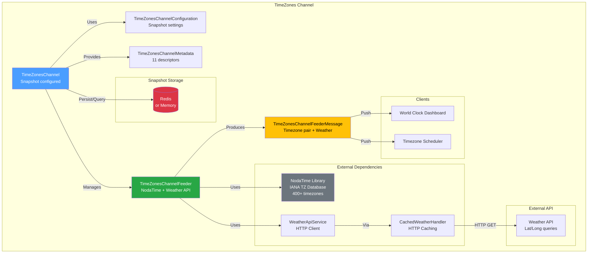
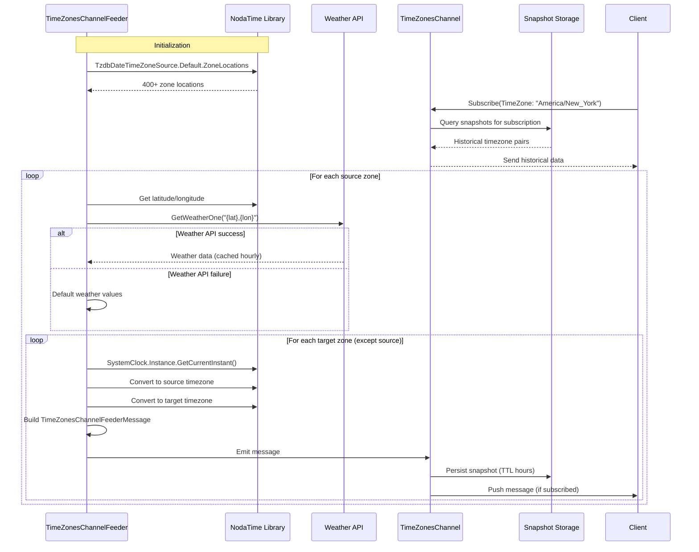

# TimeZones Channel

[↑ Back to Channels](../README.md) | [→ All Documentation](/docs/README.md)

## Contents

- [Overview](#overview)
- [Files](#files)
- [Types & Members](#types--members)
- [Key Features](#key-features)
- [Diagrams](#diagrams)
- [ThunderPropagator Dependencies](#thunderpropagator-dependencies)
- [Examples](#examples)
- [See Also](#see-also)

## Overview

The **TimeZones Channel** is an advanced real-time channel providing multi-timezone time display with optional weather integration via external API. This channel demonstrates snapshot-based state persistence, NodaTime integration for accurate timezone handling, and resilient external API consumption with caching.

The feeder generates timezone pairs (source → target) for all IANA timezones in the TZ database, enriching each with weather data for the source location. Snapshots are persisted with configurable TTL for state recovery, making this ideal for global dashboards, world clock applications, and timezone-aware scheduling systems.

**Key capabilities**: IANA timezone database (400+ zones), NodaTime integration, weather API (optional), snapshot persistence with TTL, Redis/Memory storage, graceful API failure handling.

## Files

| File | Primary Type(s) | LOC (approx) | Responsibility |
|------|-----------------|--------------|----------------|
| [TimeZonesChannel.cs](../../../src/Channels/ThunderPropagator.Channels.TimeZones/TimeZonesChannel.cs) | `TimeZonesChannel` | 23 | Main channel with snapshot configuration |
| [TimeZonesChannelConfiguration.cs](../../../src/Channels/ThunderPropagator.Channels.TimeZones/TimeZonesChannelConfiguration.cs) | `TimeZonesChannelConfiguration` | ~20 | Channel configuration |
| [TimeZonesChannelMetadata.cs](../../../src/Channels/ThunderPropagator.Channels.TimeZones/TimeZonesChannelMetadata.cs) | `TimeZonesChannelMetadata` | ~40 | Schema descriptors (11 fields) |
| [TimeZonesChannelFeederMessage.cs](../../../src/Channels/ThunderPropagator.Channels.TimeZones/TimeZonesChannelFeederMessage.cs) | `TimeZonesChannelFeederMessage` | 80 | Data contract with timezone + weather data |
| [TimeZonesChannelFeeder.cs](../../../src/Channels/ThunderPropagator.Channels.TimeZones/TimeZonesChannelFeeder.cs) | `TimeZonesChannelFeeder` | 65 | Timezone/weather data collector |
| [TimeZonesChannelFeederConfiguration.cs](../../../src/Channels/ThunderPropagator.Channels.TimeZones/TimeZonesChannelFeederConfiguration.cs) | `TimeZonesChannelFeederConfiguration` | ~40 | Feeder config with snapshot settings |
| [TimeZonesChannelExtensions.cs](../../../src/Channels/ThunderPropagator.Channels.TimeZones/TimeZonesChannelExtensions.cs) | `TimeZonesChannelExtensions` | ~25 | DI registration |
| [WeatherApi/WeatherApiService.cs](../../../src/Channels/ThunderPropagator.Channels.TimeZones/WeatherApi/WeatherApiService.cs) | `WeatherApiService` | ~100 | HTTP client for weather API integration |
| [WeatherApi/CachedWeatherHandler.cs](../../../src/Channels/ThunderPropagator.Channels.TimeZones/WeatherApi/CachedWeatherHandler.cs) | `CachedWeatherHandler` | ~80 | HTTP message handler with caching |
| [WeatherApi/Models/](../../../src/Channels/ThunderPropagator.Channels.TimeZones/WeatherApi/Models/) | Weather DTOs | ~200 | Weather API response models |
| [AssemblyInfo.cs](../../../src/Channels/ThunderPropagator.Channels.TimeZones/AssemblyInfo.cs) | - | 3 | Assembly attributes |

[↑ Back to top](#timezones-channel)

## Types & Members

| Type | Kind | Summary | Inherits/Implements | Key Members |
|------|------|---------|---------------------|-------------|
| `TimeZonesChannel` | Class (sealed in Release) | Main channel with snapshot config | `AbstractChannel<...>` | Constructor with snapshot setup |
| `TimeZonesChannelConfiguration` | Class (sealed in Release) | Channel configuration | `AbstractChannelConfiguration` | `TimeZonesChannelFeederConfiguration`, `IsEnabled` |
| `TimeZonesChannelMetadata` | Class (sealed in Release) | Schema descriptors | `AbstractChannelMetadata<...>` | `ChannelProgramsDescriptors` (11 descriptors) |
| `TimeZonesChannelFeederMessage` | Class (internal, sealed in Release) | Timezone + weather data | `FeederMessage` | `TimeZone`, `Date`, `Time`, `WeatherKey`, `Celsius`, `Target`, etc. |
| `TimeZonesChannelFeeder` | Class (internal, sealed in Release) | Timezone/weather collector | `IterativeFeeder<...>` | `ReceiveAsync()`, NodaTime integration |
| `TimeZonesChannelFeederConfiguration` | Class (sealed in Release) | Feeder configuration | `AbstractFeederConfiguration` | `SnapshotConnectionString`, `SnapshotTtlHours`, `SnapshotRecoveryStorage` |
| `WeatherApiService` | Class (internal) | Weather API HTTP client | - | `GetWeatherOne()`, Polly resilience |
| `CachedWeatherHandler` | Class (internal) | HTTP caching handler | `DelegatingHandler` | `SendAsync()` with cache logic |

[↑ Back to top](#timezones-channel)

## Key Features

### NodaTime Integration

```csharp
// Uses IANA timezone database
var zoneLocations = TzdbDateTimeZoneSource.Default.ZoneLocations; // 400+ zones

// Accurate timezone conversion
var now = SystemClock.Instance.GetCurrentInstant();
var sourceDateTime = now.InZone(DateTimeZoneProviders.Tzdb.GetZoneOrNull(source.ZoneId));
var targetDateTime = now.InZone(DateTimeZoneProviders.Tzdb.GetZoneOrNull(target.ZoneId));
```

### Snapshot Configuration

```csharp
// In TimeZonesChannel constructor
Metadata.SetChannelSnapshot(
    ConnectionStringHelper.EnrichConnectionString(config.SnapshotConnectionString),
    config.SnapshotRecoveryStorage,
    config.SnapshotTtlHours
);
```

**Configuration Properties**:
- `SnapshotConnectionString`: Redis or Memory connection string
- `SnapshotRecoveryStorage`: Storage backend enum
- `SnapshotTtlHours`: Time-to-live for snapshot entries

### TimeZonesChannelFeederMessage

```csharp
public string TimeZone { get; set; }              // Source timezone (IANA ID)
public DateTime Date { get; set; }                // Source date
public TimeSpan Time { get; set; }                // Source time

public string WeatherKey { get; set; }            // "ZoneId/Hour" for caching
public double Celsius { get; set; }               // Temperature (°C)
public double Fahrenheit { get; set; }            // Temperature (°F)
public string Condition { get; set; }             // Weather condition text
public string ConditionIcon { get; set; }         // Weather icon URL

public string Target { get; set; }                // Target timezone (IANA ID)
public DateTime TargetDate { get; set; }          // Target date
public TimeSpan TargetTime { get; set; }          // Target time
```

### Weather API Integration

- **Service**: `WeatherApiService` with HTTP client
- **Caching**: `CachedWeatherHandler` (HTTP message handler)
- **Cache Key**: `{ZoneId}/{Hour}` (hourly cache buckets)
- **Resilience**: Polly integration for retry/timeout policies
- **Graceful Degradation**: Returns default weather values on API failure

[↑ Back to top](#timezones-channel)

## Diagrams

### Architecture Overview



### Timezone Pair Generation Flow



### Snapshot Persistence

```mermaid
graph LR
    subgraph "Message Flow"
        Feeder[TimeZonesChannelFeeder]
        Message[TimeZonesChannelFeederMessage]
        Channel[TimeZonesChannel]
        
        Feeder -->|Produces| Message
        Message -->|Routes to| Channel
    end
    
    subgraph "Snapshot Layer"
        Metadata[TimeZonesChannelMetadata<br/>SetChannelSnapshot() called]
        Storage[(Redis/Memory<br/>Connection: config.SnapshotConnectionString<br/>TTL: config.SnapshotTtlHours)]
    end
    
    Channel -->|Via| Metadata
    Metadata -->|Persist| Storage
    
    subgraph "State Recovery"
        NewClient[New Client<br/>Subscribes]
        Query[Query snapshots<br/>by subscription keys]
        Historical[Historical Data<br/>Sent to client]
    end
    
    NewClient -->|Triggers| Query
    Query -->|Reads| Storage
    Storage -->|Returns| Historical
    
    style Message fill:#ffc107,color:#000
    style Storage fill:#dc3545,color:#fff
```

[↑ Back to top](#timezones-channel)

## ThunderPropagator Dependencies

| Package | Version | Description | Links |
|---------|---------|-------------|-------|
| ThunderPropagator (platform-specific) | 1.0.1-beta.5 | Core framework with snapshot infrastructure | [GitHub Packages](https://github.com/orgs/ThunderPropagator/packages) |
| NodaTime | 3.2.2 | Robust timezone handling with IANA TZ database | [NuGet](https://www.nuget.org/packages/NodaTime/) |
| Microsoft.Extensions.Http.Polly | 8.x/9.x/10.x | HTTP resilience policies | [NuGet](https://www.nuget.org/packages/Microsoft.Extensions.Http.Polly/) |

[↑ Back to top](#timezones-channel)

## Examples

### Basic Registration

```csharp
using Microsoft.Extensions.DependencyInjection;
using ThunderPropagator.Channels.TimeZones;

var services = new ServiceCollection();

services.AddTimeZonesChannel(config =>
{
    config.IsEnabled = true;
    config.TimeZonesChannelFeederConfiguration.IsEnabled = true;
    config.TimeZonesChannelFeederConfiguration.SnapshotConnectionString = "redis://localhost:6379";
    config.TimeZonesChannelFeederConfiguration.SnapshotTtlHours = 24;
    config.TimeZonesChannelFeederConfiguration.SnapshotRecoveryStorage = SnapshotRecoveryStorage.Redis;
});
```

### Client Subscription

```csharp
// Subscribe to specific timezone
var subscription = await channel.SubscribeAsync(new Dictionary<string, object>
{
    ["TimeZone"] = "America/New_York"
});

subscription.OnMessage(message =>
{
    var data = message as TimeZonesChannelFeederMessage;
    
    Console.WriteLine($"Source: {data.TimeZone}");
    Console.WriteLine($"  Time: {data.Date:yyyy-MM-dd} {data.Time}");
    Console.WriteLine($"  Weather: {data.Celsius}°C ({data.Fahrenheit}°F) - {data.Condition}");
    Console.WriteLine($"Target: {data.Target}");
    Console.WriteLine($"  Time: {data.TargetDate:yyyy-MM-dd} {data.TargetTime}");
    Console.WriteLine();
});
```

### World Clock Dashboard

```csharp
// Display multiple timezones simultaneously
var subscriptions = new List<string>
{
    "America/New_York", "Europe/London", "Asia/Tokyo", "Australia/Sydney"
};

foreach (var timezone in subscriptions)
{
    var sub = await channel.SubscribeAsync(new Dictionary<string, object>
    {
        ["TimeZone"] = timezone
    });
    
    sub.OnMessage(message =>
    {
        var data = message as TimeZonesChannelFeederMessage;
        
        UpdateClockDisplay(new ClockData
        {
            TimeZone = data.TimeZone,
            LocalTime = $"{data.Date:MMM dd} {data.Time:hh\\:mm\\:ss}",
            Temperature = $"{data.Celsius:F1}°C",
            Condition = data.Condition,
            Icon = data.ConditionIcon
        });
    });
}
```

### Timezone Converter Application

```csharp
// Real-time timezone conversion
var sourceZone = "America/Los_Angeles";
var targetZones = new[] { "Europe/Paris", "Asia/Shanghai", "America/Sao_Paulo" };

var subscription = await channel.SubscribeAsync(new Dictionary<string, object>
{
    ["TimeZone"] = sourceZone
});

subscription.OnMessage(message =>
{
    var data = message as TimeZonesChannelFeederMessage;
    
    // Filter for desired target zones
    if (targetZones.Contains(data.Target))
    {
        Console.WriteLine($"{sourceZone}: {data.Time:hh\\:mm\\:ss}");
        Console.WriteLine($"  → {data.Target}: {data.TargetTime:hh\\:mm\\:ss}");
        Console.WriteLine($"  Time difference: {data.TargetTime - data.Time}");
    }
});
```

### Snapshot-Based State Recovery

```csharp
// New subscriber receives historical data from snapshots
var newSubscription = await channel.SubscribeAsync(new Dictionary<string, object>
{
    ["TimeZone"] = "America/Chicago"
});

newSubscription.OnConnect(() =>
{
    Console.WriteLine("Connected! Receiving snapshot data...");
});

newSubscription.OnMessage(message =>
{
    var data = message as TimeZonesChannelFeederMessage;
    
    // First messages are from snapshots (within TTL hours)
    // Then real-time updates follow
    Console.WriteLine($"[{(IsHistorical(data) ? "SNAPSHOT" : "LIVE")}] " +
                      $"{data.TimeZone} → {data.Target}: {data.TargetTime}");
});

bool IsHistorical(TimeZonesChannelFeederMessage data)
{
    // Heuristic: snapshots typically arrive in rapid succession
    // Real-time updates have feeder iteration delay
    return DateTime.UtcNow - data.Date < TimeSpan.FromSeconds(1);
}
```

[↑ Back to top](#timezones-channel)

## See Also

- [Channels Overview](../README.md) — All 7 production channels
- [Clock Channel](../Clock/README.md) — Simpler time streaming without timezones
- [Notifications Channel](../Notifications/README.md) — Another snapshot-enabled channel
- [Main Documentation](/docs/README.md) — Repository documentation home

[↑ Back to top](#timezones-channel)
