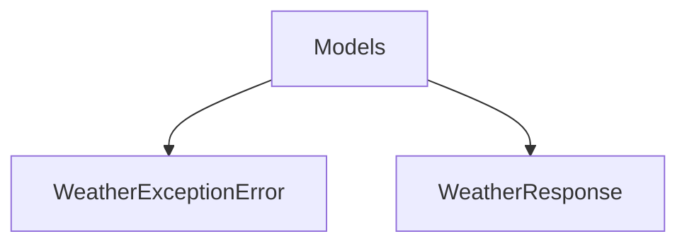

# Models

## Contents

- [Overview](#overview)
- [Files](#files)
- [Types and Members](#types-and-members)
- [Serialization and Contracts](#serialization-and-contracts)
- [Validation and Constraints](#validation-and-constraints)
- [Package Dependencies](#package-dependencies)
- [Diagrams](#diagrams)
- [Examples](#examples)
- [See Also](#see-also)

## Overview

The **Models** area groups 2 documented types, including `WeatherExceptionError`, `WeatherResponse`. It provides the contracts and implementation used by this part of ThunderPropagator.Channels.

## Files

| File | Primary type(s)/symbol(s) | LOC (approx.) | Responsibility |
|---|---|---:|---|
| `WeatherBulkRequest.cs` | `WeatherBulkRequest`, `WeatherBulkRequestLocation` | 35 | Defines WeatherBulkRequest, WeatherBulkRequestLocation and its related behavior. |
| `WeatherBulkResponse.cs` | `WeatherBulkResponse`, `WeatherBulkResponseObject`, `WeatherBulkQueryResponse` | 42 | Defines WeatherBulkResponse, WeatherBulkResponseObject, WeatherBulkQueryResponse and its related behavior. |
| `WeatherException.cs` | `WeatherException`, `WeatherExceptionError` | 27 | Defines WeatherException, WeatherExceptionError and its related behavior. |
| `WeatherResponse.cs` | `WeatherResponse`, `WeatherResponseLocation`, `WeatherResponseCurrent`, `WeatherResponseCurrentCondition`, `WeatherResponseCurrentAirQuality` | 384 | Defines WeatherResponse, WeatherResponseLocation, WeatherResponseCurrent and its related behavior. |

## Types and Members

| Type | Kind | Summary | Inherits/Implements | Key Members |
|---|---|---|---|---|
| [`WeatherExceptionError`](#weatherexceptionerror) | class | Represents the WeatherExceptionError class. | — | `Code`, `Message`, `Error` |
| [`WeatherResponse`](#weatherresponse) | class | Represents the WeatherResponse class. | — | `Name`, `Region`, `Country`, `Lat`, `Lon`, `TzId` |

### WeatherExceptionError

- **Kind:** class
- **Namespace:** `ThunderPropagator.Channels.TimeZones.WeatherApi.Models`
- **Inherits/implements:** None declared
- **Attributes:** None detected
- **Key members:** `Code`, `Message`, `Error`
- **Summary:** Represents the WeatherExceptionError class.
- **Thread safety:** Follow the lifetime and concurrency guarantees of the owning component; no additional guarantee is inferred.

**Usage recipe**

```csharp
// Resolve WeatherExceptionError from the configured service container or construct it with its declared dependencies.
```

[↑ Back to top](#contents)

### WeatherResponse

- **Kind:** class
- **Namespace:** `ThunderPropagator.Channels.TimeZones.WeatherApi.Models`
- **Inherits/implements:** None declared
- **Attributes:** None detected
- **Key members:** `Name`, `Region`, `Country`, `Lat`, `Lon`, `TzId`, `LocaltimeEpoch`, `Localtime`
- **Summary:** Represents the WeatherResponse class.
- **Thread safety:** Follow the lifetime and concurrency guarantees of the owning component; no additional guarantee is inferred.

**Usage recipe**

```csharp
// Resolve WeatherResponse from the configured service container or construct it with its declared dependencies.
```

[↑ Back to top](#contents)

## Serialization and Contracts

Serialization behavior is part of the public wire or persistence contract in this area. Preserve field names, ordering rules, content negotiation, and backward-compatibility expectations when changing these types.

## Validation and Constraints

Inputs are validated at component boundaries. Callers should provide non-null required values and handle domain or argument exceptions without retrying invalid requests unchanged.

## Package Dependencies

| Package | Version | Description | Links |
|---|---|---|---|
| `Bogus` | `35.6.5` | External dependency used by the repository. | [Registry](https://www.nuget.org/packages/Bogus) |
| `Microsoft.Extensions.Caching.StackExchangeRedis` | `10.*` | External dependency used by the repository. | [Registry](https://www.nuget.org/packages/Microsoft.Extensions.Caching.StackExchangeRedis) |
| `Microsoft.Extensions.Diagnostics.Testing` | `10.*` | External dependency used by the repository. | [Registry](https://www.nuget.org/packages/Microsoft.Extensions.Diagnostics.Testing) |
| `Microsoft.Extensions.Http.Polly` | `10.*` | External dependency used by the repository. | [Registry](https://www.nuget.org/packages/Microsoft.Extensions.Http.Polly) |
| `NodaTime` | `3.3.2` | External dependency used by the repository. | [Registry](https://www.nuget.org/packages/NodaTime) |

## Diagrams

### Component overview



The diagram shows the direct components documented by the **Models** area.

## Examples

Start with `WeatherExceptionError` as the primary entry point for this folder, then follow its linked contracts and collaborators.

## See Also

- [Parent area](../README.md)

[↑ Back to top](#contents)
