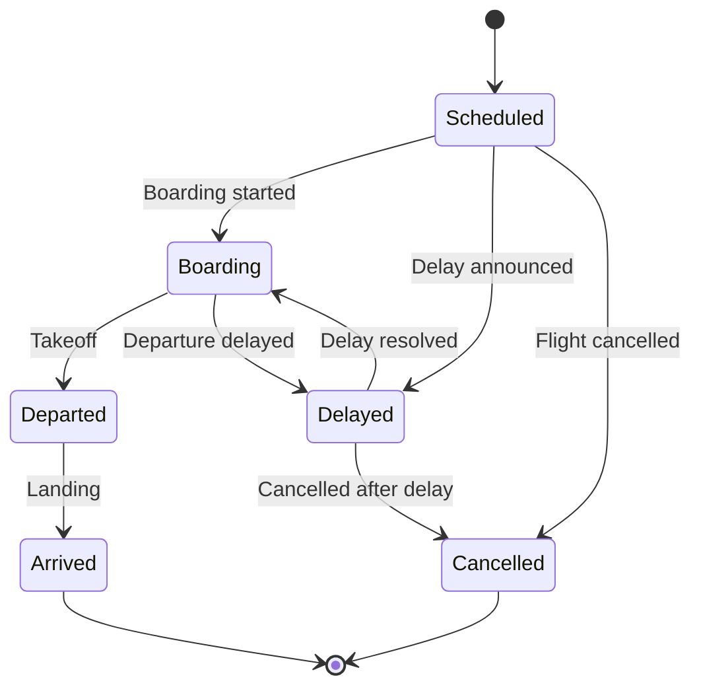

# Airport Demo

[↑ Back to Demo Projects](../README.md) | [→ All Documentation](/docs/README.md)

## Overview

**Domain**: Aviation Operations | **Complexity**: ★★★★★ Expert

The **Airport Demo** is a comprehensive flight tracking and airport operations management system providing real-time flight status updates, gate assignments, departure/arrival boards, and operational metrics. This demo showcases the most complex ThunderPropagator patterns with time-based operations, multi-entity coordination, and external API integration.

## Key Features

- **Real-Time Flight Tracking**: Status updates (scheduled, boarding, departed, arrived, cancelled, delayed)
- **Gate Management**: Dynamic gate assignments, conflict detection
- **Departure/Arrival Boards**: Filtered feeds by airport, airline, status
- **Flight Search**: Complex queries with filtering
- **Timezone-Aware**: Handles departure/arrival times across timezones
- **Weather Integration**: Airport conditions via external API
- **Operational Metrics**: On-time performance, delay statistics

## Architecture

### Entities
- **Flight**: FlightNumber, Airline, Origin, Destination, Status, Gate, ScheduledTime, ActualTime
- **Gate**: GateNumber, Terminal, Status, AssignedFlight
- **Airport**: Code, Name, Timezone, Weather
- **Airline**: Code, Name, Logo

### Pipelines (10+)
- `Flights/Search` — Query flights by criteria
- `Flights/GetStatus` — Get specific flight details
- `Flights/UpdateStatus` — Admin: Update flight status
- `Gates/Assign` — Admin: Assign flight to gate
- `Gates/GetAvailable` — Query available gates
- `Boards/GetDepartures` — Departure board feed
- `Boards/GetArrivals` — Arrival board feed
- `Airlines/GetAll` — List all airlines

### Feeders
- **FlightStatusFeeder**: Polls external flight API for real-time updates
- **WeatherFeeder**: Airport weather conditions
- **MetricsFeeder**: Operational statistics (delays, cancellations)

## State Machine: Flight Status



## Usage Example

```csharp
// Register Airport channel
services.AddAirportChannel(config =>
{
    config.FlightApiKey = "your-api-key";
    config.WeatherApiKey = "your-weather-key";
});

// Client: Subscribe to departure board
var subscription = await channel.SubscribeAsync(new Dictionary<string, object>
{
    ["Airport"] = "JFK",
    ["Board"] = "Departures"
});

subscription.OnMessage(message =>
{
    var flight = message as FlightMessage;
    Console.WriteLine($"{flight.FlightNumber} to {flight.Destination} - Gate {flight.Gate} - {flight.Status}");
});

// Client: Search flights
var searchRequest = new
{
    RequestKey = "Flights/Search",
    Origin = "JFK",
    Destination = "LAX",
    Date = DateTime.Today
};
var flights = await channel.SendRequestAsync(searchRequest);
```

## Dependencies

- ThunderPropagator 1.0.1-beta.5
- NodaTime 3.2.2 (timezone handling)
- External Flight API (configurable)
- Weather API (optional)

## Use Cases

- Airport information display systems
- Flight tracking mobile apps
- Airline operations dashboards
- Travel booking platforms
- Aviation analytics

## See Also

- [Demo Projects Overview](../README.md)
- [TimeZones Channel](../../Channels/TimeZones/README.md) — Timezone handling patterns
- [Notifications Channel](../../Channels/Notifications/README.md) — Real-time alerts

[↑ Back to top](#airport-demo)
