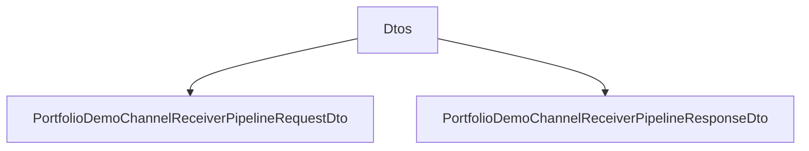

# Dtos

## Contents

- [Overview](#overview)
- [Files](#files)
- [Types and Members](#types-and-members)
- [Validation and Constraints](#validation-and-constraints)
- [Package Dependencies](#package-dependencies)
- [Diagrams](#diagrams)
- [Examples](#examples)
- [See Also](#see-also)

## Overview

The **Dtos** area groups 2 documented types, including `PortfolioDemoChannelReceiverPipelineRequestDto`, `PortfolioDemoChannelReceiverPipelineResponseDto`. It provides the contracts and implementation used by this part of ThunderPropagator.Channels.

## Files

| File | Primary type(s)/symbol(s) | LOC (approx.) | Responsibility |
|---|---|---:|---|
| `PortfolioDemoChannelReceiverPipelineRequestDto.cs` | `PortfolioDemoChannelReceiverPipelineRequestDto` | 36 | Defines PortfolioDemoChannelReceiverPipelineRequestDto and its related behavior. |
| `PortfolioDemoChannelReceiverPipelineResponseDto.cs` | `PortfolioDemoChannelReceiverPipelineResponseDto` | 13 | Defines PortfolioDemoChannelReceiverPipelineResponseDto and its related behavior. |

## Types and Members

| Type | Kind | Summary | Inherits/Implements | Key Members |
|---|---|---|---|---|
| [`PortfolioDemoChannelReceiverPipelineRequestDto`](#portfoliodemochannelreceiverpipelinerequestdto) | class | Represents the PortfolioDemoChannelReceiverPipelineRequestDto class. | `BindingDictionary<string, object>, IRequestContentFormCollection` | — |
| [`PortfolioDemoChannelReceiverPipelineResponseDto`](#portfoliodemochannelreceiverpipelineresponsedto) | class | Represents the PortfolioDemoChannelReceiverPipelineResponseDto class. | `ResponseContentFormCollection` | `Echo` |

### PortfolioDemoChannelReceiverPipelineRequestDto

- **Kind:** class
- **Namespace:** `ThunderPropagator.Channels.Demo.Portfolio.Pipelines.Dtos`
- **Inherits/implements:** `BindingDictionary<string, object>, IRequestContentFormCollection`
- **Attributes:** None detected
- **Key members:** Refer to the API surface in the source package
- **Summary:** Represents the PortfolioDemoChannelReceiverPipelineRequestDto class.
- **Thread safety:** Follow the lifetime and concurrency guarantees of the owning component; no additional guarantee is inferred.

**Usage recipe**

```csharp
// Resolve PortfolioDemoChannelReceiverPipelineRequestDto from the configured service container or construct it with its declared dependencies.
```

[↑ Back to top](#contents)

### PortfolioDemoChannelReceiverPipelineResponseDto

- **Kind:** class
- **Namespace:** `ThunderPropagator.Channels.Demo.Portfolio.Pipelines.Dtos`
- **Inherits/implements:** `ResponseContentFormCollection`
- **Attributes:** None detected
- **Key members:** `Echo`
- **Summary:** Represents the PortfolioDemoChannelReceiverPipelineResponseDto class.
- **Thread safety:** Follow the lifetime and concurrency guarantees of the owning component; no additional guarantee is inferred.

**Usage recipe**

```csharp
// Resolve PortfolioDemoChannelReceiverPipelineResponseDto from the configured service container or construct it with its declared dependencies.
```

[↑ Back to top](#contents)

## Validation and Constraints

Inputs are validated at component boundaries. Callers should provide non-null required values and handle domain or argument exceptions without retrying invalid requests unchanged.

## Package Dependencies

| Package | Version | Description | Links |
|---|---|---|---|
| `Bogus` | `35.6.5` | External dependency used by the repository. | [Registry](https://www.nuget.org/packages/Bogus) |
| `Microsoft.Extensions.Caching.StackExchangeRedis` | `10.*` | External dependency used by the repository. | [Registry](https://www.nuget.org/packages/Microsoft.Extensions.Caching.StackExchangeRedis) |
| `Microsoft.Extensions.Diagnostics.Testing` | `10.*` | External dependency used by the repository. | [Registry](https://www.nuget.org/packages/Microsoft.Extensions.Diagnostics.Testing) |
| `Microsoft.Extensions.Http.Polly` | `10.*` | External dependency used by the repository. | [Registry](https://www.nuget.org/packages/Microsoft.Extensions.Http.Polly) |
| `NodaTime` | `3.3.2` | External dependency used by the repository. | [Registry](https://www.nuget.org/packages/NodaTime) |

## Diagrams

### Component overview



The diagram shows the direct components documented by the **Dtos** area.

## Examples

Start with `PortfolioDemoChannelReceiverPipelineRequestDto` as the primary entry point for this folder, then follow its linked contracts and collaborators.

## See Also

- [Parent area](../README.md)

[↑ Back to top](#contents)
