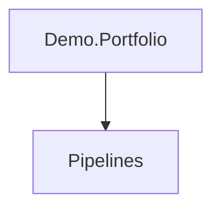

# Demo.Portfolio

## Contents

- [Overview](#overview)
- [Files](#files)
- [Types and Members](#types-and-members)
- [Validation and Constraints](#validation-and-constraints)
- [Performance Notes](#performance-notes)
- [Package Dependencies](#package-dependencies)
- [Diagrams](#diagrams)
- [Examples](#examples)
- [See Also](#see-also)

## Overview

The **Demo.Portfolio** area groups 1 documented type, including `PortfolioDemoExtensions`. It provides the contracts and implementation used by this part of ThunderPropagator.Channels.

## Files

| File | Primary type(s)/symbol(s) | LOC (approx.) | Responsibility |
|---|---|---:|---|
| `AssemblyInfo.cs` | — | 5 | Contains the assembly info implementation or configuration. |
| `PortfolioDemoChannel.cs` | `PortfolioDemoChannel` | 115 | Defines PortfolioDemoChannel and its related behavior. |
| `PortfolioDemoChannelConfiguration.cs` | `PortfolioDemoChannelConfiguration` | 16 | Defines PortfolioDemoChannelConfiguration and its related behavior. |
| `PortfolioDemoChannelFeederMessage.cs` | `PortfolioDemoChannelFeederMessage` | 55 | Defines PortfolioDemoChannelFeederMessage and its related behavior. |
| `PortfolioDemoChannelMetadata.cs` | `PortfolioDemoChannelMetadata` | 22 | Defines PortfolioDemoChannelMetadata and its related behavior. |
| `PortfolioDemoExtensions.cs` | `PortfolioDemoExtensions` | 23 | Defines PortfolioDemoExtensions and its related behavior. |
| `ThunderPropagator.Channels.Demo.Portfolio.csproj` | — | 20 | Defines project build targets, dependencies, and package metadata. |

### Direct child areas

- [Pipelines](./Pipelines/README.md) `Types:2` `Files:2`

## Types and Members

| Type | Kind | Summary | Inherits/Implements | Key Members |
|---|---|---|---|---|
| [`PortfolioDemoExtensions`](#portfoliodemoextensions) | class | Represents the PortfolioDemoExtensions class. | — | `AddPortfolioDemoChannel(…)` |

### PortfolioDemoExtensions

- **Kind:** class
- **Namespace:** `ThunderPropagator.Channels.Demo.Portfolio`
- **Inherits/implements:** None declared
- **Attributes:** None detected
- **Key members:** `AddPortfolioDemoChannel(…)`
- **Summary:** Represents the PortfolioDemoExtensions class.
- **Thread safety:** Follow the lifetime and concurrency guarantees of the owning component; no additional guarantee is inferred.

**Usage recipe**

```csharp
// Resolve PortfolioDemoExtensions from the configured service container or construct it with its declared dependencies.
```

[↑ Back to top](#contents)

## Validation and Constraints

Inputs are validated at component boundaries. Callers should provide non-null required values and handle domain or argument exceptions without retrying invalid requests unchanged.

## Performance Notes

This area contains performance-sensitive constructs such as pooled buffers, spans, asynchronous value types, or concurrent collections. Avoid unnecessary allocations and blocking calls on streaming or message-processing paths.

## Package Dependencies

| Package | Version | Description | Links |
|---|---|---|---|
| `Bogus` | `35.6.5` | External dependency used by the repository. | [Registry](https://www.nuget.org/packages/Bogus) |
| `Microsoft.Extensions.Caching.StackExchangeRedis` | `10.*` | External dependency used by the repository. | [Registry](https://www.nuget.org/packages/Microsoft.Extensions.Caching.StackExchangeRedis) |
| `Microsoft.Extensions.Diagnostics.Testing` | `10.*` | External dependency used by the repository. | [Registry](https://www.nuget.org/packages/Microsoft.Extensions.Diagnostics.Testing) |
| `Microsoft.Extensions.Http.Polly` | `10.*` | External dependency used by the repository. | [Registry](https://www.nuget.org/packages/Microsoft.Extensions.Http.Polly) |
| `NodaTime` | `3.3.2` | External dependency used by the repository. | [Registry](https://www.nuget.org/packages/NodaTime) |

## Diagrams

### Component overview



The diagram shows the direct components documented by the **Demo.Portfolio** area.

## Examples

Start with `PortfolioDemoExtensions` as the primary entry point for this folder, then follow its linked contracts and collaborators.

## See Also

- [Parent area](../README.md)
- [Demo.Airport](../Demo.Airport/README.md)
- [Demo.StockListBasic](../Demo.StockListBasic/README.md)

[↑ Back to top](#contents)
