# Business Demonstration Projects

[↑ Back to Documentation Home](/docs/README.md)

## Contents

- [Overview](#overview)
- [Available Demos](#available-demos)
- [Demo Comparison](#demo-comparison)
- [Common Patterns](#common-patterns)
- [Getting Started](#getting-started)
- [See Also](#see-also)

## Overview

The **Demo** directory contains **3 production-quality business demonstration applications** showcasing ThunderPropagator's capabilities in real-world domain contexts. Each demo implements complex business logic, domain-driven design patterns, and advanced channel features including bidirectional communication, stateful operations, and external API integration.

These demos serve as:
- **Reference Implementations**: Production-ready code demonstrating best practices
- **Learning Resources**: Complete examples of complex ThunderPropagator applications
- **Proof of Concepts**: Domain-specific use cases (aviation, finance, market data)

All demos follow the standard channel architecture with full test coverage and comprehensive documentation.

## Available Demos

### [Airport Demo](./Airport/README.md)

**Domain**: Aviation Operations | **Complexity**: ★★★★★ Expert

Flight tracking and airport operations management system with real-time flight status updates, gate assignments, and departure/arrival boards. Demonstrates complex state management, time-based operations, and multi-entity coordination.

**Key Features**:
- Real-time flight status tracking (scheduled, boarding, departed, arrived, cancelled)
- Gate assignment management
- Departure and arrival board feeds
- Flight search and filtering
- Airport operational metrics
- Timezone-aware scheduling

**Use Cases**: Airport information systems, flight tracking apps, aviation operations dashboards

**[→ Full Documentation](./Airport/README.md)**

### [Portfolio Demo](./Portfolio/README.md)

**Domain**: Finance & Trading | **Complexity**: ★★★★☆ Advanced

Investment portfolio management system with real-time position tracking, profit/loss calculations, and market data integration. Demonstrates financial calculations, multi-currency support, and high-frequency updates.

**Key Features**:
- Real-time portfolio valuation
- Position tracking across multiple assets
- Profit/loss calculations (realized & unrealized)
- Market data integration
- Historical performance tracking
- Risk metrics and analytics

**Use Cases**: Trading platforms, investment management, wealth management dashboards, robo-advisors

**[→ Full Documentation](./Portfolio/README.md)**

### [StockListBasic Demo](./StockListBasic/README.md)

**Domain**: Market Data Streaming | **Complexity**: ★★★☆☆ Intermediate

Basic stock market data feed providing real-time price updates, volume tracking, and market statistics. Demonstrates high-frequency data streaming, efficient message routing, and market data protocols.

**Key Features**:
- Real-time stock price updates
- Volume and trade statistics
- Market open/close handling
- Symbol-based subscription routing
- Tick-by-tick data streaming
- Market summary aggregations

**Use Cases**: Stock tickers, market data terminals, trading dashboards, financial news applications

**[→ Full Documentation](./StockListBasic/README.md)**

## Demo Comparison

| Demo | Domain | Entities | Pipelines | External APIs | Complexity | Primary Pattern |
|------|--------|----------|-----------|---------------|------------|-----------------|
| [Airport](./Airport/README.md) | Aviation | Flights, Gates, Airlines | 10+ | Flight data, Weather | ★★★★★ | Complex stateful operations |
| [Portfolio](./Portfolio/README.md) | Finance | Positions, Assets, Accounts | 8+ | Market data, Pricing | ★★★★☆ | Real-time calculations |
| [StockListBasic](./StockListBasic/README.md) | Market Data | Stocks, Trades | 3+ | Market feed | ★★★☆☆ | High-frequency streaming |

## Common Patterns

### Domain-Driven Design

All demos follow DDD principles:
- **Aggregates**: Core business entities (Flight, Position, Stock)
- **Value Objects**: Immutable domain concepts (Money, FlightNumber, Symbol)
- **Domain Services**: Business logic encapsulation (FlightService, PortfolioService)
- **Repositories**: Data access abstraction

### Bidirectional Communication

Demos support both push and pull:
- **Push**: Real-time updates via feeders (price changes, flight status)
- **Pull**: Client-initiated requests via pipelines (search flights, query positions)

### State Management

Complex stateful operations:
- **In-Memory State**: Channel-level caches (active flights, open positions)
- **Persistence**: Optional database integration for durability
- **State Transitions**: Managed lifecycle (flight status FSM, order states)

### External API Integration

- **Market Data Providers**: Real-time pricing, historical data
- **Flight APIs**: Flight status, schedules, airport information
- **Weather Services**: Airport conditions, forecasts
- **Resilience**: Polly policies for retries, circuit breakers, timeouts

## Getting Started

### 1. Choose a Demo

Select based on your domain interest or learning goal:
- **Complex State Management** → Airport
- **Financial Calculations** → Portfolio
- **High-Frequency Streaming** → StockListBasic

### 2. Install Dependencies

```bash
# Each demo is a standalone package
dotnet add package ThunderPropagator.Channels.Demo.Airport
# or
dotnet add package ThunderPropagator.Channels.Demo.Portfolio
# or
dotnet add package ThunderPropagator.Channels.Demo.StockListBasic
```

### 3. Register in DI Container

```csharp
using Microsoft.Extensions.DependencyInjection;

var services = new ServiceCollection();

// Example: Airport Demo
services.AddAirportChannel(config =>
{
    config.IsEnabled = true;
    // Configure feeders, pipelines, etc.
});
```

### 4. Explore Documentation

Each demo includes:
- Architecture overview with diagrams
- Entity models and relationships
- Pipeline documentation (request/response schemas)
- Feeder configuration options
- Realistic usage examples
- Test examples

## Architecture Overview

```mermaid
graph TB
    subgraph "Demo Applications"
        Airport[Airport Demo<br/>Aviation Operations<br/>★★★★★ Expert]
        Portfolio[Portfolio Demo<br/>Finance & Trading<br/>★★★★☆ Advanced]
        StockList[StockListBasic Demo<br/>Market Data<br/>★★★☆☆ Intermediate]
    end
    
    subgraph "ThunderPropagator Framework"
        Core[Core Channel Infrastructure]
        Feeders[Feeder System]
        Pipelines[Pipeline System]
        Telemetry[Telemetry & Health]
    end
    
    Airport -->|Built on| Core
    Portfolio -->|Built on| Core
    StockList -->|Built on| Core
    
    Airport -->|Uses| Feeders
    Airport -->|Uses| Pipelines
    Airport -->|Uses| Telemetry
    
    Portfolio -->|Uses| Feeders
    Portfolio -->|Uses| Pipelines
    
    StockList -->|Uses| Feeders
    StockList -->|Uses| Pipelines
    
    subgraph "External Systems"
        FlightAPI[Flight Data APIs]
        MarketAPI[Market Data Providers]
        WeatherAPI[Weather Services]
    end
    
    Airport -->|Integrates| FlightAPI
    Airport -->|Integrates| WeatherAPI
    Portfolio -->|Integrates| MarketAPI
    StockList -->|Integrates| MarketAPI
    
    subgraph "Client Applications"
        AirportUI[Airport Dashboards]
        TradingUI[Trading Platforms]
        TickerUI[Stock Tickers]
    end
    
    Airport -->|Powers| AirportUI
    Portfolio -->|Powers| TradingUI
    StockList -->|Powers| TickerUI
    
    style Airport fill:#dc3545,color:#fff
    style Portfolio fill:#fd7e14,color:#fff
    style StockList fill:#ffc107,color:#000
    style Core fill:#4a9eff,color:#fff
```



## See Also

- [Main Documentation](/docs/README.md) — Documentation home
- [Channels](../Channels/README.md) — 7 production channels
- [Games](../Games/README.md) — 2 interactive games
- [Development Guide](../../.github/copilot-instructions.md) — Contributing guidelines

[↑ Back to top](#business-demonstration-projects)
