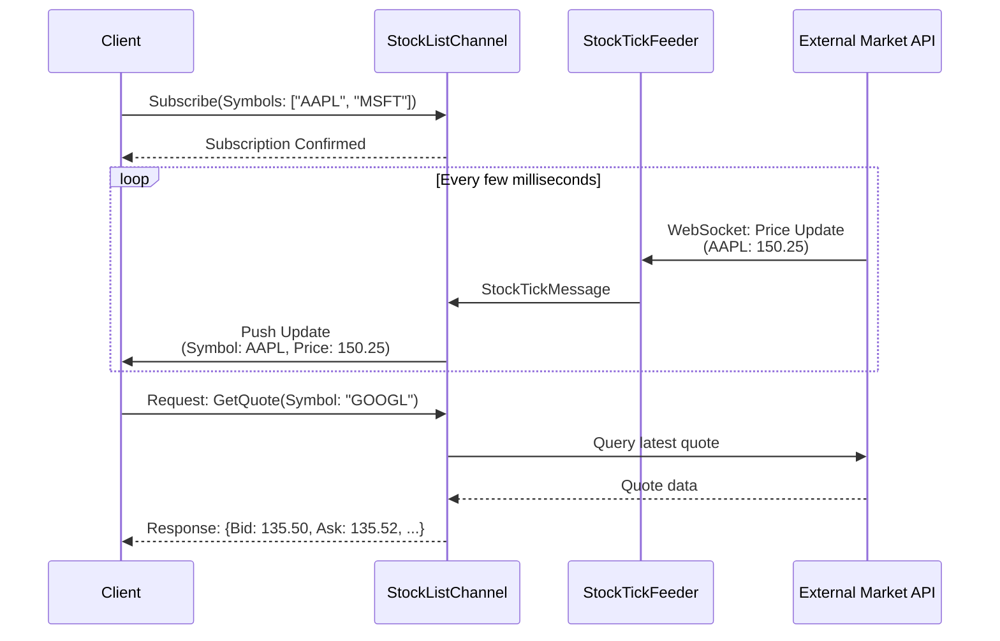

# StockListBasic Demo

[↑ Back to Demo Projects](../README.md) | [→ All Documentation](/docs/README.md)

## Overview

**Domain**: Market Data Streaming | **Complexity**: ★★★☆☆ Intermediate

The **StockListBasic Demo** is a real-time stock market data feed providing price updates, volume tracking, and market statistics. This demo demonstrates high-frequency data streaming, efficient message routing, and market data protocols.

## Key Features

- **Real-Time Price Updates**: Tick-by-tick or snapshot-based price feeds
- **Volume Tracking**: Real-time volume, VWAP calculations
- **Market Statistics**: High/low, change, percent change
- **Symbol-Based Routing**: Subscribe to specific symbols or watchlists
- **Market Hours Handling**: Pre-market, regular, after-hours, closed
- **Market Summary**: Index updates (S&P 500, NASDAQ, DOW)
- **Quote Aggregation**: Bid/ask, spread, depth

## Architecture

### Entities
- **Stock**: Symbol, Name, Exchange, Currency
- **Quote**: Symbol, Timestamp, Price, Bid, Ask, BidSize, AskSize
- **Trade**: Symbol, Timestamp, Price, Volume
- **OHLCV**: Symbol, Date, Open, High, Low, Close, Volume
- **MarketSummary**: Index, Value, Change, PercentChange

### Pipelines (3+)
- `Stocks/Subscribe` — Subscribe to symbol(s)
- `Stocks/GetQuote` — Get current quote for symbol
- `Market/GetSummary` — Get market indices summary

### Feeders
- **StockTickFeeder**: Real-time tick data from market feed
- **MarketSummaryFeeder**: Index values (S&P, NASDAQ, etc.)
- **QuoteSnapshotFeeder**: Periodic quote snapshots (fallback if no tick feed)

## Market Data Flow



## Usage Example

```csharp
// Register StockListBasic channel
services.AddStockListBasicChannel(config =>
{
    config.MarketDataProvider = "AlphaVantage";  // or IEX, Polygon, etc.
    config.ApiKey = "your-api-key";
    config.UpdateFrequency = TimeSpan.FromMilliseconds(500);  // Snapshot mode
});

// Client: Subscribe to watchlist
var subscription = await channel.SubscribeAsync(new Dictionary<string, object>
{
    ["Symbols"] = new[] { "AAPL", "MSFT", "GOOGL", "AMZN", "TSLA" }
});

subscription.OnMessage(message =>
{
    var tick = message as StockTickMessage;
    
    var changePercent = (tick.Price - tick.PreviousClose) / tick.PreviousClose * 100;
    var arrow = changePercent >= 0 ? "↑" : "↓";
    
    Console.WriteLine($"{tick.Symbol} ${tick.Price:F2} {arrow} {Math.Abs(changePercent):F2}%  Vol: {tick.Volume:N0}");
});

// Client: Get quote on-demand
var quoteRequest = new
{
    RequestKey = "Stocks/GetQuote",
    Symbol = "NVDA"
};
var quote = await channel.SendRequestAsync(quoteRequest);
Console.WriteLine($"Bid: ${quote.Bid}  Ask: ${quote.Ask}  Spread: ${quote.Ask - quote.Bid:F2}");
```

## Market Data Message

```csharp
public class StockTickMessage : FeederMessage
{
    public string Symbol { get; set; }           // Stock symbol
    public decimal Price { get; set; }            // Current/last price
    public long Volume { get; set; }              // Cumulative volume
    public decimal Change { get; set; }           // Price change from previous close
    public decimal PercentChange { get; set; }    // Percent change
    public decimal High { get; set; }             // Day high
    public decimal Low { get; set; }              // Day low
    public decimal Open { get; set; }             // Opening price
    public decimal PreviousClose { get; set; }    // Previous day close
    public DateTime Timestamp { get; set; }       // Quote timestamp
}
```

## Dependencies

- ThunderPropagator 1.0.1-beta.5
- Market Data API (Alpha Vantage, IEX Cloud, Polygon.io, etc.)
- Optional: WebSocket-based real-time feed for lower latency

## Performance Considerations

- **High Frequency**: Can handle 1000+ ticks/second
- **Symbol Routing**: Efficient filtering to subscribed symbols only
- **Batching**: Optional message batching for reduced overhead
- **Throttling**: Configurable update frequency per symbol

## Use Cases

- Stock ticker displays
- Trading terminal applications
- Market data dashboards
- Financial news integration
- Algorithmic trading signal sources

## See Also

- [Demo Projects Overview](../README.md)
- [Portfolio Demo](../Portfolio/README.md) — Portfolio management with market data
- [Throughput Channel](../../Channels/Throughput/README.md) — High-volume streaming patterns

[↑ Back to top](#stocklistbasic-demo)
