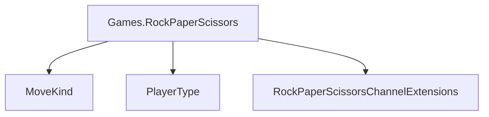

# Games.RockPaperScissors

## Contents

- [Overview](#overview)
- [Files](#files)
- [Types and Members](#types-and-members)
- [Performance Notes](#performance-notes)
- [Package Dependencies](#package-dependencies)
- [Diagrams](#diagrams)
- [Examples](#examples)
- [See Also](#see-also)

## Overview

The **Games.RockPaperScissors** area groups 3 documented types, including `MoveKind`, `PlayerType`, `RockPaperScissorsChannelExtensions`. It provides the contracts and implementation used by this part of ThunderPropagator.Channels.

## Files

| File | Primary type(s)/symbol(s) | LOC (approx.) | Responsibility |
|---|---|---:|---|
| `AssemblyInfo.cs` | — | 5 | Contains the assembly info implementation or configuration. |
| `MoveKind.cs` | `MoveKind` | 9 | Defines MoveKind and its related behavior. |
| `Player.cs` | `Player` | 31 | Defines Player and its related behavior. |
| `PlayerType.cs` | `PlayerType` | 8 | Defines PlayerType and its related behavior. |
| `RockPaperScissorsChannel.cs` | `RockPaperScissorsChannel` | 33 | Defines RockPaperScissorsChannel and its related behavior. |
| `RockPaperScissorsChannelConfiguration.cs` | `RockPaperScissorsChannelConfiguration` | 16 | Defines RockPaperScissorsChannelConfiguration and its related behavior. |
| `RockPaperScissorsChannelExtensions.cs` | `RockPaperScissorsChannelExtensions` | 22 | Defines RockPaperScissorsChannelExtensions and its related behavior. |
| `RockPaperScissorsChannelFeederMessage.cs` | `RockPaperScissorsChannelFeederMessage` | 56 | Defines RockPaperScissorsChannelFeederMessage and its related behavior. |
| `RockPaperScissorsChannelMetadata.cs` | `RockPaperScissorsChannelMetadata` | 26 | Defines RockPaperScissorsChannelMetadata and its related behavior. |
| `RockPaperScissorsChannelReceiveEvent.cs` | `RockPaperScissorsChannelReceiveEvent` | 45 | Defines RockPaperScissorsChannelReceiveEvent and its related behavior. |
| `RockPaperScissorsComputer.cs` | `RockPaperScissorsComputer` | 92 | Defines RockPaperScissorsComputer and its related behavior. |
| `ThunderPropagator.Channels.Games.RockPaperScissors.csproj` | — | 29 | Defines project build targets, dependencies, and package metadata. |

## Types and Members

| Type | Kind | Summary | Inherits/Implements | Key Members |
|---|---|---|---|---|
| [`MoveKind`](#movekind) | enum | Represents the MoveKind enum. | — | — |
| [`PlayerType`](#playertype) | enum | Represents the PlayerType enum. | — | — |
| [`RockPaperScissorsChannelExtensions`](#rockpaperscissorschannelextensions) | class | Represents the RockPaperScissorsChannelExtensions class. | — | `AddRockPaperScissorsChannel(…)` |

### MoveKind

- **Kind:** enum
- **Namespace:** `ThunderPropagator.Channels.Games.RockPaperScissors`
- **Inherits/implements:** None declared
- **Attributes:** None detected
- **Key members:** Refer to the API surface in the source package
- **Summary:** Represents the MoveKind enum.
- **Thread safety:** Follow the lifetime and concurrency guarantees of the owning component; no additional guarantee is inferred.

**Usage recipe**

```csharp
// Resolve MoveKind from the configured service container or construct it with its declared dependencies.
```

[↑ Back to top](#contents)

### PlayerType

- **Kind:** enum
- **Namespace:** `ThunderPropagator.Channels.Games.RockPaperScissors`
- **Inherits/implements:** None declared
- **Attributes:** None detected
- **Key members:** Refer to the API surface in the source package
- **Summary:** Represents the PlayerType enum.
- **Thread safety:** Follow the lifetime and concurrency guarantees of the owning component; no additional guarantee is inferred.

**Usage recipe**

```csharp
// Resolve PlayerType from the configured service container or construct it with its declared dependencies.
```

[↑ Back to top](#contents)

### RockPaperScissorsChannelExtensions

- **Kind:** class
- **Namespace:** `ThunderPropagator.Channels.Games.RockPaperScissors`
- **Inherits/implements:** None declared
- **Attributes:** None detected
- **Key members:** `AddRockPaperScissorsChannel(…)`
- **Summary:** Represents the RockPaperScissorsChannelExtensions class.
- **Thread safety:** Follow the lifetime and concurrency guarantees of the owning component; no additional guarantee is inferred.

**Usage recipe**

```csharp
// Resolve RockPaperScissorsChannelExtensions from the configured service container or construct it with its declared dependencies.
```

[↑ Back to top](#contents)

## Performance Notes

This area contains performance-sensitive constructs such as pooled buffers, spans, asynchronous value types, or concurrent collections. Avoid unnecessary allocations and blocking calls on streaming or message-processing paths.

## Package Dependencies

| Package | Version | Description | Links |
|---|---|---|---|
| `Bogus` | `35.6.5` | External dependency used by the repository. | [Registry](https://www.nuget.org/packages/Bogus) |
| `Microsoft.Extensions.Caching.StackExchangeRedis` | `10.*` | External dependency used by the repository. | [Registry](https://www.nuget.org/packages/Microsoft.Extensions.Caching.StackExchangeRedis) |
| `Microsoft.Extensions.Diagnostics.Testing` | `10.*` | External dependency used by the repository. | [Registry](https://www.nuget.org/packages/Microsoft.Extensions.Diagnostics.Testing) |
| `Microsoft.Extensions.Http.Polly` | `10.*` | External dependency used by the repository. | [Registry](https://www.nuget.org/packages/Microsoft.Extensions.Http.Polly) |
| `NodaTime` | `3.3.2` | External dependency used by the repository. | [Registry](https://www.nuget.org/packages/NodaTime) |

## Diagrams

### Component overview



The diagram shows the direct components documented by the **Games.RockPaperScissors** area.

## Examples

Start with `MoveKind` as the primary entry point for this folder, then follow its linked contracts and collaborators.

## See Also

- [Parent area](../README.md)
- [Games.TicTacToe](../Games.TicTacToe/README.md)

[↑ Back to top](#contents)
