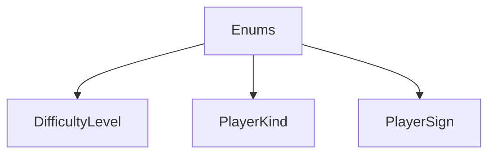

# Enums

## Contents

- [Overview](#overview)
- [Files](#files)
- [Types and Members](#types-and-members)
- [Package Dependencies](#package-dependencies)
- [Diagrams](#diagrams)
- [Examples](#examples)
- [See Also](#see-also)

## Overview

The **Enums** area groups 3 documented types, including `DifficultyLevel`, `PlayerKind`, `PlayerSign`. It provides the contracts and implementation used by this part of ThunderPropagator.Channels.

## Files

| File | Primary type(s)/symbol(s) | LOC (approx.) | Responsibility |
|---|---|---:|---|
| `DifficultyLevel.cs` | `DifficultyLevel` | 9 | Defines DifficultyLevel and its related behavior. |
| `PlayerKind.cs` | `PlayerKind` | 8 | Defines PlayerKind and its related behavior. |
| `PlayerSign.cs` | `PlayerSign` | 8 | Defines PlayerSign and its related behavior. |

## Types and Members

| Type | Kind | Summary | Inherits/Implements | Key Members |
|---|---|---|---|---|
| [`DifficultyLevel`](#difficultylevel) | enum | Represents the DifficultyLevel enum. | — | — |
| [`PlayerKind`](#playerkind) | enum | Represents the PlayerKind enum. | — | — |
| [`PlayerSign`](#playersign) | enum | Represents the PlayerSign enum. | — | — |

### DifficultyLevel

- **Kind:** enum
- **Namespace:** `ThunderPropagator.Channels.Games.TicTacToe.Game.Enums`
- **Inherits/implements:** None declared
- **Attributes:** None detected
- **Key members:** Refer to the API surface in the source package
- **Summary:** Represents the DifficultyLevel enum.
- **Thread safety:** Follow the lifetime and concurrency guarantees of the owning component; no additional guarantee is inferred.

**Usage recipe**

```csharp
// Resolve DifficultyLevel from the configured service container or construct it with its declared dependencies.
```

[↑ Back to top](#contents)

### PlayerKind

- **Kind:** enum
- **Namespace:** `ThunderPropagator.Channels.Games.TicTacToe.Game.Enums`
- **Inherits/implements:** None declared
- **Attributes:** None detected
- **Key members:** Refer to the API surface in the source package
- **Summary:** Represents the PlayerKind enum.
- **Thread safety:** Follow the lifetime and concurrency guarantees of the owning component; no additional guarantee is inferred.

**Usage recipe**

```csharp
// Resolve PlayerKind from the configured service container or construct it with its declared dependencies.
```

[↑ Back to top](#contents)

### PlayerSign

- **Kind:** enum
- **Namespace:** `ThunderPropagator.Channels.Games.TicTacToe.Game.Enums`
- **Inherits/implements:** None declared
- **Attributes:** None detected
- **Key members:** Refer to the API surface in the source package
- **Summary:** Represents the PlayerSign enum.
- **Thread safety:** Follow the lifetime and concurrency guarantees of the owning component; no additional guarantee is inferred.

**Usage recipe**

```csharp
// Resolve PlayerSign from the configured service container or construct it with its declared dependencies.
```

[↑ Back to top](#contents)

## Package Dependencies

| Package | Version | Description | Links |
|---|---|---|---|
| `Bogus` | `35.6.5` | External dependency used by the repository. | [Registry](https://www.nuget.org/packages/Bogus) |
| `Microsoft.Extensions.Caching.StackExchangeRedis` | `10.*` | External dependency used by the repository. | [Registry](https://www.nuget.org/packages/Microsoft.Extensions.Caching.StackExchangeRedis) |
| `Microsoft.Extensions.Diagnostics.Testing` | `10.*` | External dependency used by the repository. | [Registry](https://www.nuget.org/packages/Microsoft.Extensions.Diagnostics.Testing) |
| `Microsoft.Extensions.Http.Polly` | `10.*` | External dependency used by the repository. | [Registry](https://www.nuget.org/packages/Microsoft.Extensions.Http.Polly) |
| `NodaTime` | `3.3.2` | External dependency used by the repository. | [Registry](https://www.nuget.org/packages/NodaTime) |

## Diagrams

### Component overview



The diagram shows the direct components documented by the **Enums** area.

## Examples

Start with `DifficultyLevel` as the primary entry point for this folder, then follow its linked contracts and collaborators.

## See Also

- [Parent area](../README.md)
- [Exceptions](../Exceptions/README.md)
- [Players](../Players/README.md)

[↑ Back to top](#contents)
