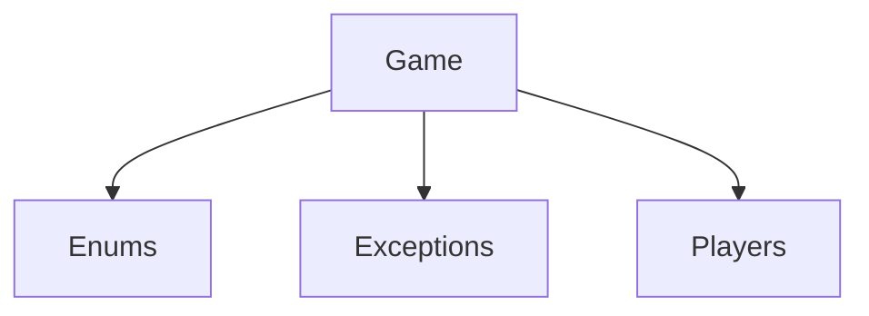

# Game

## Contents

- [Overview](#overview)
- [Files](#files)
- [Types and Members](#types-and-members)
- [Validation and Constraints](#validation-and-constraints)
- [Package Dependencies](#package-dependencies)
- [Diagrams](#diagrams)
- [Examples](#examples)
- [See Also](#see-also)

## Overview

The **Game** area groups 2 documented types, including `BoardChangedEventArgs`, `TicTacToeGame`. It provides the contracts and implementation used by this part of ThunderPropagator.Channels.

## Files

| File | Primary type(s)/symbol(s) | LOC (approx.) | Responsibility |
|---|---|---:|---|
| `BoardChangedEventArgs.cs` | `BoardChangedEventArgs` | 22 | Defines BoardChangedEventArgs and its related behavior. |
| `TicTacToeGame.cs` | `TicTacToeGame` | 118 | Defines TicTacToeGame and its related behavior. |

### Direct child areas

- [Enums](./Enums/README.md) `Types:3` `Files:3`
- [Exceptions](./Exceptions/README.md) `Types:1` `Files:1`
- [Players](./Players/README.md) `Types:3` `Files:3`

## Types and Members

| Type | Kind | Summary | Inherits/Implements | Key Members |
|---|---|---|---|---|
| [`BoardChangedEventArgs`](#boardchangedeventargs) | class | Represents the BoardChangedEventArgs class. | — | `Player`, `Row`, `Column` |
| [`TicTacToeGame`](#tictactoegame) | class | Represents the TicTacToeGame class. | — | `SessionId`, `Player1`, `Player2`, `IsValidMove(…)`, `IsBoardFull(…)`, `CheckWinner(…)` |

### BoardChangedEventArgs

- **Kind:** class
- **Namespace:** `ThunderPropagator.Channels.Games.TicTacToe.Game`
- **Inherits/implements:** None declared
- **Attributes:** None detected
- **Key members:** `Player`, `Row`, `Column`
- **Summary:** Represents the BoardChangedEventArgs class.
- **Thread safety:** Follow the lifetime and concurrency guarantees of the owning component; no additional guarantee is inferred.

**Usage recipe**

```csharp
// Resolve BoardChangedEventArgs from the configured service container or construct it with its declared dependencies.
```

[↑ Back to top](#contents)

### TicTacToeGame

- **Kind:** class
- **Namespace:** `ThunderPropagator.Channels.Games.TicTacToe.Game`
- **Inherits/implements:** None declared
- **Attributes:** None detected
- **Key members:** `SessionId`, `Player1`, `Player2`, `IsValidMove(…)`, `IsBoardFull(…)`, `CheckWinner(…)`, `StartGame(…)`
- **Summary:** Represents the TicTacToeGame class.
- **Thread safety:** Follow the lifetime and concurrency guarantees of the owning component; no additional guarantee is inferred.

**Usage recipe**

```csharp
// Resolve TicTacToeGame from the configured service container or construct it with its declared dependencies.
```

[↑ Back to top](#contents)

## Validation and Constraints

Inputs are validated at component boundaries. Callers should provide non-null required values and handle domain or argument exceptions without retrying invalid requests unchanged.

## Package Dependencies

| Package | Version | Description | Links |
|---|---|---|---|
| `Bogus` | `35.6.5` | External dependency used by the repository. | [Registry](https://www.nuget.org/packages/Bogus) |
| `Microsoft.Extensions.Caching.StackExchangeRedis` | `10.*` | External dependency used by the repository. | [Registry](https://www.nuget.org/packages/Microsoft.Extensions.Caching.StackExchangeRedis) |
| `Microsoft.Extensions.Diagnostics.Testing` | `10.*` | External dependency used by the repository. | [Registry](https://www.nuget.org/packages/Microsoft.Extensions.Diagnostics.Testing) |
| `Microsoft.Extensions.Http.Polly` | `10.*` | External dependency used by the repository. | [Registry](https://www.nuget.org/packages/Microsoft.Extensions.Http.Polly) |
| `NodaTime` | `3.3.2` | External dependency used by the repository. | [Registry](https://www.nuget.org/packages/NodaTime) |

## Diagrams

### Component overview



The diagram shows the direct components documented by the **Game** area.

## Examples

Start with `BoardChangedEventArgs` as the primary entry point for this folder, then follow its linked contracts and collaborators.

## See Also

- [Parent area](../README.md)
- [Pipelines](../Pipelines/README.md)

[↑ Back to top](#contents)
