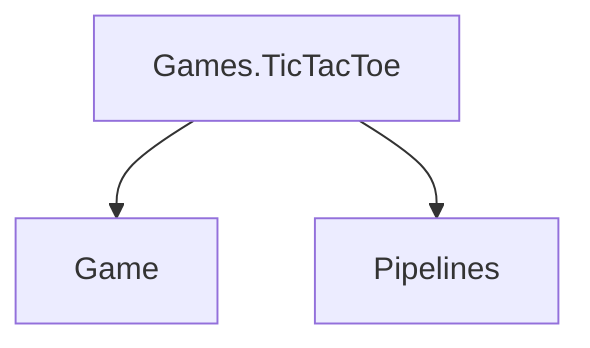

# Games.TicTacToe

## Contents

- [Overview](#overview)
- [Files](#files)
- [Types and Members](#types-and-members)
- [Validation and Constraints](#validation-and-constraints)
- [Performance Notes](#performance-notes)
- [Package Dependencies](#package-dependencies)
- [Diagrams](#diagrams)
- [Examples](#examples)
- [See Also](#see-also)

## Overview

The **Games.TicTacToe** area groups 1 documented type, including `TicTacToeChannelExtensions`. It provides the contracts and implementation used by this part of ThunderPropagator.Channels.

## Files

| File | Primary type(s)/symbol(s) | LOC (approx.) | Responsibility |
|---|---|---:|---|
| `AssemblyInfo.cs` | — | 5 | Contains the assembly info implementation or configuration. |
| `ThunderPropagator.Channels.Games.TicTacToe.csproj` | — | 20 | Defines project build targets, dependencies, and package metadata. |
| `TicTacToeChannel.cs` | `TicTacToeChannel` | 143 | Defines TicTacToeChannel and its related behavior. |
| `TicTacToeChannelConfiguration.cs` | `TicTacToeChannelConfiguration` | 16 | Defines TicTacToeChannelConfiguration and its related behavior. |
| `TicTacToeChannelExtensions.cs` | `TicTacToeChannelExtensions` | 28 | Defines TicTacToeChannelExtensions and its related behavior. |
| `TicTacToeChannelFeederMessage.cs` | `TicTacToeChannelFeederMessage` | 42 | Defines TicTacToeChannelFeederMessage and its related behavior. |
| `TicTacToeChannelMetadata.cs` | `TicTacToeChannelMetadata` | 26 | Defines TicTacToeChannelMetadata and its related behavior. |
| `TicTacToeChannelSubscribeRequest.cs` | `TicTacToeChannelSubscribeRequest` | 16 | Defines TicTacToeChannelSubscribeRequest and its related behavior. |

### Direct child areas

- [Game](./Game/README.md) `Types:2` `Files:2`
- [Pipelines](./Pipelines/README.md) `Types:0` `Files:0`

## Types and Members

| Type | Kind | Summary | Inherits/Implements | Key Members |
|---|---|---|---|---|
| [`TicTacToeChannelExtensions`](#tictactoechannelextensions) | class | Represents the TicTacToeChannelExtensions class. | — | `AddTicTacToeChannel(…)` |

### TicTacToeChannelExtensions

- **Kind:** class
- **Namespace:** `ThunderPropagator.Channels.Games.TicTacToe`
- **Inherits/implements:** None declared
- **Attributes:** None detected
- **Key members:** `AddTicTacToeChannel(…)`
- **Summary:** Represents the TicTacToeChannelExtensions class.
- **Thread safety:** Follow the lifetime and concurrency guarantees of the owning component; no additional guarantee is inferred.

**Usage recipe**

```csharp
// Resolve TicTacToeChannelExtensions from the configured service container or construct it with its declared dependencies.
```

[↑ Back to top](#contents)

## Validation and Constraints

Inputs are validated at component boundaries. Callers should provide non-null required values and handle domain or argument exceptions without retrying invalid requests unchanged.

## Performance Notes

This area contains performance-sensitive constructs such as pooled buffers, spans, asynchronous value types, or concurrent collections. Avoid unnecessary allocations and blocking calls on streaming or message-processing paths.

## Package Dependencies

| Package | Version | Description | Links |
|---|---|---|---|
| `Bogus` | `35.6.5` | External dependency used by the repository. | [Registry](https://www.nuget.org/packages/Bogus) |
| `Microsoft.Extensions.Caching.StackExchangeRedis` | `10.*` | External dependency used by the repository. | [Registry](https://www.nuget.org/packages/Microsoft.Extensions.Caching.StackExchangeRedis) |
| `Microsoft.Extensions.Diagnostics.Testing` | `10.*` | External dependency used by the repository. | [Registry](https://www.nuget.org/packages/Microsoft.Extensions.Diagnostics.Testing) |
| `Microsoft.Extensions.Http.Polly` | `10.*` | External dependency used by the repository. | [Registry](https://www.nuget.org/packages/Microsoft.Extensions.Http.Polly) |
| `NodaTime` | `3.3.2` | External dependency used by the repository. | [Registry](https://www.nuget.org/packages/NodaTime) |

## Diagrams

### Component overview



The diagram shows the direct components documented by the **Games.TicTacToe** area.

## Examples

Start with `TicTacToeChannelExtensions` as the primary entry point for this folder, then follow its linked contracts and collaborators.

## See Also

- [Parent area](../README.md)
- [Games.RockPaperScissors](../Games.RockPaperScissors/README.md)

[↑ Back to top](#contents)
