# Interactive Multiplayer Games

[↑ Back to Documentation Home](/docs/README.md)

## Contents

- [Overview](#overview)
- [Available Games](#available-games)
- [Game Comparison](#game-comparison)
- [Common Patterns](#common-patterns)
- [Getting Started](#getting-started)
- [See Also](#see-also)

## Overview

The **Games** directory contains **2 interactive multiplayer games** demonstrating ThunderPropagator's real-time bidirectional communication capabilities. These games showcase turn-based gameplay, matchmaking, game state management, and instant player synchronization—all core patterns for building live multiplayer experiences.

These games serve as:
- **Interactive Examples**: Playable demonstrations of real-time features
- **Pattern Demonstrations**: Game state machines, turn management, win detection
- **Educational Resources**: Complete multiplayer game implementations
- **Proof of Concepts**: Low-latency real-time synchronization

Both games follow standard channel architecture with comprehensive test coverage and full documentation.

## Available Games

### [RockPaperScissors Game](./RockPaperScissors/README.md)

**Genre**: Classic Hand Game | **Players**: 2 | **Complexity**: ★★★☆☆ Intermediate

The timeless hand game implemented as a real-time multiplayer experience with matchmaking, simultaneous move submission, win/loss/tie detection, and match history tracking.

**Key Features**:
- Player matchmaking system
- Simultaneous hidden move submission
- Win/loss/tie determination
- Round-based gameplay
- Match statistics tracking
- Instant result synchronization

**Game Flow**:
1. Players join matchmaking queue
2. System pairs two players
3. Both submit moves simultaneously (hidden from opponent)
4. Results revealed and winner determined
5. Option to play again or exit

**Use Cases**: Real-time game mechanics, turn-based multiplayer, matchmaking systems, competitive gameplay

**[→ Full Documentation](./RockPaperScissors/README.md)**

### [TicTacToe Game](./TicTacToe/README.md)

**Genre**: Strategic Board Game | **Players**: 2 | **Complexity**: ★★★★☆ Advanced

Classic TicTacToe with real-time board synchronization, turn management, win condition detection, and game replay capabilities. Demonstrates complex state validation and board management.

**Key Features**:
- Real-time board synchronization
- Turn-based gameplay enforcement
- Win/draw detection (8 winning conditions)
- Move validation (occupied cells, turn enforcement)
- Game state recovery
- Replay/spectator support

**Game Flow**:
1. Players create or join game room
2. X player makes first move
3. Moves alternate between X and O
4. Board updates synchronize instantly
5. Win/draw detection triggers game end
6. Option to rematch or leave

**Use Cases**: Turn-based games, board game mechanics, state validation, real-time synchronization, game room management

**[→ Full Documentation](./TicTacToe/README.md)**

## Game Comparison

| Game | Genre | Players | Turns | Win Conditions | Complexity | Key Challenge |
|------|-------|---------|-------|----------------|------------|---------------|
| [RockPaperScissors](./RockPaperScissors/README.md) | Hand Game | 2 | Simultaneous | 3 outcomes | ★★★☆☆ | Hidden move submission |
| [TicTacToe](./TicTacToe/README.md) | Board Game | 2 | Sequential | 8 lines | ★★★★☆ | State validation & sync |

## Common Patterns

### Game State Management

Both games implement comprehensive state machines:

**RockPaperScissors States**:
- `Matchmaking` → waiting for opponent
- `InProgress` → moves submitted, awaiting reveal
- `Completed` → winner determined
- `Rematch` → players opt for another round

**TicTacToe States**:
- `WaitingForPlayers` → room created, awaiting opponent
- `InProgress` → active gameplay, turns alternating
- `Won` → winning condition met (X or O)
- `Draw` → board full, no winner
- `Abandoned` → player disconnected

### Turn Management

Different approaches for different game types:

**Simultaneous Turns (RockPaperScissors)**:
- Both players submit moves independently
- Moves hidden until both submitted
- Reveal happens atomically
- No turn order enforcement needed

**Sequential Turns (TicTacToe)**:
- Strict turn alternation (X → O → X...)
- Server validates turn ownership
- Move rejection for out-of-turn attempts
- Turn timer (optional)

### Matchmaking & Room Management

**RockPaperScissors**:
- Global matchmaking queue
- Automatic pairing (first-come-first-served)
- Anonymous matching
- Quick-play focus

**TicTacToe**:
- Room-based system
- Create/join by room ID
- Friend matching supported
- Spectator capability

### Win Detection Algorithms

**RockPaperScissors**:
```csharp
// Simple lookup table
var outcomes = new Dictionary<(Move, Move), Outcome>
{
    {(Rock, Scissors), Player1Wins},
    {(Scissors, Paper), Player1Wins},
    {(Paper, Rock), Player1Wins},
    // ... inverse and ties
};
```

**TicTacToe**:
```csharp
// Check 8 winning lines
var lines = new[]
{
    new[] {0, 1, 2}, {3, 4, 5}, {6, 7, 8},  // Rows
    new[] {0, 3, 6}, {1, 4, 7}, {2, 5, 8},  // Columns
    new[] {0, 4, 8}, {2, 4, 6}               // Diagonals
};

foreach (var line in lines)
{
    if (board[line[0]] == player && 
        board[line[1]] == player && 
        board[line[2]] == player)
        return true;  // Winner!
}
```

## Getting Started

### 1. Choose a Game

Select based on learning goal:
- **Simultaneous Action** → RockPaperScissors
- **Turn-Based Strategy** → TicTacToe

### 2. Install Dependencies

```bash
# Install game package
dotnet add package ThunderPropagator.Channels.Games.RockPaperScissors
# or
dotnet add package ThunderPropagator.Channels.Games.TicTacToe
```

### 3. Register in DI Container

```csharp
using Microsoft.Extensions.DependencyInjection;

var services = new ServiceCollection();

// Example: TicTacToe
services.AddTicTacToeChannel(config =>
{
    config.IsEnabled = true;
    // Configure pipelines, game settings, etc.
});
```

### 4. Build Client

Games require client-side UI:
- **Web**: JavaScript/TypeScript with WebSocket
- **Desktop**: WPF, WinForms, Avalonia
- **Mobile**: Xamarin, MAUI
- **Console**: Terminal-based UI

### 5. Explore Documentation

Each game includes:
- Game rules and mechanics
- Architecture diagrams (state machines, message flows)
- Pipeline documentation (CreateGame, MakeMove, etc.)
- Client integration examples
- Test examples

## Architecture Overview

```mermaid
graph TB
    subgraph "Multiplayer Games"
        RPS[RockPaperScissors<br/>Simultaneous Moves<br/>★★★☆☆]
        TTT[TicTacToe<br/>Sequential Turns<br/>★★★★☆]
    end
    
    subgraph "ThunderPropagator Framework"
        Core[Core Channel Infrastructure]
        Pipelines[Pipeline System<br/>Request/Response]
        PubSub[Pub/Sub System<br/>Real-time Sync]
        State[State Management]
    end
    
    RPS -->|Built on| Core
    TTT -->|Built on| Core
    
    RPS -->|Uses| Pipelines
    RPS -->|Uses| PubSub
    RPS -->|Uses| State
    
    TTT -->|Uses| Pipelines
    TTT -->|Uses| PubSub
    TTT -->|Uses| State
    
    subgraph "Game Mechanics"
        Matchmaking[Matchmaking Logic]
        TurnMgmt[Turn Management]
        WinDetection[Win Detection]
        Validation[Move Validation]
    end
    
    RPS -->|Implements| Matchmaking
    RPS -->|Implements| WinDetection
    
    TTT -->|Implements| TurnMgmt
    TTT -->|Implements| WinDetection
    TTT -->|Implements| Validation
    
    subgraph "Client Applications"
        WebUI[Web Clients<br/>Browser-based]
        MobileUI[Mobile Apps<br/>iOS/Android]
        DesktopUI[Desktop Apps<br/>Cross-platform]
    end
    
    RPS -->|Powers| WebUI
    RPS -->|Powers| MobileUI
    
    TTT -->|Powers| WebUI
    TTT -->|Powers| DesktopUI
    
    style RPS fill:#28a745,color:#fff
    style TTT fill:#17a2b8,color:#fff
    style Core fill:#4a9eff,color:#fff
```



## Implementation Patterns

### Client-Server Communication

**Client Actions (via Pipelines)**:
- Join matchmaking / Create game room
- Submit move
- Request rematch
- Leave game

**Server Pushes (via Feeders)**:
- Game state updates
- Opponent moves
- Match results
- Player joined/left notifications

### State Synchronization

Both games ensure consistency:
- **Authoritative Server**: All game logic on server
- **Client as View**: Clients render server state
- **Optimistic Updates**: Optional client-side prediction
- **State Recovery**: Clients receive full state on reconnect

### Error Handling

Robust validation:
- Invalid move rejection
- Out-of-turn prevention
- Occupied cell detection (TicTacToe)
- Disconnection handling
- Rematch request management

## See Also

- [Main Documentation](/docs/README.md) — Documentation home
- [Channels](../Channels/README.md) — 7 production channels
- [Demo](../Demo/README.md) — 3 business demos
- [Chat Channel](../Channels/Chat/README.md) — Complex stateful channel example

[↑ Back to top](#interactive-multiplayer-games)
