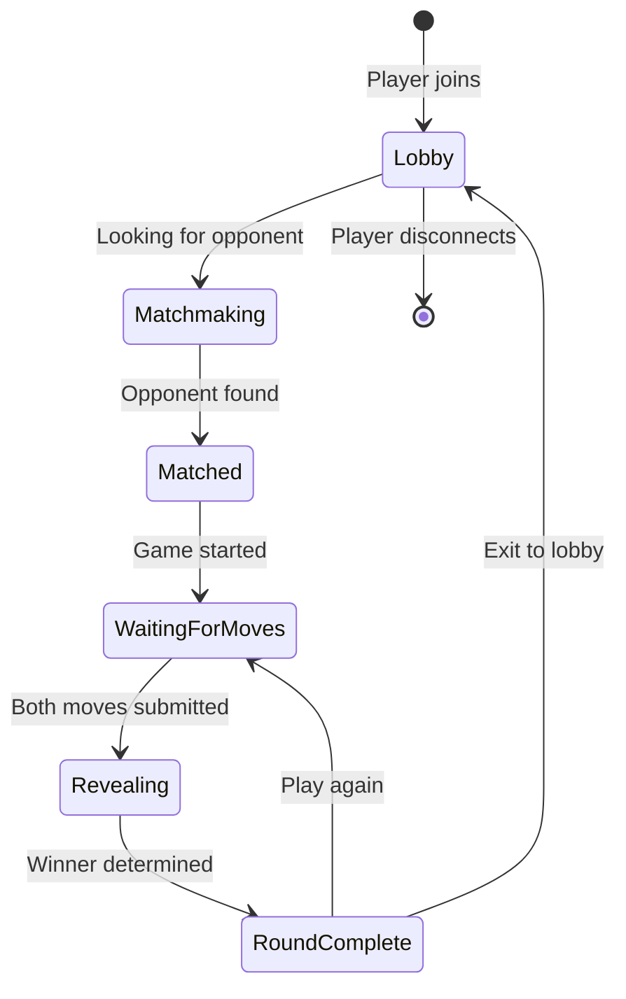
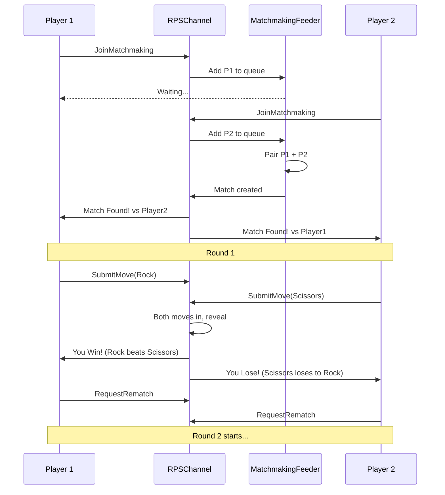

# RockPaperScissors Game

[↑ Back to Games](../README.md) | [→ All Documentation](/docs/README.md)

## Overview

**Genre**: Classic Hand Game | **Players**: 2 | **Complexity**: ★★★☆☆ Intermediate

The **RockPaperScissors Game** is a real-time multiplayer implementation of the timeless hand game with matchmaking, simultaneous move submission, win/loss/tie detection, and match history tracking.

## Game Rules

- Rock beats Scissors
- Scissors beats Paper
- Paper beats Rock
- Same move = Tie

## Key Features

- **Matchmaking System**: Automatic pairing of waiting players
- **Simultaneous Moves**: Hidden submission until both players ready
- **Instant Results**: Immediate winner determination
- **Match Statistics**: Win/loss/tie tracking per player
- **Rematch Support**: Quick play-again functionality
- **Lobby System**: Waiting room for unmatched players

## Game States



## Architecture

### Entities
- **Player**: Id, Name, Wins, Losses, Ties, CurrentMove
- **Match**: Id, Player1Id, Player2Id, Status, Rounds
- **Round**: Id, MatchId, Player1Move, Player2Move, Winner, Timestamp

### Pipelines
- `Game/JoinMatchmaking` — Enter matchmaking queue
- `Game/SubmitMove` — Submit Rock/Paper/Scissors
- `Game/RequestRematch` — Play again with same opponent
- `Game/LeaveMatch` — Exit current game

### Feeders
- **MatchmakingFeeder**: Pairs waiting players, broadcasts match start
- **RoundResultFeeder**: Emits results after both moves submitted

## Gameplay Flow



## Win Detection Logic

```csharp
public enum Move { Rock, Paper, Scissors }

public RoundOutcome DetermineWinner(Move player1Move, Move player2Move)
{
    if (player1Move == player2Move)
        return RoundOutcome.Tie;
    
    return (player1Move, player2Move) switch
    {
        (Move.Rock, Move.Scissors) => RoundOutcome.Player1Wins,
        (Move.Scissors, Move.Paper) => RoundOutcome.Player1Wins,
        (Move.Paper, Move.Rock) => RoundOutcome.Player1Wins,
        _ => RoundOutcome.Player2Wins
    };
}
```

## Usage Example

```csharp
// Register RockPaperScissors channel
services.AddRockPaperScissorsChannel(config =>
{
    config.IsEnabled = true;
    config.MatchmakingTimeout = TimeSpan.FromMinutes(1);
});

// Client: Join matchmaking
var joinRequest = new
{
    RequestKey = "Game/JoinMatchmaking",
    PlayerName = "PlayerOne"
};
var response = await channel.SendRequestAsync(joinRequest);

// Client: Subscribe to game events
var subscription = await channel.SubscribeAsync(new Dictionary<string, object>
{
    ["PlayerId"] = response.PlayerId
});

subscription.OnMessage(message =>
{
    var gameEvent = message as GameEventMessage;
    
    switch (gameEvent.EventType)
    {
        case "MatchFound":
            Console.WriteLine($"Opponent: {gameEvent.OpponentName}");
            break;
        case "WaitingForMove":
            // Prompt user to select Rock/Paper/Scissors
            break;
        case "RoundResult":
            Console.WriteLine($"Result: {gameEvent.Outcome}");
            Console.WriteLine($"You: {gameEvent.YourMove}, Opponent: {gameEvent.OpponentMove}");
            break;
    }
});

// Client: Submit move
var moveRequest = new
{
    RequestKey = "Game/SubmitMove",
    MatchId = response.MatchId,
    Move = "Rock"  // or "Paper", "Scissors"
};
await channel.SendRequestAsync(moveRequest);
```

## Messages

### GameEventMessage
```csharp
public class GameEventMessage : FeederMessage
{
    public string EventType { get; set; }        // MatchFound, WaitingForMove, RoundResult
    public string MatchId { get; set; }
    public string OpponentName { get; set; }
    public string YourMove { get; set; }
    public string OpponentMove { get; set; }
    public string Outcome { get; set; }          // Win, Lose, Tie
    public int YourScore { get; set; }
    public int OpponentScore { get; set; }
}
```

## Dependencies

- ThunderPropagator 1.0.1-beta.5

## Use Cases

- Multiplayer game mechanics demonstration
- Real-time matchmaking patterns
- Simultaneous turn-based gameplay
- Competitive gaming features

## See Also

- [Games Overview](../README.md)
- [TicTacToe Game](../TicTacToe/README.md) — Sequential turn-based gameplay
- [Chat Channel](../../Channels/Chat/README.md) — Complex stateful channel patterns

[↑ Back to top](#rockpaperscissors-game)
