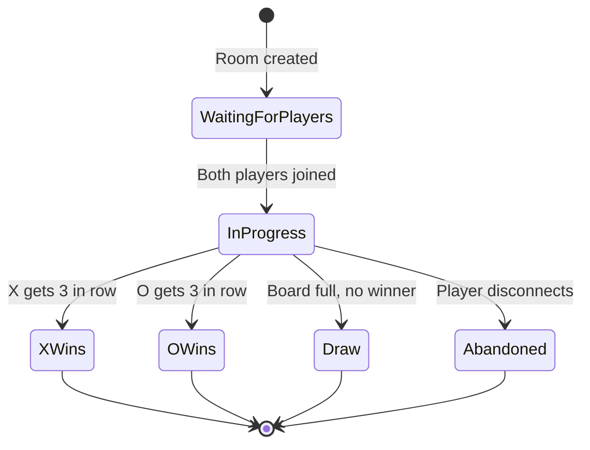
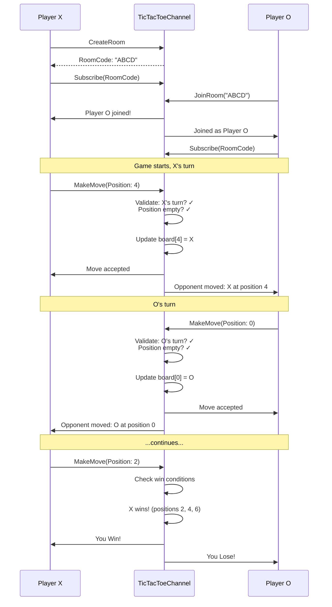

# TicTacToe Game

[↑ Back to Games](../README.md) | [→ All Documentation](/docs/README.md)

## Overview

**Genre**: Strategic Board Game | **Players**: 2 | **Complexity**: ★★★★☆ Advanced

The **TicTacToe Game** is a real-time multiplayer implementation of the classic 3x3 board game with turn management, win detection, real-time board synchronization, and spectator support.

## Game Rules

- 3x3 grid, players alternate placing X and O
- Win: 3 in a row (horizontal, vertical, or diagonal)
- Draw: Board full with no winner
- X always moves first

## Key Features

- **Real-Time Board Sync**: Instant updates to both players
- **Turn Enforcement**: Server validates turn ownership
- **Win Detection**: 8 winning conditions checked
- **Move Validation**: Prevents occupied cell placement
- **Room System**: Create/join game rooms with IDs
- **Spectator Mode**: Watch games in progress
- **Game History**: Move log, replay capability

## Game States



## Architecture

### Entities
- **Game**: Id, RoomCode, PlayerXId, PlayerOId, Board, CurrentTurn, Status, Winner
- **Move**: Id, GameId, PlayerId, Position, Symbol, Timestamp
- **Player**: Id, Name, GamesPlayed, Wins, Losses, Draws

### Pipelines
- `Game/CreateRoom` — Create new game room
- `Game/JoinRoom` — Join existing room by code
- `Game/MakeMove` — Place X or O at position
- `Game/GetBoard` — Get current board state
- `Game/Forfeit` — Resign from game

### Feeders
- **GameUpdateFeeder**: Broadcasts board state after each move
- **GameResultFeeder**: Emits win/draw/forfeit results

## Board Representation

```
Positions:  Board Array:
0 | 1 | 2   [X, O, X,
---------    _, X, O,
3 | 4 | 5    O, _, _]
---------
6 | 7 | 8
```

## Win Detection Algorithm

```csharp
private static readonly int[][] WinningLines = new[]
{
    new[] {0, 1, 2},  // Top row
    new[] {3, 4, 5},  // Middle row
    new[] {6, 7, 8},  // Bottom row
    new[] {0, 3, 6},  // Left column
    new[] {1, 4, 7},  // Middle column
    new[] {2, 5, 8},  // Right column
    new[] {0, 4, 8},  // Diagonal \
    new[] {2, 4, 6}   // Diagonal /
};

public bool CheckWin(char[] board, char symbol)
{
    foreach (var line in WinningLines)
    {
        if (board[line[0]] == symbol &&
            board[line[1]] == symbol &&
            board[line[2]] == symbol)
        {
            return true;
        }
    }
    return false;
}

public bool CheckDraw(char[] board)
{
    return !board.Contains('_') && !CheckWin(board, 'X') && !CheckWin(board, 'O');
}
```

## Gameplay Flow



## Usage Example

```csharp
// Register TicTacToe channel
services.AddTicTacToeChannel(config =>
{
    config.IsEnabled = true;
    config.TurnTimeoutSeconds = 30;  // Optional move timer
});

// Player X: Create room
var createRequest = new
{
    RequestKey = "Game/CreateRoom",
    PlayerName = "PlayerX"
};
var createResponse = await channel.SendRequestAsync(createRequest);
var roomCode = createResponse.RoomCode;

// Player O: Join room
var joinRequest = new
{
    RequestKey = "Game/JoinRoom",
    RoomCode = roomCode,
    PlayerName = "PlayerO"
};
var joinResponse = await channel.SendRequestAsync(joinRequest);

// Both players: Subscribe to game updates
var subscription = await channel.SubscribeAsync(new Dictionary<string, object>
{
    ["GameId"] = createResponse.GameId
});

subscription.OnMessage(message =>
{
    var gameUpdate = message as GameUpdateMessage;
    
    switch (gameUpdate.EventType)
    {
        case "BoardUpdate":
            DisplayBoard(gameUpdate.Board);
            Console.WriteLine($"Current Turn: {gameUpdate.CurrentTurn}");
            break;
        case "GameOver":
            Console.WriteLine($"Game Over! {gameUpdate.Winner} wins!");
            break;
        case "Draw":
            Console.WriteLine("Game ended in a draw!");
            break;
    }
});

// Make move
var moveRequest = new
{
    RequestKey = "Game/MakeMove",
    GameId = createResponse.GameId,
    Position = 4  // Center of board
};
var moveResponse = await channel.SendRequestAsync(moveRequest);

if (!moveResponse.Success)
{
    Console.WriteLine($"Invalid move: {moveResponse.Error}");
}
```

## Move Validation

```csharp
public class MoveValidator
{
    public ValidationResult ValidateMove(Game game, Guid playerId, int position)
    {
        // Check: Is it this player's turn?
        if (game.CurrentTurn != GetPlayerSymbol(game, playerId))
            return ValidationResult.Fail("Not your turn");
        
        // Check: Is position valid? (0-8)
        if (position < 0 || position > 8)
            return ValidationResult.Fail("Invalid position");
        
        // Check: Is position empty?
        if (game.Board[position] != '_')
            return ValidationResult.Fail("Position already occupied");
        
        // Check: Is game still in progress?
        if (game.Status != GameStatus.InProgress)
            return ValidationResult.Fail("Game has ended");
        
        return ValidationResult.Success();
    }
}
```

## Messages

### GameUpdateMessage
```csharp
public class GameUpdateMessage : FeederMessage
{
    public string EventType { get; set; }        // BoardUpdate, GameOver, Draw
    public string GameId { get; set; }
    public char[] Board { get; set; }             // 9-element array
    public char CurrentTurn { get; set; }         // X or O
    public string Winner { get; set; }            // X, O, or null
    public int[] WinningLine { get; set; }        // Positions forming win
    public int LastMovePosition { get; set; }
    public string LastMovePlayer { get; set; }
}
```

## Dependencies

- ThunderPropagator 1.0.1-beta.5

## Use Cases

- Turn-based game mechanics
- Board game implementations
- State synchronization patterns
- Move validation demonstration
- Game room management

## See Also

- [Games Overview](../README.md)
- [RockPaperScissors Game](../RockPaperScissors/README.md) — Simultaneous turn gameplay
- [Chat Channel](../../Channels/Chat/README.md) — Complex stateful operations

[↑ Back to top](#tictactoe-game)
