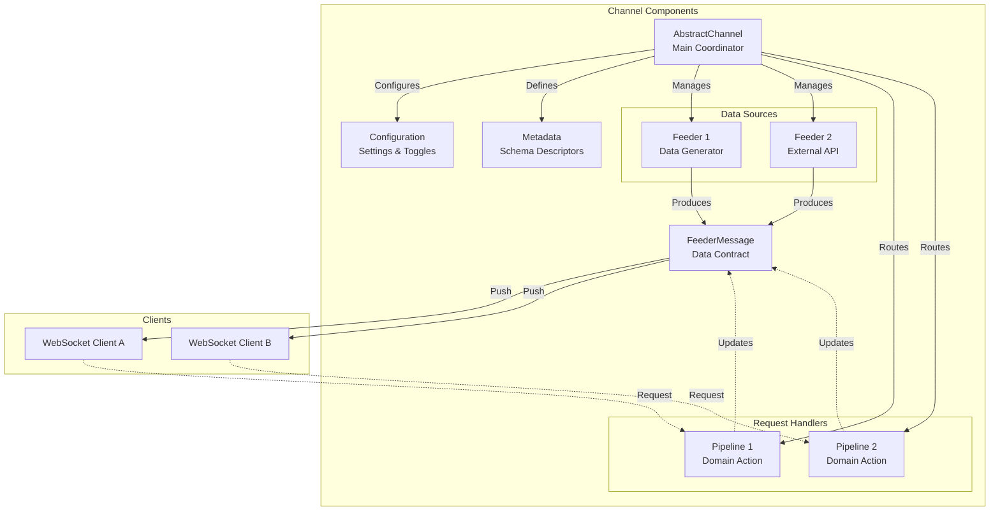

# ThunderPropagator.Channels Documentation

Welcome to the comprehensive documentation for **ThunderPropagator.Channels**, a production-ready library providing real-time streaming channels built on the ThunderPropagator framework for blazingly fast, cloud-native data streaming with WebSocket-based pub/sub patterns.

## Contents

- [Overview](#overview)
- [Repository Structure](#repository-structure)
- [Quick Start](#quick-start)
- [Documentation Sections](#documentation-sections)
  - [Production Channels](#production-channels)
  - [Business Demos](#business-demos)
  - [Interactive Games](#interactive-games)
- [Architecture](#architecture)
- [Key Concepts](#key-concepts)
- [Dependencies](#dependencies)
- [Contributing](#contributing)

## Overview

This repository contains **12 complete implementations** demonstrating the ThunderPropagator framework's capabilities:

- **7 Production Channels**: Fully-featured real-time channels for common use cases
- **3 Business Demos**: Complex domain-driven applications showcasing advanced patterns
- **2 Interactive Games**: Multiplayer games demonstrating bidirectional communication

All implementations follow strict architectural patterns and include comprehensive documentation, unit tests, and deployment configurations.

## Repository Structure

```
ThunderPropagator.Channels/
├── src/
│   ├── Channels/          # 7 production-ready channels
│   ├── Demo/              # 3 business demonstration projects
│   └── Games/             # 2 interactive multiplayer games
├── Tests/
│   ├── ArchTests/         # Architecture validation tests
│   ├── UnitTests/         # Comprehensive unit test suites
│   └── Demo/              # Demo-specific integration tests
├── docs/                  # This documentation (auto-generated)
│   ├── Channels/          # Channel documentation
│   ├── Demo/              # Demo documentation
│   └── Games/             # Game documentation
└── .github/
    ├── copilot-instructions.md
    └── prompts/
```

## Quick Start

### Install a Channel

```bash
# Install via NuGet (GitHub Packages)
dotnet add package ThunderPropagator.Channels.Clock
```

### Register and Configure

```csharp
using Microsoft.Extensions.DependencyInjection;
using ThunderPropagator.Channels.Clock;

var services = new ServiceCollection();

// Register Clock channel with default configuration
services.AddClockChannel(config =>
{
    config.IsEnabled = true;
});

var serviceProvider = services.BuildServiceProvider();
```

### Subscribe to Real-Time Updates

```csharp
// Client connects and subscribes to local time feed
var subscription = await channel.SubscribeAsync(new Dictionary<string, object>
{
    ["Key"] = "Now"
});

subscription.OnMessage(message =>
{
    var clockMessage = message as ClockChannelFeederMessage;
    Console.WriteLine($"Current time: {clockMessage.DateTime}");
});
```

## Documentation Sections

### Production Channels

Explore the 7 production-ready channels in [Channels/README.md](./Channels/README.md):

| Channel | Description | Key Features | Documentation |
|---------|-------------|--------------|---------------|
| **[Chat](./Channels/Chat/README.md)** | Full-featured chat system | Groups, users, messages, pipelines | [View →](./Channels/Chat/README.md) |
| **[Clock](./Channels/Clock/README.md)** | Real-time time streaming | Local & UTC feeds, 300ms updates | [View →](./Channels/Clock/README.md) |
| **[NetworkMonitoring](./Channels/NetworkMonitoring/README.md)** | Network performance metrics | Latency, bandwidth, packet loss | [View →](./Channels/NetworkMonitoring/README.md) |
| **[Notifications](./Channels/Notifications/README.md)** | User notification system | Priority levels, types, snapshots | [View →](./Channels/Notifications/README.md) |
| **[ResourceMonitoring](./Channels/ResourceMonitoring/README.md)** | System resource monitoring | CPU, memory, disk metrics | [View →](./Channels/ResourceMonitoring/README.md) |
| **[Throughput](./Channels/Throughput/README.md)** | High-volume data streaming | Stress testing, performance validation | [View →](./Channels/Throughput/README.md) |
| **[TimeZones](./Channels/TimeZones/README.md)** | Multi-timezone time display | NodaTime integration, weather API | [View →](./Channels/TimeZones/README.md) |

### Business Demos

See complex domain applications in [Demo/README.md](./Demo/README.md):

| Demo | Description | Domain | Documentation |
|------|-------------|--------|---------------|
| **[Airport](./Demo/Airport/README.md)** | Flight tracking system | Aviation operations | [View →](./Demo/Airport/README.md) |
| **[Portfolio](./Demo/Portfolio/README.md)** | Investment portfolio management | Finance & trading | [View →](./Demo/Portfolio/README.md) |
| **[StockListBasic](./Demo/StockListBasic/README.md)** | Stock market data feed | Market data streaming | [View →](./Demo/StockListBasic/README.md) |

### Interactive Games

Explore multiplayer games in [Games/README.md](./Games/README.md):

| Game | Description | Players | Documentation |
|------|-------------|---------|---------------|
| **[RockPaperScissors](./Games/RockPaperScissors/README.md)** | Classic hand game | 2 players | [View →](./Games/RockPaperScissors/README.md) |
| **[TicTacToe](./Games/TicTacToe/README.md)** | Strategic board game | 2 players | [View →](./Games/TicTacToe/README.md) |

## Architecture

### Channel Pattern

All channels follow the **ThunderPropagator Channel Pattern**:



### Key Components

1. **Channel**: Inherits `AbstractChannel<TMetadata, TConfiguration>` - coordinates feeders and pipelines
2. **Feeders**: Inherit `IterativeFeeder<T>` - generate/collect data asynchronously
3. **Pipelines**: Inherit `AbstractReceivePipeline<T>` - handle client requests
4. **Messages**: Inherit `FeederMessage` - data contracts for serialization
5. **Metadata**: Extends `AbstractChannelMetadata` - schema descriptors
6. **Configuration**: Extends `AbstractChannelConfiguration` - runtime settings

## Key Concepts

### Feeders (Data Sources)

Feeders generate or collect data for channels:

- **Iterative Feeders**: Infinite loops emitting data at intervals (Clock, ResourceMonitoring)
- **Event-Driven Feeders**: React to external events (NetworkMonitoring)
- **API Feeders**: Pull data from external APIs (TimeZones weather)

### Pipelines (Request Handlers)

Pipelines handle bidirectional client-server communication:

- **Request/Response Pattern**: Client sends request, server responds
- **Domain Organization**: Grouped by domain (Users, Groups, Messages)
- **Request Key Routing**: Format: `"{Domain}/{Action}"` (e.g., `"Users/Login"`)

### Snapshots

Channels can persist message snapshots for:

- **State Recovery**: New subscribers receive recent state
- **Historical Data**: Query past messages
- **Caching**: Reduce redundant computations

### Subscription Model

Clients subscribe with parameters:

- **Subscribing Keys**: Filter data streams (e.g., `Key: "Now"` vs `"UtcNow"`)
- **Dynamic Routing**: Messages routed based on subscription parameters
- **Multi-Subscription**: One client can have multiple subscriptions

## Dependencies

### Core Framework

| Package | Version | Description |
|---------|---------|-------------|
| ThunderPropagator | 1.0.1-beta.5 | Core framework (platform-specific packages) |

### External Libraries

| Package | Version | Usage |
|---------|---------|-------|
| Microsoft.Extensions.* | 8.x/9.x/10.x | DI, caching, HTTP, diagnostics |
| NodaTime | 3.2.2 | TimeZones channel (timezone handling) |
| Bogus | 35.6.5 | Test data generation |
| xUnit | 2.9.3 | Unit testing framework |
| NSubstitute | 5.3.0 | Mocking framework |

### Multi-Targeting

All projects target .NET 8, 9, and 10 with platform-specific builds:
- AnyCPU, x86, x64, ARM64

Packages follow naming convention:
- Debug: `{ProjectName}.Debug.{Platform}`
- Release: `{ProjectName}.{Platform}` (AnyCPU omits suffix)

## Contributing

This repository follows strict architectural rules defined in [.github/copilot-instructions.md](../.github/copilot-instructions.md):

### Channel Structure Requirements

Every channel must include:

1. `{Name}Channel.cs` - Main channel class
2. `{Name}ChannelConfiguration.cs` - Configuration
3. `{Name}ChannelMetadata.cs` - Schema descriptors
4. `{Name}ChannelFeederMessage.cs` - Data contract
5. `{Name}ChannelExtensions.cs` - DI registration

### Code Conventions

- **Conditional Sealing**: Classes are non-sealed in DEBUG for testability
- **XML Documentation**: Required for all public APIs
- **Nullable Reference Types**: Enabled globally
- **Telemetry**: Activity tracing and metrics in all feeders/pipelines

### Documentation Standards

This documentation is auto-generated following rules in `.github/prompts/repo-docs.md.prompt.md`:

- Deep recursion for all non-excluded folders
- Mandatory Mermaid diagrams (sequence, class, component)
- Comprehensive type/member tables
- Realistic code examples (no test code)
- Cross-document linking with relative paths

---

**Version**: 1.0.1-beta.7  
**Framework**: ThunderPropagator 1.0.1-beta.5  
**Targets**: .NET 8.0, 9.0, 10.0  
**License**: See repository root for licensing information

For technical details, see individual channel/demo/game documentation linked above.
